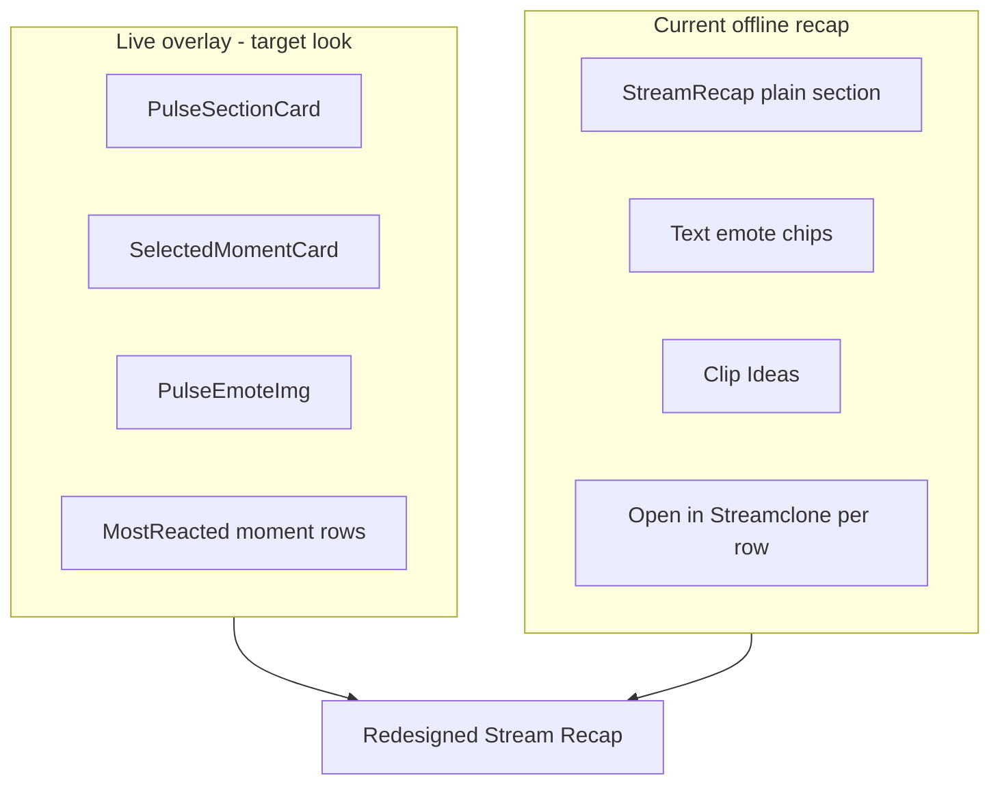

# Stream Recap extension redesign

## Problem

Offline **Stream Recap** in the Chrome extension ([`src/ui/Overlay.tsx`](c:/Users/Aron/streamclone-pulse/src/ui/Overlay.tsx)) looks like a separate dashboard (generic purple stat cards, text emote pills, Clip Ideas, repeated "Open in Streamclone" links). Live tracking uses a different product system ([`PulseSectionCard`](c:/Users/Aron/streamclone-pulse/src/ui/PulseSectionCard.tsx), [`SelectedMomentCard`](c:/Users/Aron/streamclone-pulse/src/ui/SelectedMomentCard.tsx), [`PulseEmoteImg`](c:/Users/Aron/streamclone-pulse/src/ui/PulseEmoteImg.tsx)).

Root causes:

1. **Recap API** returns text-only emotes (`code`, `count`, `provider`) from [`internal/analytics/recap/recap.go`](c:/Users/Aron/twitch-7tv-clone/internal/analytics/recap/recap.go).
2. **StreamRecap UI** renders `{emote.code} · {count}` text chips instead of images.
3. **No explicit UI state machine** — recap appears only when `payload.recap` is non-null; transition from live→offline can flicker between `OfflineRecapCard` and partial recap.



---

## Goals (non-negotiable)

1. **Remove Clip Ideas** completely from `StreamRecap` and `OfflineRecapCard` (delete JSX + unused styles: `clipIdeas`, `clipIdeasLabel`, `clipIdeasRow`, `clipIdeaChip`).
2. **Visual parity** with live overlay — reuse extension product components, not a dashboard layout.
3. **Emote images** — top emotes and emote burst render via `PulseEmoteImg` when metadata exists.
4. **Robust states** — loading skeleton, ready, empty, partial, error; no broken/half-loaded sections.
5. **Live overlay unchanged** — `MostReactedSection`, `LiveStatsBand`, etc. untouched.

---

## Backend (streamclone)

### 1. Extend recap emote model

**File:** [`internal/analytics/recap/recap.go`](c:/Users/Aron/twitch-7tv-clone/internal/analytics/recap/recap.go)

```go
type Emote struct {
    Code     string `json:"code"`
    Count    int    `json:"count"`
    Provider string `json:"provider,omitempty"`
    ID       string `json:"id,omitempty"`
    ImageURL string `json:"imageUrl,omitempty"`
}
```

Add recap-level enrichment signal on `StreamRecap`:

```go
EmoteEnrichmentStatus string `json:"emoteEnrichmentStatus,omitempty"` // "complete" | "partial" | "missing"
```

- **complete:** every recap topEmote has resolvable `imageUrl` (or `id` + provider CDN path)
- **partial:** some emotes enriched, some fall back to code-only
- **missing:** no image metadata resolved (still return code/count/provider)

Backwards compatible: clients that ignore new fields keep working.

### 2. Enrichment in `buildPulseStreamRecap`

**File:** [`internal/analytics/recap_handler.go`](c:/Users/Aron/twitch-7tv-clone/internal/analytics/recap_handler.go) + new [`internal/analytics/recap_emote_enrich.go`](c:/Users/Aron/twitch-7tv-clone/internal/analytics/recap_emote_enrich.go)

After `pulserecap.Build(...)`:

1. Build catalog: `TopEmotesFromRollups(rollups, maxTopEmotes)` from existing store rollups.
2. Filter catalog to **7TV providers only** (preserve current `topSevenTVEmotes` semantics).
3. Apply `rewriteHostedTopEmotes(ctx, catalog)` for hosted CDN URLs.
4. Join recap rows → catalog by **case-insensitive** `code` ↔ `name`.
5. **Preserve recap `Count` and order** — catalog supplies `id` / `imageUrl` only.
6. Compute `EmoteEnrichmentStatus` from enriched count vs total.

Covers both `GET /v1/pulse/streams/{streamId}/recap` and extension BFF (already calls `buildPulseStreamRecap` in [`extension_api.go`](c:/Users/Aron/twitch-7tv-clone/internal/analytics/extension_api.go)).

### 3. Go tests

**File:** `internal/analytics/recap_emote_enrich_test.go`

| Case | Assert |
|------|--------|
| Case-insensitive join | `LOL` recap row matches catalog `lol` |
| Hosted URL rewrite | enriched emote gets CDN/proxy URL when hosted |
| Missing image fallback | unmatched emote keeps code/count; status `partial` or `missing` |
| 7TV-only filter | non-7TV catalog entries not joined |
| Count authority | recap count preserved even if catalog count differs |

Run: `go test ./internal/analytics/... -run RecapEmote`

### 4. TypeScript type updates

- [`streamclone-pulse/src/shared/messages.ts`](c:/Users/Aron/streamclone-pulse/src/shared/messages.ts) — `PulseRecapEmote`, `PulseStreamRecap.emoteEnrichmentStatus`
- [`twitch-7tv-clone/frontend/src/api.ts`](c:/Users/Aron/twitch-7tv-clone/frontend/src/api.ts)
- [`twitch-7tv-clone/packages/analytics-console/src/apiTypes.ts`](c:/Users/Aron/twitch-7tv-clone/packages/analytics-console/src/apiTypes.ts)

---

## Extension (streamclone-pulse)

### 1. Emote resolution helper

**New file:** [`src/ui/recapEmotes.ts`](c:/Users/Aron/streamclone-pulse/src/ui/recapEmotes.ts)

```ts
recapEmoteToExtensionEmote(emote: PulseRecapEmote): ExtensionEmote
resolveRecapEmotes(recapEmotes, catalog?: ExtensionEmote[]): ExtensionEmote[]
```

- Prefer backend `id` / `imageUrl` when present.
- Fallback: case-insensitive join to `payload.topEmotes`.
- Never emit raw text chips upstream — consumers use `PulseEmoteImg` which already falls back to truncated name when image fails.

**Tests:** `tests/recapEmotes.test.ts` — join fallback, missing image, partial catalog.

### 2. Recap UI state machine

**New file:** [`src/ui/recapUiState.ts`](c:/Users/Aron/streamclone-pulse/src/ui/recapUiState.ts)

```ts
type RecapUiState = 'loading' | 'ready' | 'empty' | 'partial' | 'error'

resolveRecapUiState(input: {
  isLive: boolean
  tracking: boolean
  streamId?: string
  recap: PulseStreamRecap | null
  pollError?: string | null
  hadLiveSession?: boolean  // optional: track live→offline transition in Overlay
}): RecapUiState
```

| State | When | Render |
|-------|------|--------|
| **loading** | Offline + tracked stream + `streamId` + no `recap` yet + no error | `RecapSkeleton` (matches final layout slots) |
| **ready** | `recap` present + enrichment complete or acceptable | Full redesigned recap |
| **partial** | `recap` present but sparse data or `emoteEnrichmentStatus !== 'complete'` | Render available sections only; hide empty blocks |
| **empty** | Offline + no recap + no rollup/peaks to show | "No recap yet" compact message |
| **error** | Poll/health failure while expecting recap | Compact retry/unavailable |

**Anti-flicker:** Single `StreamRecapSection` wrapper in Overlay decides state once per stable `streamId`; skeleton persists until recap arrives or timeout → empty/error. Do not alternate `OfflineRecapCard` ↔ partial recap during same stream end transition.

Update [`src/ui/pulsePanelLayout.ts`](c:/Users/Aron/streamclone-pulse/src/ui/pulsePanelLayout.ts) if needed to expose `showRecapLoading` vs `showRecap` vs `showOfflineFallback`.

**New file:** [`src/ui/RecapSkeleton.tsx`](c:/Users/Aron/streamclone-pulse/src/ui/RecapSkeleton.tsx) — pulse placeholders for hero, stat band, emote row, moment list (reuse existing pulse skeleton patterns from `WarmingState` / coverage cards).

### 3. Component structure

**New file:** [`src/ui/RecapTopEmotesRow.tsx`](c:/Users/Aron/streamclone-pulse/src/ui/RecapTopEmotesRow.tsx)

- Read-only ranked grid (visual language from [`EmoteOverlayChips`](c:/Users/Aron/streamclone-pulse/src/ui/EmoteOverlayChips.tsx)).
- Each cell: `PulseEmoteImg` + count badge + optional rank `#n`.
- Omit section entirely when `resolveRecapEmotes` returns empty.

**Refactor:** [`StreamRecap`](c:/Users/Aron/streamclone-pulse/src/ui/Overlay.tsx) → extract to [`src/ui/StreamRecapSection.tsx`](c:/Users/Aron/streamclone-pulse/src/ui/StreamRecapSection.tsx) (keeps Overlay.tsx smaller).

Layout (inside `PulseSectionCard`):

1. **Header:** "Stream Recap" + `{duration} · {messages}` meta (existing `SectionHeading` tone or PulseSectionCard title).
2. **Top moment hero:** Reuse `SelectedMomentCard` visual language — convert `recap.topMoments[0]` to minimal `LiveHeatPoint` via adapter, or thin `RecapMomentHero` sharing styles from [`SelectedMomentCard.tsx`](c:/Users/Aron/streamclone-pulse/src/ui/SelectedMomentCard.tsx).
   - **Primary CTA here only:** "Jump to moment" + "Analytics" (not repeated on every row).
3. **Compact stat band:** peak chat + total messages (2-column, same scale as live stats — not oversized dashboard cards).
4. **Highlight strip:** biggest spike + top emote burst; burst includes `PulseEmoteImg` when code resolves.
5. **Top emotes row:** `RecapTopEmotesRow`.
6. **Ranked moments list:** Reuse live `MomentRow` styling from [`MostReactedSection.tsx`](c:/Users/Aron/streamclone-pulse/src/ui/MostReactedSection.tsx) — telemetry rows, not purple rank cards.
   - Row tap selects/highlights moment; **no** per-row "Open in Streamclone".
   - Optional quiet timestamp-only affordance; full jump via hero CTA or row select → hero update.

**OfflineRecapCard:** Same visual system where data exists; remove Clip Ideas; use `RecapTopEmotesRow` for `payload.topEmotes`; align stat band + moment rows with live styling.

### 4. Overlay wiring

Replace current block (~lines 1154–1166):

```tsx
<StreamRecapSection
  payload={payload}
  backendUrl={backendUrl}
  uiState={recapUiState}
  isLive={uiIsLive}
  onJump={jumpMoment}
  onAnalytics={openAnalyticsForMoment}
  onOpenAnalytics={openAnalytics}
  pollError={pulseError}
/>
```

Pass `backendUrl`, `payload.topEmotes` catalog, and enrichment status into child components.

### 5. Delete Clip Ideas

Remove from `StreamRecap`:
- `clipIdeas` variable and JSX block (~1592–1603)
- Related styles (~1914–1917)

Confirm `OfflineRecapCard` has no clip ideas (currently none — verify after refactor).

---

## Acceptance criteria

- [ ] Offline ended-stream recap **visually matches** live extension overlay (section card, hero moment, emote images, telemetry rows).
- [ ] Top emotes render as **images** when `imageUrl` or resolvable `id` exists.
- [ ] **No Clip Ideas** section anywhere in extension recap surfaces.
- [ ] Recap does **not flicker** between broken/partial layouts while loading (skeleton → ready).
- [ ] **Live overlay behavior unchanged** (`MostReactedSection`, `LiveStatsBand`, warming, coverage).
- [ ] **One primary CTA** on hero; no repeated "Open in Streamclone" on every row.
- [ ] Tests pass:
  - Go recap enrichment tests
  - `streamclone-pulse` npm tests (`recapEmotes.test.ts`, optional `recapUiState.test.ts`)
  - Manual: `npm run dev` → ended tracked stream → verify images + states

---

## Verification commands

```powershell
# streamclone
cd c:\Users\Aron\twitch-7tv-clone
go test ./internal/analytics/... -run RecapEmote

# extension
cd c:\Users\Aron\streamclone-pulse
npm test
npm run dev   # manual reload on offline channel with recap
```

API spot-check (stack up):

```powershell
curl http://localhost:8090/v1/extension/pulse/channels/{login}
# Expect offline tracked stream: recap.topEmotes[].imageUrl, emoteEnrichmentStatus
```

---

## Out of scope

- Desktop [`StreamRecapPanel`](c:/Users/Aron/twitch-7tv-clone/frontend/src/components/Analytics.tsx) UI redesign (backend enrichment still benefits it later).
- Portal [`RecapBlock`](c:/Users/Aron/streamclone-pulse/streampulse-web/src/ui/components/RecapBlock.tsx).
- Changing recap ranking algorithm or clip candidate computation (clip candidates may remain in API; UI simply stops showing them).
