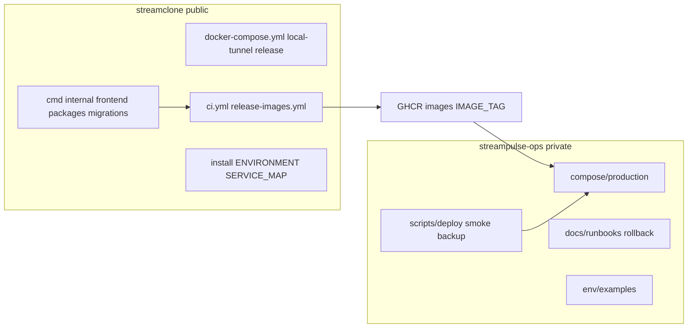

# StreamPulse Ops Boundary Migration Plan

## Phase 0 Baseline (read-only — completed in audit)


| Item               | Current state                                                                                                                                                                                                                                                                                                    |
| ------------------ | ---------------------------------------------------------------------------------------------------------------------------------------------------------------------------------------------------------------------------------------------------------------------------------------------------------------- |
| Local checkout     | `[C:\Users\Aron\twitch-7tv-clone](C:\Users\Aron\twitch-7tv-clone)`, git repo, branch `master`, remote `origin` → `Aron-Chu/streamclone`                                                                                                                                                                          |
| Working tree       | **Large dirty tree** — migration work should land on a dedicated branch; do not mix with unrelated WIP                                                                                                                                                                                                           |
| GitHub visibility  | **Public** (`isPrivate: false`), default branch `master`                                                                                                                                                                                                                                                         |
| Branch protection  | **None** (`404 Branch not protected`)                                                                                                                                                                                                                                                                            |
| Latest release     | `v0.3.0-rc5` (pre-release, 2026-06-15)                                                                                                                                                                                                                                                                           |
| `streampulse-ops`  | **Does not exist** — create via `gh repo create Aron-Chu/streampulse-ops --private` in Phase 5                                                                                                                                                                                                                   |
| Production host    | **streampulse-vps** (`23.173.152.156`) per `[docs/agent-notes/streampulse-vps-production-migration-2026-07-02.md](docs/agent-notes/streampulse-vps-production-migration-2026-07-02.md)`; BearHost (`141.11.243.103`) rollback-only                                                                               |
| Deploy model today | **rsync + source build** via `[scripts/streampulse-vps-production-deploy.sh](scripts/streampulse-vps-production-deploy.sh)`; optional `STREAMPULSE_USE_RELEASE_IMAGES=1` + `IMAGE_TAG` already wired in `[scripts/lib/streampulse-vps-production-compose.sh](scripts/lib/streampulse-vps-production-compose.sh)` |


### CI state on latest `master` push ([run 28636434856](https://github.com/Aron-Chu/streamclone/actions/runs/28636434856))


| Job                      | Result                                     | Blocker class         |
| ------------------------ | ------------------------------------------ | --------------------- |
| Secret scan              | pass                                       | —                     |
| Full gate (`make check`) | pass                                       | —                     |
| Code graph rebuild       | **fail** (`make codegraph-install` exit 2) | **codegraph/tooling** |
| Core compose smoke       | **fail** (Wait for health endpoints)       | **compose/runtime**   |


**Gate:** Do not delete public ops files or cut over until CI blockers are fixed or explicitly documented as unrelated. `make check` passing is not sufficient — smoke + codegraph must be addressed in Phase 3.

### `.env.dev` drift (Phase 2 blocker)

- `.env.dev` exists **locally** but is **not tracked** in git.
- CI already bootstraps from `[.env.example](.env.example)` via `[scripts/ci-bootstrap-env.sh](scripts/ci-bootstrap-env.sh)` (added in recent commit).
- **Still broken:** `[Makefile](Makefile)` line 89 (`cp .env.dev .env`), `[scripts/lib/env.sh](scripts/lib/env.sh)` line 276 (sources `.env.dev`), `[.github/workflows/release-images.yml](.github/workflows/release-images.yml)` (`cp .env.dev .env` + compose `--env-file .env.dev`), `[scripts/package-release.sh](scripts/package-release.sh)`, bootstrap/validate scripts, docs.




---

## PR 1 — Baseline note + move manifest (Phase 0–1)

**Branch:** `chore/ops-migration-manifest`

1. Write local (uncommitted first) `[migration-baseline.md](migration-baseline.md)` at repo root with summarized audit above.
2. Add `[docs/ops-migration-manifest.md](docs/ops-migration-manifest.md)` with exact-path classification.

### Manifest highlights (90+ tracked paths audited)

**Stay in streamclone**

- All `cmd/**`, `internal/**`, `frontend/**`, `packages/**`, `migrations/**`
- Local/generic compose: `[deploy/docker-compose.yml](deploy/docker-compose.yml)`, `[deploy/docker-compose.local-tunnel.yml](deploy/docker-compose.local-tunnel.yml)`, `[deploy/docker-compose.release.yml](deploy/docker-compose.release.yml)`, `[deploy/docker-compose.prod.yml](deploy/docker-compose.prod.yml)` (generic Caddy/ACME VM example)
- Local env profiles: `profile-core.env`, `profile-scraper.env`, `profile-full.env`, `profile-laptopworker-dev.env`
- CI/workflows: `[ci.yml](.github/workflows/ci.yml)`, `[codeql.yml](.github/workflows/codeql.yml)`, `[release-images.yml](.github/workflows/release-images.yml)`, `[hub-health-monitor.yml](.github/workflows/hub-health-monitor.yml)` (public API probe, no host secrets)
- Public docs listed in user spec + `[deploy/FREE_DEPLOYMENT.md](deploy/FREE_DEPLOYMENT.md)`

**Move to streampulse-ops** (copy first, delete later)

- Compose: all `deploy/docker-compose.bearhost*.yml`, `deploy/docker-compose.streampulse-vps*.yml`, plus untracked `[deploy/docker-compose.bearhost-worker.yml](deploy/docker-compose.bearhost-worker.yml)`
- Env: `deploy/env/profile-bearhost*`, `deploy/env/profile-streampulse-vps*`, `deploy/env/profile-hosted-data-mcp.env.example`
- Scripts (~78): all `scripts/bearhost*`, all `scripts/streampulse-vps*`, plus untracked `scripts/streampulse-vps-{cron-install,pg-backup,r2-corpus-cutover,top500-scale}.sh`, `scripts/bearhost-worker.sh`, `scripts/hosted-data-{mcp,tunnel}.sh`, `scripts/test-streampulse-vps-production-compose.sh`
- Lib helpers: `[scripts/lib/streampulse-vps-production-compose.sh](scripts/lib/streampulse-vps-production-compose.sh)`, `[scripts/lib/deploy-rsync.sh](scripts/lib/deploy-rsync.sh)`
- Host Caddy overlays: `[deploy/Caddyfile.bearhost](deploy/Caddyfile.bearhost)` (if still used on rollback host)
- Docs: `[docs/bearhost-production.md](docs/bearhost-production.md)`, `[docs/site-links.md](docs/site-links.md)`, `[docs/operator-secrets.md](docs/operator-secrets.md)`, `docs/agent-notes/*production*`, `docs/agent-notes/*vps*`, `docs/launch-readiness/*`, `[docs/archive/bearhost-rollback-artifacts.md](docs/archive/bearhost-rollback-artifacts.md)`

**Archive in streampulse-ops/archive**

- BearHost Grafana/observability scripts (product scope 2026-07 removed local Grafana compose; scripts are legacy operator tooling)
- Azure archive plane compose/scripts: `deploy/docker-compose.azure-*`, `scripts/storage/corpus-azure-*`
- Superseded launch-readiness agent notes

**Replace with public stub** (after private copy validates)

- `[docs/site-links.md](docs/site-links.md)`, `[docs/bearhost-production.md](docs/bearhost-production.md)`, `[docs/operator-secrets.md](docs/operator-secrets.md)` → pointer stubs only
- Makefile bearhost/grafana/streampulse-vps targets → print redirect message

**Needs human review** (manifest section, leave in place until reviewed)

- `[deploy/docker-compose.laptopworker-dev.yml](deploy/docker-compose.laptopworker-dev.yml)` + `[docs/laptopworker-dev.md](docs/laptopworker-dev.md)` — tailnet **local dev**, not production; likely **stay public**
- `[scripts/local-vps-only.sh](scripts/local-vps-only.sh)` — dev hybrid scrape handoff; **stay** but doc link update
- `[deploy/Caddyfile](deploy/Caddyfile)` — shared base; **stay**; ops gets production-specific overlay only
- Untracked `[deploy/alerts/top500-hosted.proposal.yml](deploy/alerts/top500-hosted.proposal.yml)` — proposal; archive or delete after review

---

## PR 2 — Fix `.env.dev` drift (Phase 2)

**Branch:** `fix/env-dev-removal`

### Target behavior

- **CI / release:** tracked files only (`.env.example` + `deploy/env/profile-*.env` + generated secrets in CI)
- **Local dev:** `make env` / `make setup` synthesizes `.env` from `.env.example` + `deploy/env/profile-dev.env` (new tracked non-secret file) + profile overlay + generated secrets

### Files to patch


| File                                                                                                                      | Change                                                                                       |
| ------------------------------------------------------------------------------------------------------------------------- | -------------------------------------------------------------------------------------------- |
| `[Makefile](Makefile)`                                                                                                    | `env` target: call `bash scripts/lib/env.sh synthesize core` instead of `cp .env.dev .env`   |
| `[scripts/lib/env.sh](scripts/lib/env.sh)`                                                                                | Replace `.env.dev` source with `.env.example` + optional `deploy/env/profile-dev.env`        |
| `[scripts/lib/env.ps1](scripts/lib/env.ps1)`                                                                              | Mirror bash logic                                                                            |
| `[.github/workflows/release-images.yml](.github/workflows/release-images.yml)`                                            | Use `bash scripts/ci-bootstrap-env.sh` (or shared `env_synthesize`) instead of `cp .env.dev` |
| `[.github/workflows/smoke-scraper.yml](.github/workflows/smoke-scraper.yml)`                                              | Same                                                                                         |
| `[scripts/package-release.sh](scripts/package-release.sh)`                                                                | Ship `.env.example` + `profile-dev.env`, not `.env.dev`                                      |
| `[scripts/bootstrap.sh](scripts/bootstrap.sh)`, `[scripts/bootstrap.ps1](scripts/bootstrap.ps1)`                          | Update messages                                                                              |
| `[scripts/validate-env.sh](scripts/validate-env.ps1)`                                                                     | Update hints                                                                                 |
| `[docs/ENVIRONMENT.md](docs/ENVIRONMENT.md)`, `[.env.example](.env.example)` header, `[CONTRIBUTING.md](CONTRIBUTING.md)` | Document new synthesis chain                                                                 |
| `[.pre-commit-config.yaml](.pre-commit-config.yaml)`                                                                      | Allow `.env.example`; remove `.env.dev` exception if file deleted                            |


### New file: `deploy/env/profile-dev.env`

Non-secret dev defaults currently implied by missing `.env.dev` (e.g. `TWITCH_DEV_TOKEN_IMPORT_ENABLED=true` for localhost).

### Validation

```bash
rg "\.env\.dev"   # only intentional historical mentions or "removed" notes
make compose-config-check
make check-quick
bash scripts/ci-bootstrap-env.sh && make check-quick  # CI-equivalent
```

---

## PR 3 — CI green + branch protection + artifact contract (Phase 3–4)

**Branch:** `chore/ci-and-artifact-contract`

### Fix CI failures

1. **Code graph:** inspect `make codegraph-install` failure in `[.github/workflows/ci.yml](.github/workflows/ci.yml)`; fix dependency/pin issue (do not downgrade job without justification in manifest).
2. **Core compose smoke:** diagnose health wait failure (likely service timing or env from bootstrap); fix or adjust smoke script timeouts with evidence from `Dump compose state on failure` artifact.

### Branch protection

Enable on `master` via `gh api` (or document exact settings in `[docs/repo-maintenance.md](docs/repo-maintenance.md)` if API blocked):

- Require PR, status checks (CI jobs), CodeQL, secret scan, no force push, no deletion

### Production Artifact Contract (new public section)

Add to `[docs/ENVIRONMENT.md](docs/ENVIRONMENT.md)` or new `[docs/production-artifact-contract.md](docs/production-artifact-contract.md)`:

- `IMAGE_TAG` is immutable release identifier (git tag / VERSION)
- GHCR images built from streamclone: `metadata`, `chat`, `video`, `analytics`, `emote`, `frontend`, `scraper` (optional), `**migrate**` (new)
- **Invariant:** `analytics` == `analytics-workers` == `migrate` == deployed `IMAGE_TAG`
- Ops pulls by tag; rollback = redeploy previous `IMAGE_TAG`
- Host topology / secrets live in private `streampulse-ops` (no IPs in public doc)

---

## PR 4 — GHCR migrate image (prerequisite for image-only ops)

**Branch:** `feat(release): publish migrate image`

Today `[deploy/docker-compose.yml](deploy/docker-compose.yml)` uses `migrate/migrate` with host-mounted `migrations/`. Production ops cannot be checkout-free without a migrate image.

### Implementation

1. Add `[deploy/Dockerfile.migrate](deploy/Dockerfile.migrate)`:
  ```dockerfile
   FROM migrate/migrate
   COPY migrations /migrations
  ```
2. Extend `[release-images.yml](.github/workflows/release-images.yml)` matrix with `migrate` image → `ghcr.io/aron-chu/streamclone/migrate:${IMAGE_TAG}`
3. Add compose overlay snippet (in streamclone for reference, copied to ops):
  - Service `migrate.image: ghcr.io/aron-chu/streamclone/migrate:${IMAGE_TAG}`
  - `volumes: !reset []` (migrations inside image)
4. Release smoke: run `docker compose ... run --rm migrate` against test DB before publish gate passes
5. Document break-glass: checkout-mounted `migrate/migrate` path lives only under `streampulse-ops/archive/break-glass/`

---

## PR 5 — Create `streampulse-ops` + scaffold (Phase 5)

```bash
gh repo create Aron-Chu/streampulse-ops --private --description "StreamPulse production ops (private)"
```

### Initial tree

```
streampulse-ops/
  README.md          # private, IMAGE_TAG deploy, secrets outside git
  AGENTS.md          # operator guardrails from user spec
  .gitignore         # exact block from user spec
  compose/production/
  compose/archive/
  env/examples/production.env.example
  scripts/{deploy,smoke,backup,restore,observability}/
  docs/{runbooks,rollback,architecture,deployments,migration}/
  archive/{bearhost,azure,launch-notes,break-glass}/
```

Commit scaffold first; no secrets.

---

## PR 6 — Copy ops files + image-based production compose (Phase 6–7)

**Repos:** `streampulse-ops` branch `init/import-from-streamclone`

### Copy rules

- **Copy, do not move** from streamclone
- Rewrite paths: `deploy/` → `compose/production/`, `deploy/env/` → `env/examples/`
- Replace rsync-first deploy with **image-first** default in new `[scripts/deploy/production-deploy.sh](streampulse-ops/scripts/deploy/production-deploy.sh)`
- Remove hardcoded `23.173.152.156` from scripts where possible — use `WORKER_HOST` from private env file
- Do not copy: `.env`, `.env.local`, `*.local.env`, secrets dirs, `runtime/`, rendered compose output

### Production compose (ops-owned)

New `[compose/production/docker-compose.yml](streampulse-ops/compose/production/docker-compose.yml)` merges:

- Base service definitions referencing **GHCR images only** (`IMAGE_TAG` required)
- Production overlays from `docker-compose.streampulse-vps-production.yml` + `bearhost-prod` + `bearhost-pulse` (adapted)
- `**docker-compose.release.yml` pattern** — no `bearhost-build.yml` in default path
- Scraper: `SCRAPER_IMAGE_TAG` or same `IMAGE_TAG` when `SCRAPER_USE_IMAGES=1`
- Migrate: `ghcr.io/aron-chu/streamclone/migrate:${IMAGE_TAG}`

Required validation:

```bash
IMAGE_TAG=v0.3.0-rc5 docker compose \
  --env-file env/examples/production.env.example \
  -f compose/production/docker-compose.yml config
```

### Import manifest

Create `[docs/migration/import-manifest.md](streampulse-ops/docs/migration/import-manifest.md)` — one row per file: source path, dest path, status (`active|archived|stubbed|pending review`), reason, validation command.

### Break-glass archive

Copy (to `archive/break-glass/`) old rsync deploy + `bearhost-build` compose + checkout-mounted migrate flow; mark **not default**.

---

## PR 7 — Ops smoke + rollback (Phase 8)

In `streampulse-ops`:

### `[scripts/smoke/production-smoke.sh](streampulse-ops/scripts/smoke/production-smoke.sh)`

- `https://api.streampulse.stream/v1/extension/health`
- `/v1/public/hub` pipeline/coverage states
- Migration status via app health (not raw DB creds)
- Scraper/worker health if enabled in compose
- Unauthenticated admin routes → expected 401/403
- `--dry-run` prints commands only

### `[docs/runbooks/rollback.md](streampulse-ops/docs/runbooks/rollback.md)`

- Record current/previous `IMAGE_TAG`
- Redeploy command with previous tag
- Post-rollback smoke
- Log inspection commands
- Success criteria + escalation to DB restore
- **Non-reversible migrations** warning

---

## PR 8 — Public stubs + agent routing (Phase 9–10)

**Branch:** `chore/ops-migration-stubs` in streamclone (only after ops copy validates)

### Stub template (all moved public docs)

> Hosted production ops are maintained in private `streampulse-ops`. This public repo contains only local/self-hosted examples. Do not put production secrets or host-specific runbooks here.

### Files to stub

- `[docs/site-links.md](docs/site-links.md)` — remove live IPs; keep localhost + GitHub links
- `[docs/bearhost-production.md](docs/bearhost-production.md)`
- `[docs/operator-secrets.md](docs/operator-secrets.md)` — generic secret *types* only, no host paths
- `[Makefile](Makefile)` — replace ~30 bearhost/grafana targets with stub echo; keep `compose-config-check`, local dev targets

### Agent/doc routing updates

- `[AGENTS.md](AGENTS.md)` — hosted production ops → private repo; migrations stay in streamclone; ops runs migrate from pinned image
- `[.kiro/steering/tech.md](.kiro/steering/tech.md)`, `[docs/workspace.md](docs/workspace.md)`, `[docs/ENVIRONMENT.md](docs/ENVIRONMENT.md)`, `[docs/repo-maintenance.md](docs/repo-maintenance.md)`, `[docs/security.md](docs/security.md)`
- Trim host IPs from `[AGENTS.md](AGENTS.md)` golden rules (replace with "see streampulse-ops")

---

## PR 9 — Validation gate (Phase 11)

### streamclone

```bash
rg "\.env\.dev"
make compose-config-check
make check-quick
make check   # if CI-equivalent environment available
```

### streampulse-ops

```bash
IMAGE_TAG=<known-good> docker compose --env-file env/examples/production.env.example \
  -f compose/production/docker-compose.yml config
bash scripts/smoke/production-smoke.sh --dry-run
```

### Checklist

- [ ] Every active runbook has committed private copy
- [ ] Public stubs present for all moved docs
- [ ] Release workflow uses tracked env only + publishes migrate image
- [ ] No secrets in either repo (`gitleaks`, manual grep)
- [ ] `import-manifest.md` complete

**Do not delete public ops files until this gate passes.**

---

## PR 10 — Production cutover with pinned tag (Phase 12)

Production is already on streampulse-vps; this phase **re-proves** deploy via ops repo + images (not rsync).

1. Choose `IMAGE_TAG` (e.g. new tag after migrate image lands)
2. Confirm GHCR images exist: `ghcr.io/aron-chu/streamclone/{analytics,frontend,migrate,...}:${IMAGE_TAG}`
3. Confirm scraper tag if separate
4. Backup: run ops `scripts/backup/pg-backup.sh`
5. Deploy from `streampulse-ops` with `IMAGE_TAG`
6. Run migrate container from pinned migrate image
7. Run `production-smoke.sh`
8. Record `[docs/deployments/2026-07-03-<tag>.md](streampulse-ops/docs/deployments/2026-07-03-<tag>.md)` with operator, tags, migration/smoke results, rollback tag, commands summary

---

## PR 11 — Cleanup after successful cutover (Phase 13)

**Only after one successful image-based deploy + rollback plan confirmed.**

### streamclone (delete or stub moved files)

- Remove copied scripts/docs/compose/env profiles listed in manifest
- Remove Makefile bearhost targets entirely (stubs already in place)
- Keep local dev paths working

### streampulse-ops

- Mark `import-manifest.md` entries `active`
- Prune duplicate archive docs
- Confirm README/AGENTS/rollback current

### Final deliverable doc

Add `[docs/migration/completion-report.md](docs/ops-migration-completion-report.md)` in streamclone (public summary, no secrets):

- What moved / stayed / stubbed
- Validation commands + results
- Remaining risks (e.g. BearHost rollback window, non-reversible migrations)
- Follow-up issues

---

## Risk register


| Risk                                                    | Mitigation                                                        |
| ------------------------------------------------------- | ----------------------------------------------------------------- |
| Large dirty working tree                                | Dedicated migration branch; narrow commits per PR                 |
| `.env.dev` untracked but release workflow depends on it | PR 2 blocks release until fixed                                   |
| No migrate GHCR image today                             | PR 4 before image-only cutover                                    |
| CI red (smoke + codegraph)                              | PR 3 before public file deletion                                  |
| Migrations irreversible on rollback                     | Document in rollback runbook; test migrate image on staging first |
| Scraper separate repo                                   | Pin `SCRAPER_IMAGE_TAG` in ops env; document in artifact contract |
| Agent docs reference host IPs                           | Stub + routing update in PR 8                                     |


## Execution order (matches user spec)

1. Audit (done) → manifest PR
2. `.env.dev` fix PR
3. CI + branch protection + artifact contract PR
4. Migrate image PR
5. Create private repo + scaffold
6. Copy ops files + image compose
7. Smoke + rollback runbooks
8. Public stubs + agent routing
9. Validate both repos
10. Cutover with pinned tag + evidence
11. Delete public ops files only after validation
