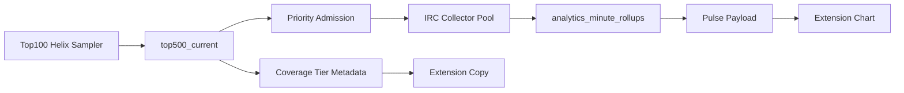

# Top100 Pulse Gap Closure Plan

## Target Contract

Assumption: “Top100 should load perfectly” means Top100 channels should have proactive chat/emote rollups from near stream start, without the user needing to click backfill as the normal path. Non-Top100 channels stay on on-demand tracking and VOD backfill.

- Top100 metadata remains the go-live detector and metadata source: `top500_current` proves `login`, `stream_id`, category, title, viewers, and sampled time.
- Top100 chat/activity requires active IRC collection. Metadata alone cannot produce chat/min or emote/min charts.
- Backfill becomes a repair path for Top100 outages/gaps, not the expected happy path. For non-Top100, backfill remains the normal way to recover earlier chat after a user arrives late.

## Backend Collection Changes

- Make Top100 admission a first-class production lane in `cmd/analytics/main.go`, `internal/analytics/top500_priority_watch.go`, and `internal/config/config.go`.
- Replace the current “cap 10 and stop” behavior with a capacity-aware Top100 governor:
  - Separate `PULSE_TOP100_IRC_TARGET` from `PULSE_MAX_ACTIVE_CHANNELS` so Top100 capacity is explicit.
  - Keep principal/protected channels higher priority, but reserve a minimum slice for Top100 live channels.
  - Emit admission outcomes per channel: admitted, already tracking, cap full, stale metadata, no stream id, evicted, skipped.
- Raise BearHost capacity in stages, not blindly:
  - Stage 1: Top25 live IRC target.
  - Stage 2: Top50 after CPU/RAM/socket/error evidence.
  - Stage 3: Top100 if IRC and DB write rates stay healthy.
- Add multiple IRC sockets or shard tuning if `MAX_CHANNELS_PER_SOCKET` becomes the bottleneck in `internal/analytics/collector.go`.
- Ensure continuous Top100 metadata is not a fragile runtime override:
  - Move approved `TOP500_METADATA_*` and `PULSE_TOP500_ADMISSION_*` flags into the BearHost Pulse profile or a tracked compose overlay.
  - Add a startup/status check that fails loudly when the override file exists but the running container labels/env do not include it.

## API Contract Changes

- Extend `GET /v1/extension/pulse/channels/{login}` in `internal/analytics/extension_api.go` to include Top100 metadata/admission context, not just rollups:
  - `topRosterRank`
  - `topRosterSource`
  - `metadataSampledAt`
  - `admissionState`
  - `admissionReason`
  - `collectorAttachedAt` when known
- Reuse `GetTop500CurrentByLogin` from `internal/analytics/top500_metadata_store.go` in the main Pulse payload, not only the separate `/coverage` route.
- Tighten coverage semantics in `internal/analytics/pulse_coverage.go`:
  - Distinguish viewer-only metadata/rollups from chat/emote rollups.
  - For Top100, return a specific state when metadata was live from start but IRC was not attached, for example `top_roster_waiting_for_collector` or `top_roster_collector_missed`.
  - Do not label viewer-only rows as successful chat/activity coverage.
- Add tests for the exact cases we observed:
  - Top100 metadata fresh, not admitted to IRC, zero chat rollups.
  - Top100 admitted late, missing prefix present.
  - Top100 admitted near stream start, graph loads without backfill CTA.
  - Non-Top100 late arrival still shows backfill/on-demand flow.

## Extension UX Changes

- Update `streamclone-pulse/src/shared/coverageAdapter.ts`, `coverageStatusCopy.ts`, and `src/ui/Overlay.tsx` so Top100 has its own product copy:
  - “Top 100 live detection active” when metadata is present.
  - “Waiting for chat collector slot” when metadata exists but IRC is not attached.
  - “Top 100 collector missed this stream; backfill can repair” only as a degraded state.
- Update `src/ui/LiveStatsBand.tsx` and chart empty states so a Top100 viewer-only payload does not look like a broken chart:
  - Show viewer metadata separately.
  - Say “chat collector has not attached yet” instead of a flat `0 chat/min` graph when all chat/emote counts are zero.
- Wire the existing “Load chat analytics” intent as a distinct action from ordinary manual tracking:
  - For Top100, call a backend “request collector slot” or existing watch endpoint with a TopRoster/user-interest priority bump.
  - For non-Top100, keep “Track channel” and backfill semantics.
- Gate “Load from 0:00” by lane:
  - Top100 happy path: hide it once collector has near-start coverage.
  - Top100 degraded path: show it as “Repair missing chat from VOD.”
  - Non-Top100: keep current “Load missed moments” copy.

## Observability And Ops

- Add Prometheus metrics and logs for the full chain:
  - Top100 live rows sampled.
  - Top100 live rows admitted to IRC.
  - Top100 live rows blocked by cap.
  - Time from Helix live sample to IRC join.
  - Time from stream start to first chat/emote rollup.
  - Top100 streams with zero chat rollups after N minutes live.
- Promote the existing proposed alerts in `deploy/prometheus/alerts/top500-hosted.proposal.yml` and add collector-specific alerts.
- Add a `scripts/top500/top100-readiness-status.sh` probe that summarizes, per Top100 live channel:
  - metadata freshness
  - stream id
  - collector tracking state
  - first chat rollup offset
  - latest chat/emote counts
  - admission block reason
- Run a real soak before calling this done:
  - 24h Top25, then 24h Top50, then 24-48h Top100.
  - Pass criteria: at least 95% of Top100 live minutes get chat/emote collector coverage within the chosen SLA, no DB/IRC instability, no uncontrolled backfill queue growth.

## Implementation Order

1. Add backend admission state and metrics without raising capacity yet. This makes the current failures visible.
2. Add main Pulse payload Top100 metadata/admission context and backend tests.
3. Update extension copy and empty states so metadata-only is honest and actionable.
4. Add the priority slot request path for user-opened Top100 channels.
5. Move continuous metadata/admission config into tracked BearHost deployment config.
6. Run Top25/Top50/Top100 staged soaks and tune collector capacity.
7. Only after soak success, change product copy to promise near-instant Top100 charts.

## Key Files

- Backend sampler/admission: `internal/analytics/top500_metadata_sampler.go`, `internal/analytics/top500_priority_watch.go`, `internal/analytics/collector.go`, `cmd/analytics/main.go`.
- Backend API/coverage: `internal/analytics/extension_api.go`, `internal/analytics/extension_coverage_tier.go`, `internal/analytics/pulse_coverage.go`, `internal/analytics/top500_metadata_store.go`.
- Config/deploy: `internal/config/config.go`, `deploy/env/profile-bearhost-pulse.env`, `scripts/top500/enable-continuous-metadata.sh`, `deploy/prometheus/alerts/top500-hosted.proposal.yml`.
- Extension UI: `streamclone-pulse/src/shared/coverageAdapter.ts`, `streamclone-pulse/src/shared/coverageStatusCopy.ts`, `streamclone-pulse/src/ui/Overlay.tsx`, `streamclone-pulse/src/ui/LiveStatsBand.tsx`, `streamclone-pulse/src/ui/chatActivityEmotes.ts`.

## Risks

- “Perfect for Top100” requires chat collection capacity, not just metadata. If BearHost cannot safely run enough IRC channels, we need either a bigger host, a dedicated collector service, or a stricter SLA like Top25/Top50.
- Twitch IRC/channel behavior may still cause gaps. The plan can minimize delay and make failures visible, but cannot invent chat that was never collected without VOD replay.
- Backfill should remain available as repair, but the UX should stop presenting it as the normal Top100 path once proactive collection is proven.
