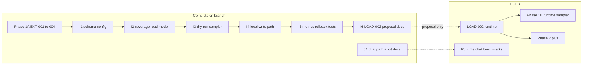

# Top 500 Integration Audit (Phase 1A, I1–I6, J1)

## Guardrail confirmation

**No forbidden operations were run in this audit:**
- Did not run `LOAD-002a`–`002f`
- Did not enable `TOP500_METADATA_ENABLED` or `TOP500_METADATA_WRITE_ENABLED`
- Did not deploy, restart services, mutate BearHost env, raise cap, change workers/scraper concurrency, enqueue corpus/silver/gold, or mutate `backfill_jobs`
- Did not run live Twitch/VOD GQL/raw export/compression benchmarks

**Safe validations executed:**
- Git status/log in both repos
- Docker Go tests (all PASS):
  - `./internal/analytics -run "Top500|ExtensionCoverage|MapExtensionCoverage|AssembleExtensionCoverage|ExtensionHealth"`
  - `./internal/config -run Top500`
  - `./internal/metrics`
- Extension: `npm run typecheck` PASS; focused Vitest **1 FAIL** in working tree (see findings)

---

## Findings (by severity)

### High — uncommitted extension UI breaks Phase 1A metadata-only contract

**Working tree only** (not in last pushed commit `11f4659`):

[`src/ui/pulsePanelLayout.ts`](c:/Users/Aron/streamclone-pulse/src/ui/pulsePanelLayout.ts) was changed to show `LiveStatsBand` when `isTracking && pageIsLive` even under `showAnalyticsModules: false` (`top500_metadata_only`). That violates [`top-500-extension-integration.md` §5.2](c:/Users/Aron/streamclone-pulse/docs/pulse-extension/top-500-extension-integration.md) (“Do not show chat heat sparkline… emote usage rankings”) and fails [`tests/metadataOnlyPanelSections.test.ts`](c:/Users/Aron/streamclone-pulse/tests/metadataOnlyPanelSections.test.ts).

**Committed HEAD** of `pulsePanelLayout.ts` correctly returns all-false sections when `!showAnalyticsModules` — Phase 1A contract is intact on the branch tip.

**Impact:** Local dev shows chat activity/emote UI under metadata-only; CI on pushed commits would not include this regression unless these uncommitted files land.

**Smallest fix:** Revert `pulsePanelLayout.ts` (and the conflicting test in `pulsePanelLayout.test.ts` lines 93–114) to committed behavior, or explicitly scope the override behind a dev flag and update integration docs + both tests.

---

### Medium — docs ledger self-contradicts on infra gates

[`top-500-tasks.md`](c:/Users/Aron/streamclone-pulse/docs/pulse-extension/top-500-tasks.md) summary (line 40) claims **11/11 gates PASS / OPS-003 PASS / Phase 1B design-only READY**, consistent with **Batch B4-G** closeout (lines 429–444).

However, **older gate tables** (lines 231–232, 259–260, 276–277) still say **OBS-001 HOLD** and **OPS-003 HOLD** with text like “no Alertmanager config in repo” — stale relative to committed streamclone observability work:

- [`deploy/docker-compose.observability.yml`](c:/Users/Aron/twitch-7tv-clone/deploy/docker-compose.observability.yml): `--storage.tsdb.retention.time=15d`, Alertmanager service
- [`deploy/alertmanager/alertmanager.yml`](c:/Users/Aron/twitch-7tv-clone/deploy/alertmanager/alertmanager.yml): Discord routing
- [`deploy/prometheus/prometheus-observability.yml`](c:/Users/Aron/twitch-7tv-clone/deploy/prometheus/prometheus-observability.yml): loads [`top500-hosted.yml`](c:/Users/Aron/twitch-7tv-clone/deploy/prometheus/alerts/top500-hosted.yml) (applied, not proposal)

**Smallest fix:** Docs-only pass to strike/supersede stale HOLD rows or add “superseded by B4-G” notes so ledger matches repo + summary table.

---

### Medium — many uncommitted files in both repos blur audit boundary

**streamclone** (`feat/codegraph-smoke-and-tools`): Top500 commits pushed through `b5dd8a0`, but large unrelated dirty tree (analytics backfill, frontend, scripts).

**streamclone-pulse** (`feat/pulse-beacon-portal`): Top500 docs through `11f4659` pushed; **18+ modified extension files** (layout, hydration, api timeout, landing page) are local-only and not part of Phase 1A/I/J batches.

Audit conclusion applies to **committed Top500 work**; working tree changes should not ship with Top500 without separate review.

---

### Low — minor doc/code drift

| Item | Detail |
|------|--------|
| Cache invalidation note | Tasks say coverage cache invalidated on `watchChannel`; code only calls `InvalidateExtensionCoverageCache` from [`pulse_backfill_api.go`](c:/Users/Aron/twitch-7tv-clone/internal/analytics/pulse_backfill_api.go) — doc imprecision, not a runtime bug |
| Alert files | [`top500-hosted.proposal.yml`](c:/Users/Aron/twitch-7tv-clone/deploy/prometheus/alerts/top500-hosted.proposal.yml) marked NOT APPLIED and includes sampler-specific alerts; applied [`top500-hosted.yml`](c:/Users/Aron/twitch-7tv-clone/deploy/prometheus/alerts/top500-hosted.yml) has BFF/coverage/backup/disk + `MetadataSnapshotStale` placeholder — **correct split** per Batch I5 evidence |
| `.env.example` | No `TOP500_*` vars (config defaults live in [`internal/config/config.go`](c:/Users/Aron/twitch-7tv-clone/internal/config/config.go) only) — acceptable; optional doc improvement |
| DB-001 ledger | Still says “no implemented batch insert path” while [`top500_metadata_store.go`](c:/Users/Aron/twitch-7tv-clone/internal/analytics/top500_metadata_store.go) + tests exist — ledger wording stale post I4 |

---

## PASS / FAIL matrix

| Area | Verdict | Rationale |
|------|---------|-----------|
| **Extension contract (committed)** | **PASS** | Tier strings match Go constants; [`coverage.ts`](c:/Users/Aron/streamclone-pulse/src/shared/coverage.ts) / [`coverageAdapter.ts`](c:/Users/Aron/streamclone-pulse/src/shared/coverageAdapter.ts) align with [`extension_coverage_tier.go`](c:/Users/Aron/twitch-7tv-clone/internal/analytics/extension_coverage_tier.go); action labels match integration doc |
| **Extension contract (working tree)** | **FAIL** | Uncommitted `pulsePanelLayout` shows live chat band under metadata-only; Vitest failure |
| **Backend coverage endpoint** | **PASS** | Read-only GET; static test forbids watch/backfill/enqueue paths; reads `top500_current` + rollups only; Redis cache is read-model only |
| **Metadata sampler gates** | **PASS** | Defaults: `ENABLED=false`, `DRY_RUN=true`, `WRITE_ENABLED=false`; writes gated at `cfg.DryRun \|\| !cfg.WriteEnabled`; `TestTop500MetadataSamplerNotWiredInMain` guards `cmd/analytics/main.go`; no `TOP500_*` in `deploy/env/*` |
| **Metrics** | **PASS** | Bounded labels (`result`, `mode`, `operation`, `reason`, `source`); no per-channel labels; registration tests pass |
| **Docs / task ledger** | **PARTIAL** | Phase 1A/I1–I5/J1 status accurate; I6 docs-only complete; LOAD-002 open; Phase 1B/2+ HOLD — but stale infra gate rows contradict summary |
| **Storage boundaries** | **PASS** | [`000044_top500_metadata.up.sql`](c:/Users/Aron/twitch-7tv-clone/migrations/000044_top500_metadata.up.sql) separate tables; sampler uses advisory lock + own store; no `backfill_jobs` in sampler path; Redis documented as cache |
| **Chat benchmark readiness (J1)** | **PASS** | [`chat-benchmark-codepath-audit.md`](c:/Users/Aron/streamclone-pulse/docs/pulse-extension/chat-benchmark-codepath-audit.md) maps IRC/missed-moments/corpus/GQL/rollup/raw paths; metrics gaps documented; runtime benchmarks explicitly HOLD |

---

## Area-by-area verification

### 1. Docs vs implementation state

| Claim | Verified |
|-------|----------|
| Phase 1A implemented | Yes — streamclone `c8c901c`+; pulse `fe16212`+ |
| I1–I5 scaffolding/observability | Yes — commits `0d7bc7d`…`b5dd8a0` |
| I6 LOAD-002 proposal docs-only | Yes — `2e81ec4`, evidence §1344–1348; `[ ] LOAD-002` remains |
| J1 chat audit docs-only | Yes — `11f4659`; METRICS-CHAT-001 implementation HOLD |
| LOAD-002 / Phase 1B runtime HOLD | Yes — no scheduler in main, flags default off |

### 2. Extension/backend contract

- **Route:** `GET /v1/extension/pulse/channels/{login}/coverage` registered in [`extension_api.go`](c:/Users/Aron/twitch-7tv-clone/internal/analytics/extension_api.go); extension fetches via [`fetchChannelCoverage`](c:/Users/Aron/streamclone-pulse/src/background/api.ts)
- **Tiers:** 6 values identical in Go and TS
- **Metadata-only UI (committed):** [`MetadataOnlyPanel`](c:/Users/Aron/streamclone-pulse/src/ui/MetadataOnlyPanel.tsx); [`Overlay.tsx`](c:/Users/Aron/streamclone-pulse/src/ui/Overlay.tsx) gates missed-moments banner and Most Reacted with `showAnalyticsModules !== false`
- **Budget/unknown:** `budget_limited` disables actions; `unknown_or_unsupported` honest labels via adapter
- **Side effects on GET:** No watch/backfill/enqueue/GQL/scraper; optional Redis SET for response cache only

### 3. Top 100 metadata implementation

- Config gates in [`config.go`](c:/Users/Aron/twitch-7tv-clone/internal/config/config.go) lines 188–197
- Write path: transactional store + integration tests; sampler skips writes unless `Enabled && !DryRun && WriteEnabled`
- No production profile enables sampler
- [`TestTop500MetadataSamplerNotWiredInMain`](c:/Users/Aron/twitch-7tv-clone/internal/analytics/top500_metadata_sampler_test.go) confirms no main.go wiring

### 4. Storage boundaries

- `top500_channels`, `top500_live_snapshots`, `top500_current` — separate from corpus/silver/gold
- Raw chat remains planning-only per storage docs; no Top500 path writes `analytics_vod_chat_messages`
- Migration 000044 forward-only (not edited)

### 5. Chat benchmark readiness

J1 audit code-path matrix matches actual entrypoints (`watchChannel`, `PulseBackfillManager`, `backfill_jobs`, GQL sync). Missing metrics list aligns with [`internal/metrics/pulse.go`](c:/Users/Aron/twitch-7tv-clone/internal/metrics/pulse.go) inventory. VOD terminal-state remains design-only (no approved migration).

---

## Test gaps / inconsistencies

| Test | Status |
|------|--------|
| Go Top500/coverage/config/metrics | PASS |
| `coverageTier.test.ts`, `metadataOnlyPanel*.test.tsx` | PASS |
| `metadataOnlyPanelSections.test.ts` | **FAIL** (working tree `pulsePanelLayout` override) |
| `pulsePanelLayout.test.ts` | PASS but **asserts the override** that conflicts with Phase 1A spec |
| Extension E2E coverage contract | Exists (`coverage.contract.test.ts` in streampulse-web; extension has fixtures) — not re-run this pass |
| Cross-repo contract drift check | No automated CI job tying Go response fixtures to TS parser on every PR |

---

## Recommended follow-up batch (smallest safe)

1. **Revert or gate** uncommitted `pulsePanelLayout.ts` metadata-only override; restore green `metadataOnlyPanelSections.test.ts` on committed contract.
2. **Docs-only ledger cleanup** in [`top-500-tasks.md`](c:/Users/Aron/streamclone-pulse/docs/pulse-extension/top-500-tasks.md): supersede stale OBS-001/OPS-003 HOLD rows; fix watch-cache invalidation note; update DB-001 wording post-I4.
3. **Branch hygiene:** keep Top500 commits separate from unrelated dirty work (backfill tuning, landing page, layout debug) before next push.
4. **Optional:** add one extension fixture test importing a frozen JSON sample from Go `TestExtensionCoverageResponseShape` to lock contract drift.

No backend code changes required for Top500 integration correctness on **committed** code.
