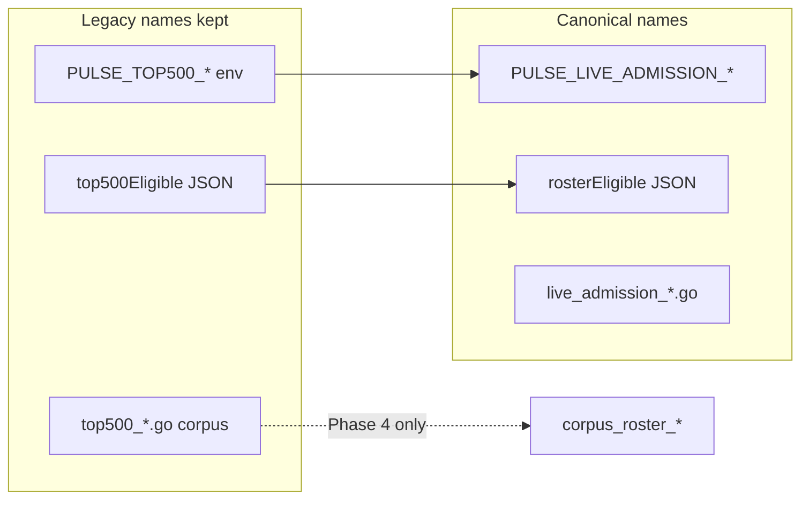

> **HISTORICAL (archived from .cursor/plans).** Not product law. Do not use for routing analytics, ingest, hub, ops, or Pulse work into public Streamclone. See docs/archive/agent-plans/README.md and docs/streampulse-product-boundary.md.
---
name: Top500 naming rename
overview: Rename misleading top500 identifiers to roster/live-admission vocabulary across Go admission code, extension BFF, and client types—while keeping env vars, DB tables, migrations, and Prometheus series backward compatible so hosted ops and dashboards do not break.
todos:
  - id: naming-truth-table
    content: Add docs/pulse-extension/roster-naming-truth-table.md and wire into AGENTS.md + live-coverage + top-roster docs
    status: completed
  - id: live-admission-rename-go
    content: Rename IRC admission files/types to live_admission_*; add PulseLiveAdmission config with PULSE_TOP500/PULSE_TOP_ROSTER env aliases
    status: completed
  - id: bff-roster-eligible
    content: "Extension BFF: rosterEligible + deprecated top500Eligible dual emit; rename extensionRosterEligible helper + contract tests"
    status: completed
  - id: extension-ts-dual-read
    content: "streamclone-pulse: isPulseRosterEligible, rosterEligible field dual-read, rename entry.ts locals + tests"
    status: completed
  - id: coverage-tier-alias
    content: "Optional: roster_metadata_only tier string alias alongside top500_metadata_only"
    status: completed
  - id: verify-rename
    content: Run Go + extension tests; curl pulse payload for dual JSON fields
    status: completed
isProject: false
---

# Top500 → roster naming (full rename, backward compatible)

## Deploy first (cap-tier slice — already implemented)

Before or in parallel with rename work, hosted ops should apply:

```bash
PULSE_TOP500_ADMISSION_INTERVAL=30s
PULSE_PROTECTED_GOLIVE_INTERVAL=30s
```

Restart **analytics** container; reload extension in Chrome. These env keys stay valid through the rename (aliases preserved).

---

## Opinion: do we need file renames?

**Yes, but not a blind global sweep.** `top500` in this repo means **three different things**:

| Domain | What it actually is | Rename priority |
|--------|---------------------|-----------------|
| **IRC live admission** | Helix top-live poll → IRC join; N = `LIVE_ADMISSION_TOP_N` / IRC cap (250 hosted), not 500 | **High** — main agent confusion |
| **Extension eligibility** | `top500Eligible` = “channel is on Pulse roster / in cap tier” | **High** — BFF + TS |
| **Corpus metadata plane** | `Top500MetadataSampler`, silver/gold gates; N = `CORPUS_TARGET_TOP_N` (up to 1000) | **Medium** — separate subsystem; keep DB table names |
| **Applied migrations / PG tables** | `000044_top500_metadata`, etc. | **Do not rename** |
| **Prometheus (admission)** | Already `streamclone_top_roster_admission_*` in [`internal/metrics/top500_admission.go`](c:/Users/Aron/twitch-7tv-clone/internal/metrics/top500_admission.go) | **Low** — metrics OK; rename file only |

Wholesale renaming all 45 `top500*.go` files would break agent muscle memory in the wrong direction unless paired with a vocabulary doc. Prefer **phased renames + aliases** over delete-and-replace.

---

## Vocabulary (target truth for agents)

Add [`docs/pulse-extension/roster-naming-truth-table.md`](c:/Users/Aron/twitch-7tv-clone/docs/pulse-extension/roster-naming-truth-table.md) (mirror [`ops-migration-truth-table.md`](c:/Users/Aron/twitch-7tv-clone/docs/ops-migration-truth-table.md)):

- **Live admission roster** — IRC cap-tier channels (`PULSE_TOP500_ADMISSION_*` legacy env → canonical **`PULSE_LIVE_ADMISSION_*`**)
- **Corpus metadata roster** — metadata sampling tier (`TOP500_METADATA_*` legacy → **`CORPUS_ROSTER_METADATA_*`** alias)
- **Extension field** — `rosterEligible` (legacy JSON `top500Eligible` still emitted one release)
- **Never assume N=500** — check `LIVE_ADMISSION_TOP_N`, `PULSE_MAX_ACTIVE_CHANNELS`, `CORPUS_TARGET_TOP_N`

Wire pointers from [`AGENTS.md`](c:/Users/Aron/twitch-7tv-clone/AGENTS.md), [`live-coverage-requirements.md`](c:/Users/Aron/streamclone-pulse/docs/pulse-extension/live-coverage-requirements.md), and [`top-roster-awareness-requirements.md`](c:/Users/Aron/twitch-7tv-clone/docs/pulse-extension/top-roster-awareness-requirements.md).

---

## Phase 1 — IRC live admission (Go)

**Goal:** File and type names match behavior; env stays backward compatible.

### File renames (git mv)

| Current | New |
|---------|-----|
| [`top500_priority_watch.go`](c:/Users/Aron/twitch-7tv-clone/internal/analytics/top500_priority_watch.go) | `live_admission_poller.go` |
| [`top500_priority_watch_test.go`](c:/Users/Aron/twitch-7tv-clone/internal/analytics/top500_priority_watch_test.go) | `live_admission_poller_test.go` |
| [`top500_live_admission.go`](c:/Users/Aron/twitch-7tv-clone/internal/analytics/top500_live_admission.go) | `live_admission_source.go` |
| [`top500_admission_*.go`](c:/Users/Aron/twitch-7tv-clone/internal/analytics/) | `live_admission_*.go` |
| [`internal/metrics/top500_admission.go`](c:/Users/Aron/twitch-7tv-clone/internal/metrics/top500_admission.go) | `live_admission_metrics.go` |

### Type renames (with deprecated type aliases in same package for one release)

```go
// live_admission_poller.go
type LiveAdmissionPoller struct { ... } // was Top500PriorityWatchPoller
type Top500PriorityWatchPoller = LiveAdmissionPoller // deprecated alias
```

Same pattern for `StartLiveAdmissionPoller`, `NewLiveAdmissionPoller`.

### Config ([`internal/config/config.go`](c:/Users/Aron/twitch-7tv-clone/internal/config/config.go))

- Add canonical struct fields: `PulseLiveAdmissionEnabled`, `PulseLiveAdmissionTopN`, `PulseLiveAdmissionInterval`, …
- Map env: **`PULSE_LIVE_ADMISSION_*`** (new primary) + existing **`PULSE_TOP500_*`** + **`PULSE_TOP_ROSTER_*`** via `applyEnvAlias` (extend current block at L398–404)
- Deprecated Go field aliases: `PulseTop500AdmissionEnabled = PulseLiveAdmissionEnabled` pattern OR embed + deprecated getters — pick one, document in truth table
- Update [`profile-hosted-pulse-live-250.env.example`](c:/Users/Aron/twitch-7tv-clone/deploy/env/profile-hosted-pulse-live-250.env.example) to show **both** keys with comment “legacy top500 name kept for ops overlays”

### Call sites

- [`cmd/analytics/main.go`](c:/Users/Aron/twitch-7tv-clone/cmd/analytics/main.go) — wire `LiveAdmissionPoller`
- [`pulse_collector_lease_manager.go`](c:/Users/Aron/twitch-7tv-clone/internal/analytics/pulse_collector_lease_manager.go) — comment only

**Out of scope:** rename `Top500Current` / metadata store (Phase 2).

---

## Phase 2 — Extension BFF + client (streamclone + streamclone-pulse)

### Backend [`extension_api.go`](c:/Users/Aron/twitch-7tv-clone/internal/analytics/extension_api.go)

- Rename `Top500Eligible` → `RosterEligible` with JSON:

```go
RosterEligible bool `json:"rosterEligible"`
// Deprecated: legacy clients; remove after 2026-Q4
Top500Eligible bool `json:"top500Eligible,omitempty"`
```

- Set **both** fields to the same value on every pulse payload response (contract test in [`extension_api_reconcile_test.go`](c:/Users/Aron/twitch-7tv-clone/internal/analytics/extension_api_reconcile_test.go))
- Rename helper `extensionTop500Eligible` → `extensionRosterEligible`

### Extension TS ([`streamclone-pulse`](c:/Users/Aron/streamclone-pulse))

| Current | New |
|---------|-----|
| `isPulseTop500Supported` | `isPulseRosterEligible` (+ deprecated export alias) |
| `top500Eligible` in [`messages.ts`](c:/Users/Aron/streamclone-pulse/src/shared/messages.ts) | `rosterEligible` primary; read `top500Eligible ?? rosterEligible` |
| `lastTop500Eligible` in [`entry.ts`](c:/Users/Aron/streamclone-pulse/src/content/entry.ts) | `lastRosterEligible` |

Update tests: [`pulseEligibility.test.ts`](c:/Users/Aron/streamclone-pulse/tests/pulseEligibility.test.ts), [`resolvePulseLiveAccess.test.ts`](c:/Users/Aron/streamclone-pulse/tests/resolvePulseLiveAccess.test.ts).

---

## Phase 3 — Coverage tier strings (optional same PR if small)

In [`extension_coverage_tier.go`](c:/Users/Aron/twitch-7tv-clone/internal/analytics/extension_coverage_tier.go):

- Add `CoverageTierRosterMetadataOnly = "roster_metadata_only"`
- Keep emitting `top500_metadata_only` as **alias** in API responses until portal/extension migrate
- Update [`extension_coverage_tier_test.go`](c:/Users/Aron/twitch-7tv-clone/internal/analytics/extension_coverage_tier_test.go)

---

## Phase 4 — Corpus metadata (defer if PR too large)

Only if Phase 1–3 merge cleanly:

- Rename Go types `Top500MetadataSampler` → `CorpusRosterMetadataSampler` with type aliases
- Add env aliases `CORPUS_ROSTER_METADATA_*` → `TOP500_METADATA_*`
- **Do not** rename SQL tables, migration files, or archive paths

Treat as separate PR to avoid blocking admission rename.

---

## Explicit non-goals (avoid agent/regression traps)

- No migration file renames (`migrations/000044_top500_metadata.up.sql`)
- No Prometheus metric name changes for series already named `top_roster_*`
- No breaking removal of `PULSE_TOP500_*` env vars in streampulse-ops overlays
- No rename of [`isPulseTop500Supported`](c:/Users/Aron/streamclone-pulse/src/ui/pulseEligibility.ts) without dual-read period



---

## Verification

| Check | Command |
|-------|---------|
| Go admission tests | `go test ./internal/analytics/ -run 'Admission|PriorityWatch|LiveAdmission|Top500Priority' -count=1` |
| Config aliases | `go test ./internal/config/ -run 'Admission|Top500|LiveAdmission' -count=1` |
| Extension contract | `go test ./internal/analytics/ -run 'Extension|CoverageTier' -count=1` |
| Pulse extension | `cd streamclone-pulse && npm test && npm run typecheck && npm run build` |
| Agent doc | `make context-verify` (if rules updated) |

Manual: `curl …/v1/extension/pulse/channels/{login}` returns **both** `rosterEligible` and `top500Eligible` with matching values.

---

## Suggested PR split

1. **PR A (this week):** Phase 1 + truth table + deploy note in runbook
2. **PR B:** Phase 2 extension BFF + TS dual-read
3. **PR C (optional):** Phase 3–4 corpus metadata type aliases

This delivers the “full rename” you asked for where agents are most misled (admission + eligibility), without a risky monolithic 45-file churn.
