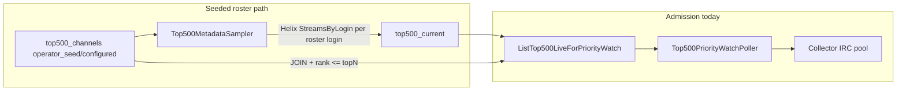

> **HISTORICAL (archived from .cursor/plans).** Not product law. Do not use for routing analytics, ingest, hub, ops, or Pulse work into public Streamclone. See docs/archive/agent-plans/README.md and docs/streampulse-product-boundary.md.
---
name: True top-live IRC admission
overview: Switch Pulse IRC admission from seeded-roster filtering (`top500_channels.rank`) to Helix paginated `/streams` (true current top-live by viewers), optimize the poller hot loop, add focused tests, and stage prod caps 100→200→500 without schema migration.
todos:
  - id: helix-top-live
    content: Add TopLiveStreams to internal/analytics/helix.go with unit test
    status: completed
  - id: admission-source
    content: Create top500_live_admission.go (Helix + roster sources, factory, config enum)
    status: completed
  - id: poller-opt
    content: "Refactor top500_priority_watch.go: use LiveAdmissionSource, single snapshot + tracked set, no per-row resnapshot"
    status: completed
  - id: readiness-align
    content: Switch top500_readiness.go to same LiveAdmissionSource for hub honesty
    status: completed
  - id: wire-main
    content: Wire provider in cmd/analytics/main.go
    status: completed
  - id: tests
    content: "Add tests: viewer order, non-roster admission, cap, duplicate stream, protected preempt"
    status: completed
  - id: verify
    content: Run narrow go test filters then check-quick
    status: completed
isProject: false
---

# True top-live IRC admission

## Current state (confirmed)

Admission is **roster-based**, not true top-live:



Evidence:

- [`top500_metadata_sampler.go`](c:\Users\Aron\twitch-7tv-clone\internal\analytics\top500_metadata_sampler.go) loads `ListEnabledTop500Channels` (roster only) and polls via `StreamsByLogin` — never `TopLiveStreams`.
- [`top500_metadata_store.go`](c:\Users\Aron\twitch-7tv-clone\internal\analytics\top500_metadata_store.go) `ListTop500LiveForPriorityWatch` (L499–520) **INNER JOINs** `top500_channels`, filters `ch.rank <= $1`, then orders by `viewer_count`. A channel outside the seeded roster never appears; a seeded rank-600 streamer who is live is excluded even if they are top-live globally.
- `top500_current.rank` is copied from roster seed rank in `buildTop500MetadataSamples`, not from live leaderboard position.
- Schema [`000044_top500_metadata.up.sql`](c:\Users\Aron\twitch-7tv-clone\migrations\000044_top500_metadata.up.sql) restricts `top500_channels.source` to `operator_seed` | `configured` — corpus/archive paths stay roster-centric by design.

**True top-live infrastructure already exists** in metadata:

- [`internal/metadata/helix/helix.go`](c:\Users\Aron\twitch-7tv-clone\internal\metadata\helix\helix.go) `TopLiveStreams` — paginated `GET /streams` sorted by viewers.
- [`internal/metadata/api/api.go`](c:\Users\Aron\twitch-7tv-clone\internal\metadata\api\api.go) uses it for `/v1/streams` when `limit > pageSize`.

Analytics [`HelixClient`](c:\Users\Aron\twitch-7tv-clone\internal\analytics\helix.go) has `StreamsByLogin` only — no `TopLiveStreams` yet.

**Prod routing note:** [`deploy/Caddyfile.pulse-api`](c:\Users\Aron\twitch-7tv-clone\deploy\Caddyfile.pulse-api) does **not** expose `/v1/streams` publicly (metadata matcher is `/v1/channels/*` and `/v1/metadata/*` only). Admission should call Helix **inside analytics**, not via public `/v1/streams`.

---

## Recommended approach: Path A (smallest, safest)

**Add a Helix top-live admission source for the poller (and readiness), keep roster tables intact for corpus/silver/bronze.**

Why not Path B (refresh `top500_current` from top-live first):

- Would either require a new `top500_channels` source value + migration, or orphan rows that break validation helpers.
- Metadata sampler batching (`BatchSize=100`) cannot refresh 500 live leaders every 60s without redesign.
- Admission-only Helix fetch is ~5 Helix pages/min at N=500 — cheap and deterministic.

### New env knob (no migration)

Add to [`internal/config/config.go`](c:\Users\Aron\twitch-7tv-clone\internal\config\config.go):

| Env | Default | Meaning |
|-----|---------|---------|
| `PULSE_TOP500_ADMISSION_SOURCE` | `helix_top_live` | `helix_top_live` = true leaderboard; `roster` = legacy SQL join |

Fallback: if Helix creds missing and source is `helix_top_live`, log + degrade to `roster` (or skip cycle) — do not silently admit wrong set.

Existing knobs unchanged: `PULSE_TOP500_ADMISSION_ENABLED`, `PULSE_TOP500_ADMISSION_TOP_N`, `LIVE_ADMISSION_TOP_N`, `PULSE_TOP500_ADMISSION_INTERVAL`.

---

## Implementation steps

### 1. Add `TopLiveStreams` to analytics Helix client

**File:** [`internal/analytics/helix.go`](c:\Users\Aron\twitch-7tv-clone\internal\analytics\helix.go)

- Port pagination logic from [`internal/metadata/helix/helix.go`](c:\Users\Aron\twitch-7tv-clone\internal\metadata\helix\helix.go) L155–220.
- Return `[]LiveStream` in **viewer order** (Helix default for unpaginated `/streams`).
- Unit test with stub HTTP: order preserved, dedupe by login, partial page tolerance.

### 2. New admission candidate provider

**New file:** `internal/analytics/top500_live_admission.go`

```go
type LiveAdmissionSource interface {
    ListLiveCandidates(ctx context.Context, topN int) ([]Top500Current, error)
}
```

Implementations:

- `HelixTopLiveAdmissionSource` — `TopLiveStreams(topN)` → map to `Top500Current` with `Rank = index+1`, `IsLive=true`, `CoverageSource=helix`, `SampledAt=now`.
- `RosterTopLiveAdmissionSource` — delegate to existing `Store.ListTop500LiveForPriorityWatch` (legacy).

Factory: `NewLiveAdmissionSource(cfg, store, helix)`.

### 3. Wire poller to provider

**Files:** [`top500_priority_watch.go`](c:\Users\Aron\twitch-7tv-clone\internal\analytics\top500_priority_watch.go), [`cmd/analytics/main.go`](c:\Users\Aron\twitch-7tv-clone\cmd\analytics\main.go)

- Extend `Top500PriorityWatchPoller` with `source LiveAdmissionSource` (replace narrow `top500PriorityWatchStore` interface).
- `runOnce`: `live, err := p.source.ListLiveCandidates(ctx, topN)`.

### 4. Optimize `runOnce` (requested)

**File:** [`top500_priority_watch.go`](c:\Users\Aron\twitch-7tv-clone\internal\analytics\top500_priority_watch.go)

Current waste:

- L96: one `TrackingSnapshot()` — OK.
- L135: **repeated** `TrackingSnapshot()` per admitted row (sorts/copies all tracked logins).

Changes:

- Take **one** snapshot at cycle start; build `trackedLoginSet map[string]struct{}` from `snap.TrackedChannels`.
- Track local `active := snap.Active` and increment on successful admission; **do not** re-snapshot in loop.
- Refactor `classifyTopRosterCandidate` to accept `trackedLoginSet` + `Collector.TrackedStreamID` (O(1) per row; stream ID not in snapshot today).
- `buildTopRosterAdmissionAttempt`: use set membership instead of `containsString(snap.TrackedChannels, login)`.
- Optional small helper on Collector: `TrackedLoginSet() map[string]struct{}` under one lock if we want to avoid building from snapshot slice.

### 5. Align readiness / hub honesty

**File:** [`top500_readiness.go`](c:\Users\Aron\twitch-7tv-clone\internal\analytics\top500_readiness.go) L94

- Replace direct `h.store.ListTop500LiveForPriorityWatch` with same `LiveAdmissionSource` built from `h.appConfig` + `h.helix` + `h.store`.
- Ensures hub/readiness “live rows” match what admission actually considers when `helix_top_live` is on.

**Leave** metadata sampler + `top500_channels` untouched for corpus/bronze/silver gate.

### 6. IRC / capacity review (no blind cap raises in code)

| Knob | Default | Role at scale |
|------|---------|---------------|
| `PULSE_MAX_ACTIVE_CHANNELS` | 0 (falls back) | **Effective IRC pool cap** when set ([`cmd/analytics/main.go`](c:\Users\Aron\twitch-7tv-clone\cmd\analytics\main.go) L176–178) |
| `MAX_CONCURRENT_TRACKED_CHANNELS` | 50 | Fallback cap |
| `MAX_CHANNELS_PER_SOCKET` | 30 | IRC fan-out: N=500 → ~17 WebSockets |

Priority preemption (already correct — extend poller tests only):

- [`pulse_tracking_priority.go`](c:\Users\Aron\twitch-7tv-clone\internal\analytics\pulse_tracking_priority.go): top-roster cannot preempt manual/protected.
- [`collector_priority_test.go`](c:\Users\Aron\twitch-7tv-clone\internal\analytics\collector_priority_test.go): protected/manual behavior covered.

`HandleIRCLine` ([`collector.go`](c:\Users\Aron\twitch-7tv-clone\internal\analytics\collector.go) L626–644): early return if no `streamID`; per-line enrich + `addChat` — scales with chat rate, not channel count alone. No change needed; monitor p95 under staged rollout.

IRC reconnect ([`ircconn.go`](c:\Users\Aron\twitch-7tv-clone\internal\chat\ircconn\ircconn.go) L180–257): re-dials and re-JOINs all channels on a dead socket — at 17 sockets, isolated failure domains; acceptable.

---

## Tests (focused)

**New/extended in `internal/analytics/`:**

| Test | Proves |
|------|--------|
| `TestHelixTopLiveStreamsPreservesViewerOrder` | Helix client maps pagination in viewer order |
| `TestHelixTopLiveAdmissionSource_RankByViewer` | Rank 1 = highest viewers |
| `TestTop500PriorityWatch_AdmitsNonRosterTopLive` | Streamer absent from fake roster store but returned by fake Helix source is admitted |
| `TestTop500PriorityWatch_StopsAtCapacity` | (extend existing) still stops at cap=1 |
| `TestTop500PriorityWatch_SkipsDuplicateStream` | same stream_id already tracked |
| `TestTop500PriorityWatch_ProtectedPreemptsTopLive` | poller admits top-live; protected `WatchWithPriority` still preempts |
| `TestTop500PriorityWatch_NoResnapshotPerRow` | optional: spy/mock ensuring single snapshot per cycle |

Use existing fakes pattern from [`top500_priority_watch_test.go`](c:\Users\Aron\twitch-7tv-clone\internal\analytics\top500_priority_watch_test.go).

**Run order:**

```powershell
go test ./internal/analytics/ -run 'Top500Priority|HelixTopLive|TopRoster|ProtectedChannel' -count=1
go test ./internal/analytics/ -run 'Top500Metadata|collector_priority' -count=1
go test ./internal/config/ -count=1
```

Broader (if stack available): `make check-quick`.

---

## Rollout recommendation (prod — streampulse-ops, not this repo)

Staged env changes on hosted analytics worker only:

| Phase | `PULSE_TOP500_ADMISSION_TOP_N` | `PULSE_MAX_ACTIVE_CHANNELS` | `MAX_CHANNELS_PER_SOCKET` | Notes |
|-------|-------------------------------|------------------------------|---------------------------|-------|
| 1 | 100 | 100 | 30 | Enable `PULSE_TOP500_ADMISSION_SOURCE=helix_top_live`; watch `TopRosterAdmission*` metrics + hub deficit |
| 2 | 200 | 200 | 30 | Verify IRC socket count (~7), Helix 429 rate |
| 3 | 500 | 500 | 30–50 | Target state; consider `50` per socket → ~10 IRC connections |

Keep unchanged until stable:

- `top500_channels` roster seeding for archive/corpus
- `TOP500_METADATA_*` sampler (roster metadata, not admission)
- `PULSE_MAX_BACKFILLS`, `PULSE_MAX_CHANNELS_PER_PRINCIPAL`

**Read-only prod probes (safe):**

```bash
curl -s https://api.streampulse.stream/v1/extension/health
curl -s https://api.streampulse.stream/v1/public/hub | head -c 500
```

Do **not** hit `/watch`, backfill enqueue, or admin routes on prod.

**Local verification:**

```bash
curl -s http://localhost:8090/v1/extension/health
# Helix top-live via metadata (full Caddy only):
curl -s "http://localhost:8090/v1/streams?limit=10"
```

---

## Files touched (narrow diff)

| File | Change |
|------|--------|
| [`internal/analytics/helix.go`](c:\Users\Aron\twitch-7tv-clone\internal\analytics\helix.go) | `TopLiveStreams` |
| `internal/analytics/top500_live_admission.go` | new provider + factory |
| [`internal/analytics/top500_priority_watch.go`](c:\Users\Aron\twitch-7tv-clone\internal\analytics\top500_priority_watch.go) | provider wiring + loop optimization |
| [`internal/analytics/top500_readiness.go`](c:\Users\Aron\twitch-7tv-clone\internal\analytics\top500_readiness.go) | shared live source |
| [`internal/config/config.go`](c:\Users\Aron\twitch-7tv-clone\internal\config\config.go) | `PulseTop500AdmissionSource` enum |
| [`cmd/analytics/main.go`](c:\Users\Aron\twitch-7tv-clone\cmd\analytics\main.go) | inject source into poller |
| `internal/analytics/*_test.go` | new/extended tests |

**Explicitly not changing:** applied migrations, `top500_metadata_sampler.go` roster loop, streampulse-ops env files, production caps in source defaults.
