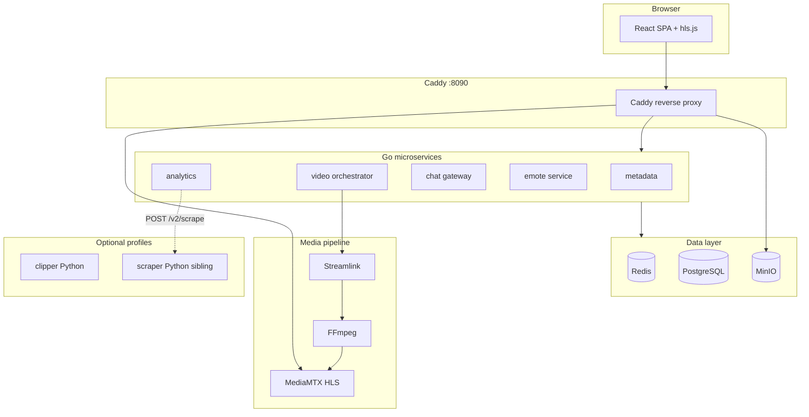

# Streamclone — Comprehensive Review Brief for External Review

**Purpose:** This document is a self-contained briefing for a stronger model (or senior engineer) to **review, critique, and recommend improvements** across the entire Streamclone program — product, architecture, code quality, security, reliability, performance, testing, UX, operations, and legal risk.

**How to use this brief:** Treat this as your primary context. Follow file paths into the repo for implementation detail. Run the benchmark and smoke scripts where feasible. Structure your response using the **Deliverables** section at the end.

**Repository:** [github.com/Aron-Chu/streamclone](https://github.com/Aron-Chu/streamclone)
**Sibling repo (optional profile):** [streamclone-scraper](https://github.com/Aron-Chu/streamclone-scraper)
**Canonical local URL:** `http://localhost:8090/`
**License:** Apache 2.0

**Related brief (install/infra only):** [`docs/infrastructure-review-brief.md`](infrastructure-review-brief.md) — use that for deep install, Compose layering, and desktop distribution critique; this document covers the full product.

---

## 1. Executive Context

### What Streamclone is

Streamclone is a **self-hosted Twitch-style directory** that mirrors the core viewing loop without ads:

| Capability | Summary |
|------------|---------|
| **Directory** | Live channel browse, search, insights — Metadata service + Twitch internal GraphQL |
| **Playback** | On-demand HLS relay — Streamlink/FFmpeg → MediaMTX, browser via hls.js |
| **Chat** | Anonymous IRC read; optional Twitch OAuth send (loopback-only device-code) |
| **Emotes** | 7TV + FFZ channel loading, libvips WebP rendering, MinIO CDN, Redis dictionaries |
| **Analytics** | Per-minute viewer/chat/emote rollups, VOD sync, TwitchTracker charts |
| **Clip Studio** (optional) | Vertical clip rendering, ASR captions, spike detection — Python `clipper/` |
| **Scraper** (optional) | Camoufox browser automation for TwitchTracker — sibling repo |

### Design north star

A non-technical user with **Docker Desktop only** can install from a release EXE/ZIP, open the directory, and watch streams **without Twitch login**. Login is optional (chat badges, follows, Clip Studio).

### What it is not

- Not a static site or single binary
- Not affiliated with Twitch or 7TV
- Not a managed SaaS — operator owns VM, secrets, compliance
- Not deployable to Vercel/Netlify/GitHub Pages

### Stack at a glance

```
Browser :8090 → Caddy → frontend (React), metadata, video, chat, emote, analytics, MediaMTX, MinIO
PostgreSQL + Redis behind Go microservices; optional Python clipper + scraper workers
```

---

## 2. Architecture Map (for orientation)



### Service boundary principles (from steering)

- **Go services** are I/O-bound glue around upstream Twitch and subprocess media tools — not in-process HLS download
- **Upstream access stays server-side** — browser never calls Twitch/7TV directly
- **Single-origin contract** — cookies, WebSocket, HLS, auth aligned through Caddy on `:8090`
- **Scraper isolated** in sibling repo — browser automation, large deps, deadlocks
- **Clipper isolated** in `clipper/` — own SQLite, queue, render pipeline

### Known duplication debt (called out in steering — review these)

| Duplicated concern | Locations | Steering recommendation |
|--------------------|-----------|-------------------------|
| Twitch IRC pools | `cmd/chat`, `cmd/analytics`, `clipper/liveclipper/irc.py` | Consolidate before adding more IRC clients |
| Twitch Helix clients | `internal/metadata/helix`, `internal/analytics/helix`, `clipper/liveclipper/twitch.py` | Extract `internal/twitch/helix` |
| TwitchTracker scrape | `internal/analytics/sync.go`, `internal/metadata/api/api.go` | Shared scrape client? |
| GQL clients | `internal/metadata/gql`, analytics sync paths | Consolidate? |

---

## 3. Review Domains & Questions

For each domain below: **read the cited paths**, assess correctness and maintainability, identify risks, and propose concrete improvements ranked by impact vs. effort.

---

### 3.1 Product & UX

**Key files:** `frontend/src/App.tsx`, `Directory.tsx`, `Channel.tsx`, `Chat.tsx`, `Analytics.tsx`, `ClipStudio.tsx`, `.kiro/steering/product.md`

**Questions:**

1. Does the product deliver a credible Twitch-style viewing loop for a self-hoster? What feels missing vs. Twitch/Streamlink-only workflows?
2. Is the **channel workspace** (playback controls, requested vs. loaded quality, diagnostics, LSF, emote management, Comfort/Dense density) coherent and discoverable?
3. Is the **Analytics** experience understandable — sync states, "Stats only" vs. "Synced", stream sidebar routing (`/analytics/{login}/{streamId}`)?
4. Is **Clip Studio** integration (`/studio/:jobId`) appropriately scoped as optional, or does it confuse the core product?
5. Are error and degradation states honest? (stale metadata, structured stream errors, chat reconnects, emote processing states)
6. Is the **Settings** and **ServiceStatusBanner** UX sufficient for non-technical users diagnosing a broken stack?
7. Does the localhost-only **token import** affordance (`LocalTokenImportButton.tsx`, `GET /v1/me` → `canImportLocalToken`) create confusion when users try tunnels/public deploy?
8. Accessibility: keyboard nav, screen reader support, color contrast, chat readability at scale?
9. Mobile/responsive: is any mobile support intentional or should it be explicitly out of scope?

**Deliverable ask:** Top 10 UX improvements with severity (blocker / annoyance / polish) and estimated effort.

---

### 3.2 Frontend Architecture (React + TypeScript)

**Key files:** `frontend/src/`, `frontend/src/playback.ts`, `frontend/package.json`, nginx `/config.js` runtime config

**Questions:**

1. Is the component structure maintainable at current scale (~23 TSX files)? When should state move to dedicated stores vs. component-local?
2. Is **Zustand** used consistently? Are there prop-drilling or duplicate fetch patterns?
3. Is **hls.js** integration robust — recovery from 401 session issues, quality switching, diagnostics alignment with backend?
4. Is runtime config via `/config.js` (`VITE_*=auto`) the right pattern vs. build-time env?
5. Are API client patterns consistent (error handling, retries, abort controllers)?
6. **Test gap:** CI only runs `npm run build` — no unit tests in CI. Frontend has Playwright smoke (`e2e/smoke-core.spec.ts`) and small `tests/*.test.ts` — is coverage adequate?
7. Bundle size, code splitting, lazy routes for Clip Studio / Analytics?
8. Type safety: are API response types shared or duplicated from backend?

**Deliverable ask:** Frontend architecture score (1–10), top 5 refactors, recommended testing strategy.

---

### 3.3 Video / HLS Playback Pipeline

**Key files:** `internal/video/orchestrator/`, `internal/video/worker/`, `internal/video/token/`, `internal/video/usher/`, `deploy/mediamtx.yml`, `deploy/Caddyfile.local-tunnel`, `.kiro/steering/playback.md`

**Questions:**

1. Is the **Streamlink → FFmpeg → MediaMTX RTMP** path the right default? When should `direct_hls` fallback trigger?
2. Is the **MediaMTX 1.18+ HLS session + `hlsCDNSecret` + Caddy Bearer** workaround sound for HTTP localhost? Any cleaner alternatives?
3. Worker supervision: crash recovery, zombie processes, resource limits, concurrent stream caps?
4. **Cold-start latency:** run `scripts/benchmark-hls-start.ps1` — is <20s acceptable? What bottlenecks exist (token fetch, Streamlink handshake, FFmpeg publish)?
5. Quality selection: does frontend reflect **backend-discovered renditions** vs. static presets correctly?
6. `/v1/stream/proxy` — security implications if exposed beyond localhost?
7. Concurrent viewers on one relay — MediaMTX fan-out limits on 8 GB RAM?
8. Subprocess safety: argv slices vs. shell injection (steering says argv — verify all spawn sites)?

**Deliverable ask:** Playback reliability score, failure-mode matrix, recommended observability metrics.

---

### 3.4 Chat Gateway

**Key files:** `internal/chat/hub/`, `internal/chat/ircconn/`, `internal/chat/parse/`, `internal/chat/enrich/`, `internal/chat/batch/`, `internal/chat/auth/`, `frontend/src/components/Chat.tsx`

**Questions:**

1. Is the **IRC → parse → enrich → batch → WebSocket** pipeline correct and performant at high message rates?
2. IRC connection pooling, reconnect backoff, PING/PONG handling — any edge cases?
3. **Emote enrichment** via Redis Trie — race conditions when dictionary reloads mid-message?
4. Chat **batching** tradeoffs: latency vs. frame efficiency?
5. WebSocket hub: per-client session isolation, backpressure, max connections?
6. **Duplicate IRC** with analytics collector — quantify upstream connection waste; propose consolidation design.
7. Anonymous read vs. authenticated send — is the auth boundary clean?
8. XSS safety: chat rendered as plain text, not innerHTML — verify all render paths.

**Deliverable ask:** Chat scalability estimate (messages/sec, concurrent viewers), consolidation proposal for IRC pools.

---

### 3.5 Emote Pipeline

**Key files:** `internal/emote/`, `internal/chat/tokenize/`, `internal/chat/enrich/`, `.kiro/steering/emote-pipeline.md`, `.kiro/specs/emote-tokenizer-roadmap.md`

**Questions:**

1. Is the **ensure → seed → worker → dictionary rebuild** flow correct? Race where pending emotes appear in hot dictionary?
2. **7TV + FFZ** provider loading — error handling, rate limits, partial failures?
3. **libvips WebP** rendering — quality, scale factors (1x–4x), failure retries (3 attempts)?
4. **Tokenizer** is whitespace whole-word Trie — is this sufficient? Roadmap calls for Aho-Corasick, punctuation-adjacent emotes, lazy hydration — prioritize?
5. Missing: native Twitch emotes from IRC `emotes` tag, FFZ globals, 7TV EventAPI SSE — impact on product credibility?
6. MinIO CDN at `/emotes/*` — cache headers, cache invalidation on emote update?
7. Curator API (`CURATOR_API_TOKEN`) — safe defaults, write path validation?

**Deliverable ask:** Emote pipeline maturity score, roadmap prioritization (top 5 items).

---

### 3.6 Analytics & VOD Sync

**Key files:** `internal/analytics/`, `frontend/src/components/Analytics.tsx`, `.kiro/steering/analytics.md`, `docs/scraper-cloudflare-and-proxy.md`

**Questions:**

1. Is the **rollup merge logic** (`mergeMinuteRollups`, `consolidateRollupsByMinute`) correct? Review tests in `internal/analytics/*_test.go`.
2. **Live collector** vs. **VOD sync** — consistency, duplicate minute rows, merge rules?
3. **TwitchTracker scrape** path: direct HTTP → Camoufox scraper fallback — is `useProxy: false` permanently correct per June 2026 benchmarks?
4. **GQL VOD comment sync** — parallelism (`ANALYTICS_VOD_GQL_CONCURRENCY`), page delays, 200k comment cap — scalability and Twitch rate-limit risk?
5. **Chat coverage** and **viewer coverage** metrics — are they meaningful to users?
6. **Sync status API** (`syncing` fallback, sparse stream rows) — UX correctness during long syncs?
7. **Emote images in analytics charts** — local emote-service IDs vs. 7TV CDN IDs — any broken image paths?
8. Run `scripts/benchmark-analytics-load.ps1` — API latency and payload sizes acceptable?

**Deliverable ask:** Analytics accuracy trust score, data pipeline diagram critique, scraper dependency risk assessment.

---

### 3.7 Metadata & Directory

**Key files:** `internal/metadata/api/`, `internal/metadata/gql/`, `internal/metadata/cache/`, `internal/metadata/helix/`, `frontend/src/components/Directory.tsx`

**Questions:**

1. **Twitch internal GraphQL** usage — stability, schema drift risk, caching strategy?
2. **Redis cache** TTLs and invalidation — stale directory data acceptable?
3. **Reddit LSF** multi-provider fallback chain — is auto-failover robust?
4. **YouTube** integration (`youtube.go`) — scope and maintenance burden?
5. Search and pagination — input validation, rate limiting?
6. Insights endpoint performance under load?

**Deliverable ask:** Upstream dependency risk matrix (Twitch GQL, Helix, 7TV, FFZ, Reddit, TwitchTracker).

---

### 3.8 Clipper / Clip Studio (optional profile)

**Key files:** `clipper/liveclipper/`, `frontend/src/components/clipStudio/`, `frontend/src/components/ClipStudio.tsx`, `.kiro/steering/clipper.md`

**Questions:**

1. Is the **boundary** correct — clipper in Python/SQLite, Go services unaware of render logic?
2. **Third IRC implementation** (`clipper/liveclipper/irc.py`) — consolidate with Go?
3. **Helix clip creation** — async polling, token scopes, error states for offline/restricted channels?
4. **faster-whisper ASR** — accuracy, language detection, resource usage on 8 GB RAM?
5. **FFmpeg vertical render** — template system (15 JSON templates), quality presets?
6. **Security:** `CLIPPER_WEBHOOK_TOKEN`, unauthenticated read paths on `:8095` — acceptable for self-host only?
7. `VITE_CLIPPER_TOKEN` client-visible — threat model?
8. Job queue, SQLite concurrency, cleanup of render artifacts?

**Deliverable ask:** Clipper production-readiness score for personal use vs. multi-user deploy.

---

### 3.9 Scraper (optional profile, sibling repo)

**Key files:** `docs/scraper-cloudflare-and-proxy.md`, `internal/analytics/sync.go`, `internal/metadata/api/api.go`, `.kiro/specs/scraper-optimization-notes.md`, `scripts/warm-camoufox-profile.ps1`, `scripts/diagnose-scraper.ps1`

**Questions:**

1. Is **Camoufox + persistent profile + Highcharts injection** the right long-term Cloudflare strategy?
2. **Windows pitfalls:** `wslrelay`, `SCRAPER_EPHEMERAL_BROWSER=true`, `SCRAPER_MAX_CONCURRENT=1` — are docs and defaults sufficient?
3. Should scraper be **published to GHCR** vs. sibling-repo build? Size vs. install friction tradeoff?
4. **CDP fallback** (host Chrome) — when is it necessary vs. Camoufox-in-Docker?
5. Proxy configuration — dead code path for TwitchTracker or still useful for Reddit/other targets?
6. Scraper API key (`SCRAPER_API_KEY`) — network exposure risk?
7. Run `scripts/benchmark-scraper.ps1` if profile available — latency under concurrency?

**Deliverable ask:** Scraper operational burden score, recommendation on packaging/distribution.

---

### 3.10 Go Backend Quality

**Key files:** `cmd/*/main.go`, `internal/*`, `go.mod`, 32 `*_test.go` files

**Questions:**

1. **Package structure** — are boundaries clear? Should any services merge (metadata+chat, analytics+metadata)?
2. **Error handling** — consistent patterns, wrapped errors, user-visible messages?
3. **Context cancellation** — respected in upstream calls and worker loops?
4. **Config** (`internal/config/`) — env parsing, validation, defaults documented?
5. **HTTP layer** (`internal/httpx/`) — CORS, rate limiting, server timeouts?
6. **Resilience** (`internal/resilience/`) — retry caps, backoff — applied consistently?
7. **Logging** (`internal/log/`) — structured slog, correlation IDs, debuggability?
8. **Metrics** (`internal/metrics/`) — Prometheus hooks sufficient? Gaps for production?
9. **Test coverage** — 32 test files but no frontend tests in CI; integration/e2e gaps?
10. **SQL** — parameterized queries everywhere? Migration strategy (`migrations/`)?

**Deliverable ask:** Code quality score, top 10 code smells with file references, recommended package extractions.

---

### 3.11 Security & Threat Model

**Key files:** `docs/security.md`, `internal/chat/auth/`, `.kiro/steering/local-auth.md`, `deploy/FREE_DEPLOYMENT.md`

**Questions:**

1. **Loopback-only device-code auth** — sufficient for "optional login" story? Dead end for tunnel/public deploy — document or fix?
2. **Default credentials** (`app:app`, `minioadmin`, `change-me` curator token) — should setup auto-generate all secrets?
3. **Unauthenticated control APIs** (video start/stop, analytics sync) — acceptable on localhost only?
4. **CORS permissive** on Go services — production hardening checklist?
5. **Subprocess injection** — all spawn sites use argv slices?
6. **SSRF** risks in scraper, metadata external fetches, video proxy?
7. **Secrets in `.env`** — gitleaks in CI; are templates safe?
8. **Clipper/scraper ports** — network segmentation guidance clear enough?
9. **Session fixation / cookie security** for chat auth?
10. Minimum hardening before recommending **public VM deploy**?

**Deliverable ask:** Security score for localhost vs. public deploy, prioritized hardening checklist (P0/P1/P2).

---

### 3.12 Legal & Compliance

**Key files:** `docs/security.md`, `LICENSE`, README compliance note

**Questions:**

1. Uses **non-public Twitch/7TV endpoints** — is the legal disclaimer sufficient?
2. **Educational/personal use** positioning — reduce operator liability how?
3. **Clip creation** via Helix — additional ToS considerations?
4. **Data retention** — analytics rollups, chat logs, clip artifacts — GDPR/privacy implications?
5. Should the project add **geo-blocking** or **rate-limit** guidance to reduce abuse risk?
6. Trademark/branding — "Streamclone" vs. Twitch trade dress?

**Deliverable ask:** Legal risk summary (not legal advice), recommended disclaimer and operator documentation improvements.

---

### 3.13 Infrastructure, Install & Distribution

**See:** [`docs/infrastructure-review-brief.md`](infrastructure-review-brief.md) for full detail.

**Summary questions (do not skip — cross-reference the infra brief):**

1. Is **Docker Desktop as sole prerequisite** right for non-technical users?
2. Is **~1.5–2 GB GHCR pull** acceptable? Compression/mirror strategies?
3. **Setup.exe unsigned** — SmartScreen impact; code signing ROI?
4. **Single-origin Caddy :8090** — long-term sound for cookies, WS, HLS?
5. **Redis + Postgres + MinIO** — overkill for solo self-host?
6. **CI gaps** — no Windows install smoke, no Playwright in CI?
7. **Oracle Always Free VM** path — realistic concurrent viewer capacity?
8. **Stop/Start/Uninstall** lifecycle — clear for non-technical users?

**Deliverable ask:** Reference infra brief scores; add any cross-cutting infra↔app issues discovered.

---

### 3.14 Testing & CI/CD

**Key files:** `.github/workflows/ci.yml`, `.github/workflows/release-images.yml`, `.github/workflows/smoke-scraper.yml`, `scripts/smoke-core.sh`, `frontend/e2e/`

**Questions:**

1. **CI coverage:** gitleaks, `go test`, `go vet`, govulncheck (non-blocking), frontend build, npm audit (non-blocking), compose config, image builds, core smoke — sufficient?
2. **Missing:** Windows install smoke, Playwright e2e in CI, scraper profile in PR CI, load tests?
3. **Smoke tests** — do they catch real regressions (HLS 401, WS auth, emote CDN)?
4. **Release pipeline** — tag `v*` → GHCR + ZIP + Setup.exe — failure modes?
5. **Pre-commit hooks** (`make install-hooks`) — adoption path for contributors?
6. **Benchmark scripts** — should CI track regression thresholds?

| Script | Measures |
|--------|----------|
| `scripts/benchmark-exe-install.ps1` | Setup.exe silent install time |
| `scripts/benchmark-hls-start.ps1` | Stream cold-start to manifest 200 |
| `scripts/benchmark-analytics-load.ps1` | Analytics API latency |
| `scripts/benchmark-scraper.ps1` | TwitchTracker scrape throughput |

**Deliverable ask:** Testing maturity score, recommended CI additions ranked by value/cost.

---

### 3.15 Observability & Operations

**Key files:** `charts/streamclone`, `internal/metrics/`, `scripts/diagnose-*.ps1`

**Questions:**

1. Is **hosted Helm observability** (Prometheus, Grafana, Loki, InfluxDB) production-viable or pilot-only?
2. **Healthchecks** — do all services have meaningful health endpoints?
3. **Diagnostics scripts** — sufficient for self-hosters without SSH skills?
4. **Log aggregation** — structured logs across Go/Python containers?
5. **Alerting** — what should fire for stream failures, scraper CF blocks, disk full?
6. **Backup/restore** — Postgres, MinIO, clipper SQLite, Camoufox profile volume?
7. **Upgrade path** — `IMAGE_TAG` bump, migration runs, rollback strategy?

**Deliverable ask:** Day-2 operations score, minimum observability kit for self-hosters.

---

### 3.16 Performance & Resource Usage

**Questions:**

1. **Idle RAM** — target ≤6 GB on 8 GB machine; measure with `docker stats` — realistic?
2. **Active streaming** — one relay + chat + emote worker CPU/RAM?
3. **Analytics sync** — long VOD (200k comments) — blocks other work?
4. **Emote seeding** — sequential provider loop — parallelize?
5. **Redis memory** — chat pub/sub + dictionaries at scale?
6. **Concurrent streams** — how many before architecture breaks on 8 GB / 16 GB?
7. **Disk growth** — MinIO emotes, clipper output, Postgres analytics tables?

**Deliverable ask:** Resource budget table (idle / 1 stream / analytics sync / clipper job).

---

### 3.17 Documentation & Developer Experience

**Key files:** `README.md`, `docs/`, `.kiro/steering/`, `AGENTS.md`

**Questions:**

1. Is docs split correct — `install-desktop.md` for users, steering for agents, `options.md` for profiles?
2. **Doc drift** — e.g. `FREE_DEPLOYMENT.md` may mention removed redirect OAuth — audit for stale content?
3. **AGENTS.md** + steering files — sufficient for AI/human contributors?
4. **Makefile** vs. PowerShell launchers — parity across Windows/macOS/Linux?
5. **Onboarding time** for a new contributor with Go + React experience?

**Deliverable ask:** Documentation score, list of stale or missing docs.

---

## 4. Known Limitations (verify and expand)

| Area | Issue | Reviewer: validate? propose fix? |
|------|-------|----------------------------------|
| Code signing | Setup.exe unsigned → SmartScreen | |
| GHCR visibility | Private packages break install | |
| Chat auth | Loopback only; no tunnel/public login | |
| Scraper | Sibling repo; Windows concurrency limits | |
| WSL2 | `wslrelay` stale localhost bindings | |
| Clipper | Unauthenticated read APIs on :8095 | |
| HLS localhost | MediaMTX session cookies + CDN secret workaround | |
| ngrok free | Breaks HLS/WS through warning interstitial | |
| IRC duplication | 3 separate Twitch IRC clients | |
| Helix duplication | 3 separate Helix implementations | |
| Emote gaps | No native Twitch emotes, no 7TV SSE | |
| Legal | May violate Twitch/7TV ToS | |
| Frontend tests | No automated UI tests in CI | |
| Default secrets | Compose ships dev credentials | |

---

## 5. Suggested Review Workflow

1. **Read** this brief + `docs/infrastructure-review-brief.md` + `.kiro/steering/*.md`
2. **Skim** `deploy/docker-compose.yml`, `deploy/Caddyfile.local-tunnel`, `internal/video/orchestrator/`, `internal/analytics/sync.go`, `frontend/src/components/Channel.tsx`
3. **Run** (if environment available):
   - `scripts/smoke-core.ps1` or `scripts/smoke-core.sh`
   - `scripts/benchmark-hls-start.ps1 -Channel <live-channel> -Runs 3`
   - `scripts/benchmark-analytics-load.ps1 -Login <channel> -Runs 3`
   - Optional: `scripts/benchmark-exe-install.ps1`, `scripts/benchmark-scraper.ps1`
4. **Trace** one end-to-end path: directory load → stream start → HLS playback → chat WS → emote render
5. **Trace** analytics path: stream list → sync POST → rollup chart render
6. **Answer** all domain questions in §3
7. **Produce** deliverables in §6

---

## 6. Required Deliverables

Structure your review as:

### 6.1 Executive summary
One paragraph: overall assessment of Streamclone as a self-hosted product — strengths, weaknesses, maturity.

### 6.2 Scores (1–10 with one-line justification each)

| Dimension | Score |
|-----------|-------|
| Product / UX | |
| Frontend architecture | |
| Backend / Go quality | |
| Video / HLS reliability | |
| Chat & real-time | |
| Emote pipeline | |
| Analytics accuracy & UX | |
| Clipper (optional) | |
| Scraper ops (optional) | |
| Security (localhost) | |
| Security (public deploy) | |
| Install experience | |
| Infrastructure | |
| Testing & CI | |
| Documentation | |
| Operational readiness | |

### 6.3 Top risks (10 items)
Security, reliability, UX, legal, ops, upstream dependency — each with severity and mitigation.

### 6.4 Quick wins (10 items)
Changes achievable in **< 1 week** with high impact.

### 6.5 Strategic changes (10 items)
Architecture, distribution, or product shifts requiring **> 1 week** — with tradeoff analysis.

### 6.6 Consolidation roadmap
Specific proposal for IRC, Helix, GQL, and TwitchTracker scrape duplication — target package layout.

### 6.7 Benchmark results (if run)

| Scenario | Result | Pass/Fail vs. target |
|----------|--------|----------------------|
| HLS cold start | | <20s suggested |
| Analytics API p50 | | |
| Install time (Setup.exe) | | <10 min suggested |
| Idle RAM | | ≤6 GB suggested |
| Scraper p50 (optional) | | ~7–9s documented |

### 6.8 Comparison matrix
Compare vs. 2–3 analogous projects (e.g. self-hosted media stacks, Streamlink frontends, alternative Twitch clients) on: install friction, feature set, maintenance burden, legal risk.

### 6.9 Alternative architectures considered
Evaluate at least: single-container monolith, k8s, managed DB (RDS/Supabase), Cloudflare Tunnel as primary deploy, Electron shell instead of browser+Docker, native app without Docker.

### 6.10 Prioritized roadmap
12-month suggested roadmap: Q1 quick wins, Q2 consolidation, Q3 production hardening, Q4 feature expansion — with explicit **out-of-scope** items.

---

## 7. Key File Index

### Core backend

| Path | Role |
|------|------|
| `cmd/metadata/main.go` | Directory, search, GQL |
| `cmd/video/main.go` | Stream orchestration |
| `cmd/chat/main.go` | IRC gateway, auth, WS |
| `cmd/emote/main.go` | Emote CRUD, seeding, worker |
| `cmd/analytics/main.go` | Rollups, sync, live collector |
| `internal/config/config.go` | Shared env config |
| `internal/resilience/resilience.go` | Retry/backoff helpers |
| `internal/httpx/` | HTTP server, CORS, rate limit |

### Video

| Path | Role |
|------|------|
| `internal/video/orchestrator/orchestrator.go` | Stream lifecycle |
| `internal/video/worker/worker.go` | Subprocess supervision |
| `internal/video/token/token.go` | Playback token fetch |
| `deploy/mediamtx.yml` | HLS/RTMP + CDN secret |

### Chat & emotes

| Path | Role |
|------|------|
| `internal/chat/hub/hub.go` | WebSocket fan-out |
| `internal/chat/ircconn/ircconn.go` | Twitch IRC pool |
| `internal/chat/enrich/enrich.go` | Emote Trie enrichment |
| `internal/emote/seeder/seeder.go` | 7TV/FFZ provider load |
| `internal/emote/worker/worker.go` | libvips render jobs |

### Analytics

| Path | Role |
|------|------|
| `internal/analytics/sync.go` | VOD sync, TT scrape |
| `internal/analytics/collector.go` | Live minute collector |
| `internal/analytics/rollup.go` | Merge/dedupe logic |
| `frontend/src/components/Analytics.tsx` | Charts, sync UI |

### Frontend

| Path | Role |
|------|------|
| `frontend/src/components/Channel.tsx` | Player, quality, workspace |
| `frontend/src/components/Chat.tsx` | Chat render |
| `frontend/src/components/Directory.tsx` | Channel grid |
| `frontend/src/playback.ts` | hls.js integration |

### Infra & install

| Path | Role |
|------|------|
| `deploy/docker-compose.yml` | Base stack |
| `deploy/docker-compose.local-tunnel.yml` | Caddy :8090 |
| `deploy/Caddyfile.local-tunnel` | Path routing |
| `scripts/setup.ps1` | Interactive setup |
| `deploy/installer/streamclone-setup.iss` | Windows installer |
| `docs/infrastructure-review-brief.md` | Install/infra deep dive |

### Optional profiles

| Path | Role |
|------|------|
| `clipper/liveclipper/` | Clip Studio backend |
| `docs/scraper-cloudflare-and-proxy.md` | Scraper CF reference |
| `.kiro/specs/scraper-optimization-notes.md` | Proxy benchmarks |

### Steering & specs

| Path | Role |
|------|------|
| `.kiro/steering/product.md` | Product guardrails |
| `.kiro/steering/tech.md` | Stack conventions |
| `.kiro/steering/playback.md` | HLS/MediaMTX |
| `.kiro/steering/analytics.md` | Analytics + scraper |
| `.kiro/steering/emote-pipeline.md` | Emote flow + gaps |
| `.kiro/steering/clipper.md` | Clipper boundaries |
| `.kiro/steering/local-auth.md` | Auth guardrails |
| `docs/security.md` | Security model |

### CI & benchmarks

| Path | Role |
|------|------|
| `.github/workflows/ci.yml` | PR CI |
| `.github/workflows/release-images.yml` | Release pipeline |
| `scripts/smoke-core.sh` | Core health smoke |
| `scripts/benchmark-*.ps1` | Performance benchmarks |
| `frontend/e2e/smoke-core.spec.ts` | Playwright smoke |

---

## 8. System Requirements (documented)

| | Minimum | Recommended |
|---|---------|-------------|
| OS | Windows 10/11 64-bit, macOS 12+, Linux + Docker | Same |
| RAM | 8 GB | 16 GB |
| Disk | 5 GB free | 10 GB+ |
| CPU | 4 cores | 6+ cores |
| Network | Stable broadband; ~1.5–2 GB first download | Wired / fast Wi‑Fi |

---

## 9. Prompt Template (copy-paste for the reviewer)

```
You are reviewing Streamclone, a self-hosted Twitch-style directory (Go microservices, React frontend, Docker Compose, optional Python clipper/scraper).

Read docs/comprehensive-review-brief.md and docs/infrastructure-review-brief.md in the repository. Follow file paths into the codebase. Run smoke/benchmark scripts if you have Docker available.

Your job:
1. Answer every question in §3 of the comprehensive review brief.
2. Produce all deliverables in §6 (scores, risks, quick wins, strategic changes, consolidation roadmap, benchmarks, comparison matrix, alternative architectures, 12-month roadmap).
3. Be specific — cite file paths, function names, and line-level issues where possible.
4. Rank recommendations by impact vs. effort.
5. Do not give generic advice; ground everything in this codebase's actual patterns and documented limitations.
6. Flag legal/compliance issues as operator risk, not legal advice.

Assume the operator is a technical hobbyist self-hosting on Windows or a free Oracle Cloud VM, not an enterprise SRE team.
```

---

*Generated for external comprehensive review. Update when major architectural or product decisions change.*
