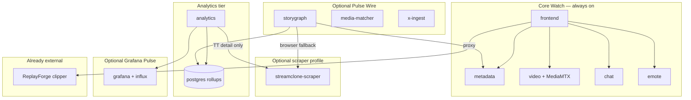
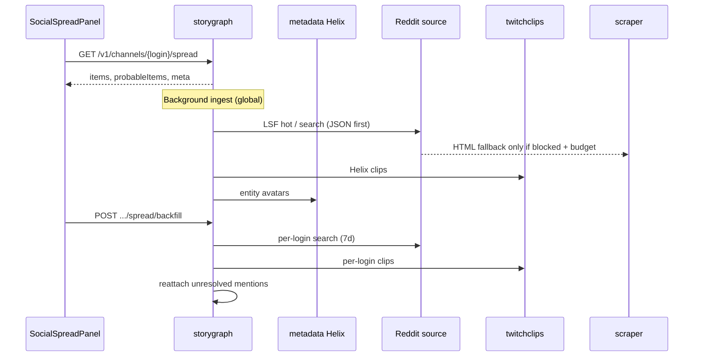

# Tiers, Scraper Coupling, Proxies, and Social Spread

Status: **architecture / operator guide** (2026-06). Complements [options.md](options.md), [scraper-cloudflare-and-proxy.md](scraper-cloudflare-and-proxy.md), and [.kiro/steering/pulse-wire.md](../.kiro/steering/pulse-wire.md).

This document answers four questions that come up when scaling Streamclone beyond a single desktop install:

1. Which features **should detach** into sibling services or optional tiers?
2. Which features **must share** the browser scraper?
3. Should a shared scraper **solely rely on proxies** when other people use it?
4. What happens to **Social spread** (and Pulse Wire) when proxies are off — or when the scraper tier is off entirely?

---

## TL;DR

| Question | Short answer |
|----------|--------------|
| Detach what? | **Already detached:** ReplayForge (Clip Studio), `streamclone-scraper`. **Good next detach candidates:** Pulse Wire ingest bundle (`storygraph` + sidecars), Grafana Pulse stack. **Keep in core:** playback, chat, emotes, metadata, analytics rollups (API path). |
| Scraper coupling | One scraper pool serves **TwitchTracker detail** (Analytics), **Reddit/YouTube browser fallbacks** (Pulse Wire), and rare **StreamerBans/X** fallbacks. Helix clips, public Reddit JSON, and StreamerBans HTML tier-1 do **not** need the scraper. |
| Proxies for shared use? | **No.** Proxies are an **optional egress strategy per install**, not a requirement for multi-user scraper hosting. Residential proxy pools add cost, ToS risk, and do not fix TwitchTracker (datacenter proxies often make TT *worse*). Shared scraper needs **concurrency caps, queue fairness, and honest degradation** — not proxy-by-default. |
| Social spread without proxies | **Works.** Spread is mostly Helix clips + Reddit search + entity matching. Proxies only matter when Docker egress is blocked *and* you enable browser fallbacks *and* `STORYGRAPH_SOCIAL_SCRAPE_USE_PROXY=true`. Default dev/release: browser budget `0`, Reddit public JSON primary, no proxy flag. |

---

## 1. Product tiers and dependency map

Streamclone is intentionally layered. **Core Watch** must never require optional tiers.



| Tier | User value | Hard dependency on scraper? | Hard dependency on proxy? |
|------|------------|----------------------------|---------------------------|
| Core Watch | Directory, HLS, chat read, emotes | No | No |
| Analytics (in-app) | VOD sync, chat rollups, heatmaps | **Only** for TwitchTracker minute charts | No (TT explicitly uses `useProxy: false` today) |
| Pulse Wire | `/pulse-wire`, Trending, Wire tab | **Partial** — YouTube scrape mode; Reddit/LSF HTML fallback; optional StreamerBans/X scrape | Only if social browser fallback + blocked egress |
| Social spread | `/c/:login` Pulse tab, channel-scoped stories | **Partial** — same as Pulse Wire for per-login Reddit search fallback | Same as Pulse Wire |
| Grafana Pulse | Emote/chat time-series dashboards | No | No |
| Clip Studio | Clips, exports | No (ReplayForge) | No |

---

## 2. What should detach (recommendations)

Detachment means: separate repo or compose profile, own release cadence, failure isolated from Core Watch, clear HTTP contract back to Streamclone.

### 2.1 Already detached — keep it that way

| Component | Location | Contract |
|-----------|----------|----------|
| **Browser scraper** | Sibling [`streamclone-scraper`](https://github.com/Aron-Chu/streamclone-scraper) or GHCR image | `POST /v2/scrape` via `SCRAPER_API_URL` |
| **Clip Studio** | Sibling **ReplayForge** | Streamclone Caddy proxies `/v1/clipper/*` → `:8095` |

These were split for good reasons: heavy browser dependencies, different failure modes, and optional adoption.

### 2.2 Should detach next (medium priority)

**Pulse Wire ingest bundle** — `storygraph` + optional `media-matcher` + `x-ingest`

- Already gated by `PULSE_WIRE_ENABLED=false` and compose profile `pulse-wire`.
- Product roadmap treats Pulse Wire as Analytics-adjacent, not Core Watch.
- **Why detach:** ingest workers, social source fan-out, and Postgres story schema evolve faster than playback; operators who only watch streams should not pull storygraph migrations or Reddit commercial gates.
- **How to detach cleanly:** keep the same public routes on Caddy (`/v1/pulse-wire/*`, `/v1/channels/*/spread`); run storygraph as a sibling stack or managed service; Streamclone frontend stays a client.
- **What stays coupled:** shared Postgres is fine for single-user desktop; for true detachment, story DB could move to a dedicated database with read API only.

**Grafana Pulse stack** — already optional (`pulse` profile / Helm `charts/pulse`)

- Detached operationally today; document as “never merge into core compose default.”
- In-app Analytics remains canonical; Grafana is export/view.

### 2.3 Should stay in the main repo (do not detach)

| Area | Reason |
|------|--------|
| metadata, video, chat, emote | Core Watch path; tight latency and auth coupling |
| analytics API + sync workers | VOD/chat rollups are the product’s local intelligence layer; only the **TT browser fetch** should call out to scraper |
| frontend | Single SPA; optional panels already lazy-gated |
| Caddy routing | Edge contract for all tiers |

### 2.4 Optional sidecars — detach only if they grow

| Sidecar | Today | Detach when |
|---------|-------|-------------|
| `x-ingest` | Bun + emusks for `@StreamerBans` tier 2 | X policy changes or multiple X accounts need pooling |
| `media-matcher` | Semantic / thumbnail matching | Becomes GPU-heavy or multi-tenant |
| `migrate-semantic` | pgvector experiments | Never on default desktop path |

### 2.5 Anti-patterns

- **Do not** fold scraper back into the Go monolith — browser pools and Cloudflare sessions belong in `streamclone-scraper`.
- **Do not** make Pulse Wire ingest block Analytics chat sync or playback token refresh.
- **Do not** require proxies for Core Watch or for Reddit’s public JSON path when it works from the host.

---

## 3. Scraper coupling matrix

The scraper is a **shared optional infrastructure tier**, not a second application server. Multiple Streamclone consumers (Analytics, storygraph, future archive workers) may call the same scraper instance on a home LAN or shared dev host.

### 3.1 Who calls the scraper today

| Consumer | Trigger | Scraper payload | `useProxy` today |
|----------|---------|-----------------|------------------|
| **Analytics sync** | TwitchTracker detail for minute charts | Camoufox page scrape | **`false`** (hardcoded — datacenter proxy hurts TT) |
| **Reddit / LSF** | Public JSON blocked → HTML fallback; comment link hydration | Browser HTML | **`STORYGRAPH_SOCIAL_SCRAPE_USE_PROXY`** (default `false`) |
| **YouTube ingest** | No `YOUTUBE_API_KEY` or API quota exhausted | Search results HTML | Same flag via social client |
| **StreamerBans** | Tier 1 HTML fails; tier 2 emusks fails → scrape X timeline | Browser HTML | Same flag (rare path) |

### 3.2 Who does **not** call the scraper

| Feature | Path |
|---------|------|
| **Social spread — Twitch clips** | Helix API via `twitchclips` source |
| **Social spread — Reddit search** | Reddit public JSON first; scraper only if JSON fails *and* browser budget allows |
| **StreamerBans tier 1** | Direct HTTP from storygraph → `streamerbans.com` |
| **StreamerBans tier 2** | `x-ingest` sidecar (not scraper) |
| **Twitch clips on Wire** | Helix |
| **Chat / emotes / playback** | No scraper |
| **Directory / rising leaderboard** | Helix + local `directory_samples` |

### 3.3 Ingest priority when scraper is contended

Storygraph workers enforce this order every cycle:

1. **Reddit LSF** (highest — drives Trending tab)
2. **StreamerBans** (direct HTML / x-ingest)
3. **Twitch clips** (Helix — parallel, no scraper)
4. **YouTube** — **skipped entirely** if shared scraper health check fails

Analytics TT jobs are scheduled separately but compete for the same browser pool if co-located. **Do not raise `SCRAPER_MAX_CONCURRENT` blindly** when multiple users share one scraper; see [scraper-debug skill](../.cursor/skills/streamclone/scraper-debug/SKILL.md).

---

## 4. Proxy strategy: single user vs shared scraper

### 4.1 Design principle

**Proxies are optional egress, not the scraper’s identity.**

- A home desktop install should work with **warm Camoufox profile + direct residential IP** (the user’s ISP).
- Proxies help when **Docker egress is blocked**, **datacenter IP is flagged**, or you are **experimenting** with Flame/residential vendors ([scraper-cloudflare-and-proxy.md](scraper-cloudflare-and-proxy.md)).
- Benchmarks showed **datacenter proxies worsened TwitchTracker Cloudflare** — Analytics keeps `useProxy: false` for TT regardless of `PROXY_*` env.

### 4.2 Should a shared multi-user scraper rely solely on proxies?

**No.** Recommended model:

| Mode | Proxy role | Notes |
|------|------------|-------|
| **Single-user desktop** | Off by default | `.env.local` for `PROXY_*` experiments only |
| **Small team shared scraper (LAN)** | Off unless host egress blocked | One warm profile per scraper instance; cap concurrent contexts |
| **Hosted scraper as a service** | **Per-tenant optional** residential pool | Charge/limit by GB; never assume proxy fixes TT; queue requests fairly |

If “other people are using it” means **multiple Streamclone installs pointing at one scraper**:

1. **Use concurrency caps** (`SCRAPER_MAX_CONCURRENT`, browser pool size in sibling repo) — not “turn on proxy for everyone.”
2. **Separate site profiles** where possible (TT vs Reddit vs YouTube) so one poisoned session does not kill all targets.
3. **Cache aggressively** for TT detail (`SCRAPER_TT_DETAIL_CACHE_MS`) so N users syncing different channels do not multiply identical warms.
4. **Expose health** (`make scraper-check`, scraper `/health`) so storygraph skips YouTube and Analytics surfaces “scraper busy” honestly.
5. **Residential proxy pool** only for social targets that fail direct egress — and only when operator opts in via `STORYGRAPH_SOCIAL_SCRAPE_USE_PROXY=true` + valid `PROXY_*`.

Proxy-only shared scraper creates:

- Runaway GB cost on Flame-style meters
- Shared IP reputation collapse (one bad tenant blocks everyone)
- False confidence on TwitchTracker (proxy often **increases** CF challenges)

### 4.3 Env knobs (quick reference)

| Variable | Default | Meaning |
|----------|---------|---------|
| `PROXY_*` | empty | Scraper-side proxy config (sibling repo); keep in `.env.local` |
| `STORYGRAPH_SOCIAL_SCRAPE_USE_PROXY` | `false` | When `true`, social scraper requests pass `useProxy: true` to `/v2/scrape` |
| Analytics TT scrape | `useProxy: false` in code | Not overridden by social flag |

---

## 5. No-proxy, no-scraper: what still works?

### 5.1 Feature matrix

| Feature | Scraper off | Scraper on, proxy off | Scraper on, proxy on |
|---------|-------------|------------------------|----------------------|
| Core Watch | ✅ | ✅ | ✅ |
| Analytics chat/emote rollups | ✅ | ✅ | ✅ |
| Analytics TT minute charts | ❌ empty / skipped | ✅ expected path | ⚠️ often worse for TT |
| Pulse Wire Trending (Reddit hot) | ✅ if public Reddit JSON works | ✅ | ✅ (+ HTML fallback if JSON blocked) |
| Pulse Wire YouTube evidence | ⚠️ needs `YOUTUBE_API_KEY` | ✅ API or scrape | ✅ scrape via proxy if egress blocked |
| StreamerBans ingest | ✅ tier 1 HTML | ✅ | ✅ |
| Wire Cross-platform (multi-source) | ⚠️ fewer corroborations | ✅ | ✅ |
| Grafana Pulse | ✅ (no scraper) | ✅ | ✅ |

### 5.2 Browser fetch budgets (critical for “no scraper load”)

Even when scraper **is** running, storygraph defaults **disable** social browser fallback:

| Variable | Default (dev) | Release full profile typical |
|----------|---------------|------------------------------|
| `STORYGRAPH_SOCIAL_BROWSER_FETCH_BUDGET` | `0` | `2` when operator wants Reddit HTML / StreamerBans scrape fallback |
| `STORYGRAPH_YOUTUBE_BROWSER_FETCH_BUDGET` | `0` | `0` unless YouTube API absent |

When budget is **`0`**:

- Reddit uses public JSON / OAuth paths only; scraper is not called for listings.
- YouTube scrape mode cannot run (API key path still works).
- StreamerBans stays on direct HTML + x-ingest; scraper X timeline fallback disabled.

When budget is **`-1`** (exhausted mid-cycle): sources return `browser fetch budget exhausted` and degrade without hanging ingest.

---

## 6. Social spread — deep dive

**Social spread** is the channel-scoped Pulse panel at `/c/:login` (Pulse tab). It is **not** the same as the global `/pulse-wire` edition, but it reads from the same storygraph store and ingest pipeline.

### 6.1 Data paths into spread



| Path | Scraper? | Proxy? | Spread impact if missing |
|------|----------|--------|--------------------------|
| Global Reddit ingest → entity match | Fallback only | Only on fallback + flag | Fewer `items`; `probableItems` from title/flair match may still appear |
| Per-login backfill (`Check for stories`) | Same as Reddit search | Same | Empty spread for that login until JSON search succeeds |
| Helix clips | Never | Never | Clip-shaped evidence missing; spread still shows Reddit-matched stories |
| Unresolved mention reattach | Never | Never | Lower `reattached` count after backfill |
| Stream Pulse LSF threads | Reddit JSON in chat path | Rare | **Independent** of spread API — UI may still show LSF context in live pulse |

### 6.2 Without proxies (typical home install)

Expected behavior:

1. **`STORYGRAPH_SOCIAL_SCRAPE_USE_PROXY=false`** — social scraper requests use scraper’s direct egress.
2. **Browser budget `0`** — spread depends on **Reddit public JSON** + **Helix** + stories already ingested globally.
3. **Backfill** runs Reddit search with up to 8 items and clips with up to 6 items — no browser unless budget > 0 and JSON fails.

User-visible symptoms when Reddit JSON is blocked (e.g. datacenter Docker IP) **without** proxy or browser budget:

- Spread panel shows **source health** warnings
- **Check for stories** may return warming then idle with low counts
- **Possible matches** (probableItems) may still surface weak title matches
- Stream Pulse may still show LSF if chat-side Reddit path differs

**Fix order (recommended):**

1. Confirm `REDDIT_COMMERCIAL_OK=true` and Pulse Wire enabled
2. Set `STORYGRAPH_SOCIAL_BROWSER_FETCH_BUDGET=2` (not `-1`) if scraper is healthy
3. Only then set `STORYGRAPH_SOCIAL_SCRAPE_USE_PROXY=true` **and** configure residential `PROXY_*` in scraper env
4. Run `make social-probe` and check `GET /v1/pulse-wire/source-health`

### 6.3 Without scraper profile entirely

| Spread capability | Status |
|-------------------|--------|
| Show already-ingested stories for known entities | ✅ |
| Helix clip backfill | ✅ (needs Twitch OAuth client creds) |
| Reddit per-login search via JSON | ✅ if Reddit reachable from storygraph container |
| Reddit HTML / comment hydration | ❌ |
| YouTube corroboration in Wire | ❌ unless `YOUTUBE_API_KEY` |
| Analytics TT charts | ❌ |

Social spread **does not require** the scraper profile for its **primary** design path (Helix + Reddit JSON + global ingest). Scraper improves **resilience** when Reddit blocks datacenter IPs or YouTube API is absent.

### 6.4 What “good” spread looks like by config

| Operator profile | Suggested env | Spread behavior |
|------------------|---------------|-----------------|
| **Minimal** (no scraper) | `PULSE_WIRE_ENABLED=true`, Reddit OK, Helix creds | Clips + JSON-matched Reddit; honest empty states |
| **Desktop default** | + scraper profile, budgets `0`, proxy off | Same, plus optional TT elsewhere in app |
| **Full news desk** | + budgets `2`, keywords, optional YouTube API | Richer corroboration, YouTube evidence |
| **Blocked egress** | + residential proxy + `STORYGRAPH_SOCIAL_SCRAPE_USE_PROXY=true` | Browser fallbacks succeed where JSON fails |

---

## 7. Operational checklist

### Probe commands

```sh
curl http://localhost:8090/v1/pulse-wire/source-health
curl http://localhost:8090/v1/channels/xqc/spread
curl -X POST http://localhost:8090/v1/channels/xqc/spread/backfill
make scraper-check
make social-probe
```

### Decision tree: “should I enable proxy?”

```text
Is Core Watch or Analytics chat sync failing?
  └─ No → proxy is irrelevant; stop here.

Is the problem TwitchTracker charts?
  └─ Yes → warm scraper profile, direct egress; do NOT enable datacenter proxy.

Is the problem Reddit/Pulse Wire/social spread?
  └─ Is public Reddit JSON working (social-probe)?
       ├─ Yes → keep proxy off; raise browser budget only if you need comment HTML hydration.
       └─ No → enable scraper profile, set SOCIAL_BROWSER_FETCH_BUDGET=2, retry.
            Still failing from Docker IP?
              └─ Configure residential PROXY_* in scraper + STORYGRAPH_SOCIAL_SCRAPE_USE_PROXY=true.
```

---

## 8. Related docs

| Doc | Topic |
|-----|-------|
| [options.md](options.md) | Env vars and profiles |
| [scraper-cloudflare-and-proxy.md](scraper-cloudflare-and-proxy.md) | Camoufox, TT, Flame proxy notes |
| [SERVICE_MAP.md](SERVICE_MAP.md) | Compose services and routes |
| [scraping-archive/requirements.md](scraping-archive/requirements.md) | Bulk scrape, GCS, shared scraper contention |
| [.kiro/steering/pulse-wire.md](../.kiro/steering/pulse-wire.md) | Agent rules for ingest and UI |
| [agents-streamclone-and-replayforge.md](agents-streamclone-and-replayforge.md) | Clip Studio boundary |

---

## 9. Summary recommendations

1. **Detach Pulse Wire ingest** as an optional sibling stack when you need independent release cadence; keep HTTP contracts stable.
2. **Keep scraper detached**; treat it as shared infrastructure with strict concurrency and caching — not a proxy appliance.
3. **Never require proxies** for single-user or LAN installs; use them as a targeted fix for blocked social egress.
4. **Social spread is designed to work without proxies** via Helix + Reddit JSON; scraper and proxy are resilience layers, not prerequisites.
5. **When sharing a scraper across people**, invest in caps, health checks, and TT caching — not default proxy routing.
