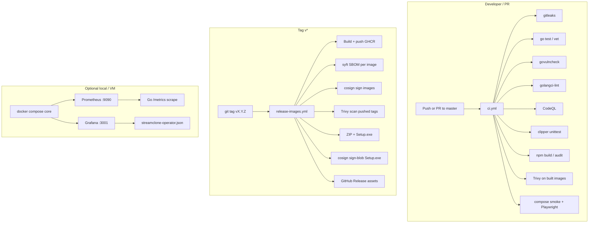

# Platform glossary and Streamclone fit

Reference for common cloud-native, security, and MLOps terms — plus what applies to **Streamclone** (local Docker Desktop install, optional single-VM Compose deploy, GitHub releases to GHCR).

**Legend for Streamclone fit**

| Symbol | Meaning |
|--------|---------|
| ✅ | Already in use or partially implemented |
| 🟡 | Worth adding with moderate effort |
| ⏸️ | Possible later if architecture changes |
| ❌ | Not a fit for current product model |

---

## Containers and orchestration

| Term | What it is | Streamclone fit |
|------|------------|-----------------|
| **Kubernetes** | Container orchestration platform: schedules pods, services, ingress, scaling, and declarative workloads across a cluster. | ❌ Desktop app uses Docker Compose; no cluster today. ⏸️ Only if you operate multi-tenant cloud Streamclone. |
| **Docker** | Container runtime and image format; Compose stacks multiple services on one host. | ✅ Core delivery: `deploy/docker-compose.yml`, GHCR images, Setup.exe + Compose. |
| **Containers** | Packaged app + dependencies isolated from the host OS. | ✅ All Go/Python services ship as images. |
| **Linux** | Primary OS for servers and most container images. | ✅ Services run in Linux containers; dev on Windows/macOS via Docker Desktop. |
| **Kubernetes Pods** | Smallest deployable unit in K8s (one or more containers sharing network/storage). | ❌ Compose uses `services:` not pods. |
| **Kubernetes Services** | Stable network endpoint for a set of pods (ClusterIP, LoadBalancer, etc.). | ❌ Compose uses service DNS names (`video:8080`, `chat:8080`). |
| **Kubernetes Deployments** | Declarative desired state for replicated pod templates (rollouts, rollbacks). | ❌ Compose `up` / image tags replace Deployments. |
| **ConfigMaps** | K8s object for non-secret configuration mounted into pods. | 🟡 Analog: `.env`, `deploy/env/*.env`, `frontend/public/config.js` — not K8s ConfigMaps. |
| **Secrets** | Sensitive values (tokens, keys) stored and injected securely. | ✅ `.env` (local), CI secrets, `env_generate_secrets` — see `docs/security.md`. 🟡 Fail startup on empty prod secrets. |
| **Ingress** | K8s/API gateway routing HTTP(S) into the cluster. | 🟡 Analog: **Caddy** in `deploy/Caddyfile` (prod VM), localhost **:8090** proxy in dev. |
| **Helm** | Package manager for Kubernetes (charts = templated manifests). | ❌ No K8s. ⏸️ If you ever chart Streamclone for cloud. |
| **Kustomize** | K8s-native overlay patches on YAML without templating language. | ❌ Compose overlays instead: `docker-compose.release.yml`, `prod.yml`, `local-tunnel.yml`. |

---

## GitOps and CI/CD

| Term | What it is | Streamclone fit |
|------|------------|-----------------|
| **GitOps** | Desired state in git; automation reconciles runtime to match (often K8s + Argo/Flux). | 🟡 Partial: git tags → GHCR images + release bundle; not cluster reconciliation. |
| **CI/CD** | Continuous integration (build/test) and delivery (deploy/release). | ✅ GitHub Actions: `ci.yml`, `release-images.yml`, `smoke-scraper.yml`. |
| **GitHub Actions** | GitHub-hosted workflows on push/PR/tag. | ✅ Primary CI/CD — gitleaks, Go tests, compose smoke, release images, Setup.exe. |
| **GitLab CI** | GitLab pipeline engine (`.gitlab-ci.yml`, runners). | ❌ Repo is on GitHub. |
| **Jenkins** | Self-hosted automation server for builds/deploys. | ❌ Redundant with GitHub Actions for this repo. |
| **Argo CD** | GitOps controller: syncs K8s cluster to git manifests. | ❌ No Kubernetes. |
| **Flux** | GitOps toolkit for K8s (source + helm + kustomize controllers). | ❌ No Kubernetes. |

---

## Observability

| Term | What it is | Streamclone fit |
|------|------------|-----------------|
| **Prometheus** | Time-series metrics DB; pull model via `/metrics` endpoints. | 🟡 Go services expose Prometheus metrics; CI smoke checks `/metrics`. Optional stack: `docker-compose.observability.yml`. |
| **Grafana** | Dashboards and alerting on metrics/logs/traces. | 🟡 Available via observability compose overlay — enable for VM or power users. |
| **Loki** | Log aggregation optimized for labels (Grafana stack). | 🟡 Pair with Fluent Bit on a VM deploy; overkill for desktop default. |
| **Fluent Bit** | Lightweight log forwarder/parser. | ⏸️ Useful if you centralize logs from a public VM. |
| **Kibana** | UI for Elasticsearch log/search analytics. | ❌ Not in stack; Loki/Grafana is lighter fit if you add logging. |
| **OpenTelemetry** | Vendor-neutral traces, metrics, logs SDKs and collectors. | ⏸️ Future: instrument Go services for distributed traces across video/chat/analytics. |

---

## Data streaming and analytics platforms

| Term | What it is | Streamclone fit |
|------|------------|-----------------|
| **Kafka** | Distributed event log / streaming bus. | ❌ Redis pub/sub + Postgres suffice for Streamclone scale. |
| **Flink** | Stream processing engine for Kafka/event pipelines. | ❌ Analytics rollups are in Go + Postgres, not Flink jobs. |
| **Pinot** | OLAP store for real-time analytics queries. | ❌ Minute rollups in Postgres; different problem domain. |

---

## MLOps and ML serving

| Term | What it is | Streamclone fit |
|------|------------|-----------------|
| **MLOps** | Practices/tooling for training, deploying, and monitoring ML models. | ❌ Not an ML product (optional scraper/clipper use ffmpeg/streamlink, not model serving). |
| **Kubeflow** | ML platform on Kubernetes (pipelines, notebooks, training). | ❌ |
| **KServe** | Model inference on Kubernetes (formerly KFServing). | ❌ |
| **Ray** | Distributed Python for ML/data workloads. | ❌ Clipper is Python but job workers, not Ray cluster. |

---

## Languages and scripting

| Term | What it is | Streamclone fit |
|------|------------|-----------------|
| **Go** | Backend services (metadata, video, chat, emote, analytics). | ✅ Primary backend; `go test`, govulncheck in CI. |
| **Python** | Clipper / Clip Studio, scraper (sibling repo). | ✅ `clipper/liveclipper/`; 🟡 add clipper tests to CI. |
| **Java** | JVM ecosystem. | ❌ Not used in Streamclone. |
| **Bash** | Shell scripting for Linux CI and release scripts. | ✅ `scripts/*.sh`, smoke tests, `package-release.sh`. |

---

## Cloud and infrastructure as code

| Term | What it is | Streamclone fit |
|------|------------|-----------------|
| **AWS** | Amazon cloud (EC2, EKS, S3, IAM, etc.). | ⏸️ Optional: run Compose on EC2 like Oracle VM in `deploy/FREE_DEPLOYMENT.md`. |
| **Azure** | Microsoft cloud. | ⏸️ Same as AWS — possible VM host, not required. |
| **Terraform** | Declarative IaC for cloud resources. | ⏸️ If you automate VM + DNS + firewall for public deploys. |
| **Ansible** | Agentless config management over SSH. | 🟡 Good fit for **single-VM** Streamclone: Docker install, `.env`, Caddy, firewall. |
| **IAM** | Identity and access management (who can do what on cloud/APIs). | 🟡 GitHub repo permissions, GHCR, Twitch OAuth scopes, `CURATOR_API_TOKEN`, setup-control token — all IAM-like patterns at app level. |

---

## Service mesh and network security

| Term | What it is | Streamclone fit |
|------|------------|-----------------|
| **Service mesh** | Sidecar layer for mTLS, traffic policy, observability between services. | ❌ Compose internal network is enough at current scale. |
| **Istio** | Popular K8s service mesh (Envoy sidecars). | ❌ Requires Kubernetes. |
| **mTLS** | Mutual TLS: client and server both present certificates. | 🟡 Caddy terminates TLS on public VM; internal Compose links are plain HTTP (acceptable on one host). ⏸️ mTLS between services only if multi-host. |

---

## Policy, admission, and image security

| Term | What it is | Streamclone fit |
|------|------------|-----------------|
| **OPA / Gatekeeper** | Policy engine; Gatekeeper enforces Rego policies on K8s admission. | ❌ K8s-only. |
| **Kyverno** | Kubernetes-native policy (validate/mutate/generate). | ❌ K8s-only. |
| **Admission control** | Block non-compliant resources before they run (often K8s webhooks). | 🟡 Analog: **pre-commit** + **gitleaks** + **validate-env** before merge; not cluster admission. |
| **Container image scanning** | Scan images for OS/library CVEs (Trivy, Grype, etc.). | 🟡 Add CI job on Dockerfiles / pushed GHCR images. |
| **Vulnerability scanning** | Broad term: deps, images, infra. | ✅ govulncheck, npm audit, gitleaks; 🟡 Trivy on images. |
| **SCA** | Software composition analysis — third-party dependency CVEs. | ✅ govulncheck + npm audit + Dependabot. |
| **SAST** | Static analysis of source code for bugs/vulns. | 🟡 go vet, partial; add golangci-lint or CodeQL. |
| **DAST** | Dynamic testing against running app. | 🟡 Playwright smoke is light DAST; optional OWASP ZAP on staging VM. |
| **SBOMs** | Software bill of materials listing components/versions. | 🟡 Generate SPDX/CycloneDX in release workflow for supply-chain transparency. |
| **Sigstore** | Signing ecosystem (Cosign, Fulcio) for artifacts and images. | 🟡 Sign GHCR images and `Streamclone-Setup-*.exe` for provenance. |
| **Image provenance checks** | Verify image was built by trusted pipeline (SLSA, cosign verify). | 🟡 GitHub attestations + cosign on release tags. |

---

## Compliance and security frameworks

| Term | What it is | Streamclone fit |
|------|------------|-----------------|
| **NIST 800-53** | US federal security control catalog. | ⏸️ Reference for hardening public deploys; not certified. Map controls to `docs/security.md` if needed. |
| **FedRAMP** | US government cloud authorization program (based on NIST). | ❌ Product is personal/educational self-host; not a FedRAMP SaaS. |
| **STIGs** | DoD hardening guides for OS/software. | ⏸️ Useful checklist for Linux VM hosting Compose. |
| **RMF** | Risk Management Framework — assess, authorize, monitor systems. | ⏸️ Process framework for orgs; overkill for hobby project, relevant if enterprise adoption. |
| **IL4 / IL5 / IL6** | DoD impact levels for classified / restricted data environments. | ❌ Streamclone is not designed for classified networks. |
| **Security+** | CompTIA certification (general security knowledge). | — Training reference only; not a tool. |

---

## Concepts (cross-cutting)

| Term | What it is | Streamclone fit |
|------|------------|-----------------|
| **GitOps** | (See CI/CD section.) Git as source of truth for deployments. | 🟡 Tag + VERSION + GHCR pin. |
| **CI/CD** | Automated build, test, release. | ✅ See `.github/workflows/`. |

---

## What Streamclone already implements

| Area | Implementation |
|------|----------------|
| **Containers / Docker** | Multi-service Compose stack, GHCR release images |
| **CI/CD** | GitHub Actions: secret scan, tests, compose smoke, Playwright, release pipeline |
| **Languages** | Go services, Python clipper, Bash/PowerShell ops scripts |
| **Secrets** | Generated install secrets, CI OAuth bundle (optional), documented in `docs/security.md` |
| **Ingress (analog)** | Caddy prod proxy; localhost `:8090` in dev |
| **Metrics** | Prometheus `/metrics` on Go services |
| **SCA** | govulncheck, npm audit, Dependabot |
| **Secret scanning** | gitleaks pre-commit + CI |
| **Config** | `.env`, profile env fragments, release bundle env |
| **IAM (app-level)** | Twitch OAuth, curator bearer token, clipper webhook token, setup-control token |

---

## Recommended additions (high value, low K8s)

Prioritized for **this repo** without adopting Kubernetes.

### P0 — GitHub and release hygiene

1. **Branch protection** on `master` — require CI checks, block force-push.
2. **Secret scanning + push protection** — confirm enabled (see `docs/security.md`).
3. **Dependabot** — already configured; merge security PRs regularly.

### P1 — Security pipeline (SCA / scanning / SBOM)

| Tool / practice | Action |
|-----------------|--------|
| **Container image scanning** | Add Trivy or Grype job in `ci.yml` on `docker compose build` images |
| **SAST** | Add `golangci-lint` and/or GitHub **CodeQL** workflow |
| **SBOMs** | `syft` or `cyclonedx-gomod` in `release-images.yml`; attach to GitHub Release |
| **Sigstore / provenance** | `cosign sign` GHCR images after push; document verify command in release notes |
| **Clipper tests in CI** | `make clipper-test` job (Python SCA via `pip audit` optional) |

### P2 — Observability (optional tier)

| Tool | Action |
|------|--------|
| **Prometheus + Grafana** | Document enabling `docker-compose.observability.yml` for VM installs |
| **Loki + Fluent Bit** | ⏸️ Only if you operate a central log host |
| **OpenTelemetry** | ⏸️ Add trace IDs across video → analytics paths if debugging cross-service latency |

### P3 — Public VM deploy (AWS/Azure/OCI)

| Tool | Action |
|------|--------|
| **Ansible** | Playbook: Docker, clone/extract bundle, `.env`, firewall, Caddy TLS |
| **Terraform** | Optional: VM + DNS + security group if you repeat deploys |
| **mTLS / Istio / mesh** | Skip — single-host Compose + Caddy is sufficient |

### P4 — Not recommended for Streamclone today

| Category | Why skip |
|----------|----------|
| Kubernetes, Helm, Kustomize, Argo CD, Flux | No cluster; Compose + GHCR matches product |
| Kafka, Flink, Pinot | Wrong scale and architecture |
| Kubeflow, KServe, Ray | Not an ML inference platform |
| GitLab CI, Jenkins | GitHub Actions already integrated |
| OPA Gatekeeper, Kyverno | K8s admission only |
| FedRAMP / IL4–IL6 | Out of product scope |
| Kibana | Prefer Loki if logs are added |

---

## Theoretical implementation plan

How Streamclone could adopt the security and observability tools discussed above — **without Kubernetes**. This is a design reference, not a committed roadmap. Phases are ordered so each layer builds on the last.

### Target architecture (after full rollout)



### Phase map

| Phase | Scope | New artifacts | Effort |
|-------|--------|---------------|--------|
| **1** | Clipper tests + golangci-lint in CI | `.github/workflows/ci.yml` jobs | ~1 day |
| **2** | CodeQL + extended SCA | `.github/workflows/codeql.yml` | ~0.5 day |
| **3** | Trivy image scan on PR | `ci.yml` job after `smoke-core` build | ~1 day |
| **4** | SBOM generation on release | `release-images.yml` + syft | ~1 day |
| **5** | Cosign sign GHCR + Setup.exe | secrets, `release-images.yml` | ~2 days |
| **6** | Prometheus / Grafana product path | docs + optional profile | ~0.5 day |

Phases 1–3 run on every PR/push. Phases 4–5 run on version tags only. Phase 6 is operator-facing, not CI.

---

### Phase 1 — Clipper tests + golangci-lint (GitHub Actions extend)

**Goal:** Close the gap where Python clipper ships without CI coverage; add Go SAST beyond `go vet`.

**Current state**

- `make clipper-test` → `PYTHONPATH=clipper python3 -m unittest discover -s clipper/tests`
- `ci.yml` runs Go and frontend but not clipper.

**Proposed `ci.yml` jobs**

```yaml
  clipper:
    name: Clipper unit tests
    runs-on: ubuntu-latest
    steps:
      - uses: actions/checkout@v4
      - uses: actions/setup-python@v5
        with:
          python-version: "3.12"
      - run: pip install -r clipper/requirements.txt  # if present, or minimal deps
      - run: PYTHONPATH=clipper python -m unittest discover -s clipper/tests

  golangci-lint:
    name: golangci-lint
    runs-on: ubuntu-latest
    steps:
      - uses: actions/checkout@v4
      - uses: actions/setup-go@v5
        with:
          go-version-file: go.mod
      - uses: golangci/golangci-lint-action@v6
        with:
          version: latest
          args: --timeout=5m
```

**Repo files to add**

| File | Purpose |
|------|---------|
| `.golangci.yml` | Enable `govet`, `staticcheck`, `errcheck`, `gosec` (moderate rules); exclude generated/migrations |

**Local parity**

```sh
make clipper-test
golangci-lint run ./...   # after brew/choco install
```

**Branch protection:** require job names `Clipper unit tests` and `golangci-lint` once stable.

---

### Phase 2 — CodeQL (SAST) + SCA summary

**Goal:** GitHub-native static analysis for Go + JavaScript; complement (not replace) govulncheck and npm audit.

**Current state**

- `govulncheck` on push to `master` only (`ci.yml`).
- `npm audit --audit-level=high` on push to `master` only.

**Proposed workflow** — `.github/workflows/codeql.yml`:

```yaml
name: CodeQL
on:
  push:
    branches: [master, main]
  pull_request:
  schedule:
    - cron: "0 6 * * 1"   # weekly

permissions:
  contents: read
  security-events: write

jobs:
  analyze:
    runs-on: ubuntu-latest
    strategy:
      matrix:
        language: [go, javascript-typescript]
    steps:
      - uses: actions/checkout@v4
      - uses: github/codeql-action/init@v3
        with:
          languages: ${{ matrix.language }}
      - uses: github/setup-go@v5
        if: matrix.language == 'go'
        with:
          go-version-file: go.mod
      - uses: actions/setup-node@v4
        if: matrix.language == 'javascript-typescript'
        with:
          node-version: "22"
          cache: npm
          cache-dependency-path: frontend/package-lock.json
      - run: npm ci && npm run build
        if: matrix.language == 'javascript-typescript'
        working-directory: frontend
      - uses: github/codeql-action/analyze@v3
```

**SCA stack after Phase 2**

| Layer | Tool | When |
|-------|------|------|
| Secrets | gitleaks | PR + push |
| Go deps | govulncheck | push `master` |
| Go SAST | golangci-lint + CodeQL | PR + push |
| JS deps | npm audit | push `master` |
| JS SAST | CodeQL | PR + push |
| Python deps | `pip-audit` (optional Phase 1b) | clipper job |

**GitHub UI:** Security → Code scanning alerts; triage like Dependabot.

---

### Phase 3 — Trivy container image scanning

**Goal:** Scan images built in CI before merge; scan release tags after push to GHCR.

#### 3a — PR / `master` CI (local build, no registry)

After existing `smoke-core` **Build core service images** step:

```yaml
  image-scan:
    name: Trivy scan (CI images)
    runs-on: ubuntu-latest
    needs: [compose-config]   # or needs smoke-core build job if split
    steps:
      - uses: actions/checkout@v4
      - run: cp .env.dev .env
      - name: Build images for scan
        run: |
          docker compose --env-file .env \
            -f deploy/docker-compose.yml \
            -f deploy/docker-compose.local-tunnel.yml \
            build metadata video chat emote analytics frontend clipper
      - uses: aquasecurity/trivy-action@master
        with:
          scan-type: image
          image-ref: streamclone-video:latest
          severity: CRITICAL,HIGH
          exit-code: 1
      # repeat or loop matrix: metadata, chat, emote, analytics, frontend, clipper
```

**Policy:** Start with `exit-code: 0` + SARIF upload (report-only); tighten to fail on CRITICAL after baseline cleanup.

```yaml
      - uses: github/codeql-action/upload-sarif@v3   # or trivy-action sarif output
        with:
          sarif_file: trivy-results.sarif
```

#### 3b — Release pipeline (GHCR tags)

In `release-images.yml`, after each `docker/build-push-action` (or one aggregated job):

```yaml
      - uses: aquasecurity/trivy-action@master
        with:
          image-ref: ghcr.io/${{ github.repository }}/video:${{ steps.tag.outputs.value }}
          severity: CRITICAL,HIGH
          exit-code: 1
```

**Note:** Trivy scans the **pushed** image ref; run after push in the same matrix job or a follow-up `scan-published` job with `needs: publish`.

---

### Phase 4 — SBOMs with Syft on release

**Goal:** Attach a Software Bill of Materials per release image and a bundle manifest on the GitHub Release.

**Where:** `release-images.yml` — new job `sbom` after `publish` succeeds.

```yaml
  sbom:
    name: Generate SBOMs
    needs: [publish]
    if: startsWith(github.ref, 'refs/tags/v')
    runs-on: ubuntu-latest
    permissions:
      contents: write
    strategy:
      matrix:
        image: [metadata, video, chat, emote, analytics, frontend, clipper]
    steps:
      - uses: anchore/sbom-action@v0
        with:
          image: ghcr.io/${{ github.repository }}/${{ matrix.image }}:${{ github.ref_name }}
          format: cyclonedx-json
          output-file: sbom-${{ matrix.image }}.cdx.json
      - uses: softprops/action-gh-release@v2
        with:
          tag_name: ${{ github.ref_name }}
          files: sbom-${{ matrix.image }}.cdx.json
```

**Alternatives**

| Tool | Output | Notes |
|------|--------|-------|
| **syft** (via anchore/sbom-action) | SPDX, CycloneDX | Scans OCI images — best match for GHCR |
| **cyclonedx-gomod** | Go module SBOM | Source-level; good supplement for Go services |
| **npm sbom** | frontend only | `npm sbom --sbom-format cyclonedx` in CI |

**Release assets (target)**

```
streamclone-v0.3.0.tar.gz
Streamclone-Setup-v0.3.0.exe
sbom-video.cdx.json
sbom-frontend.cdx.json
… (per image)
sbom-bundle.cdx.json          # merged or index file
```

**Consumer use:** Enterprise installs can import SBOMs into dependency trackers; security teams verify component list against policy.

---

### Phase 5 — Sigstore / Cosign (GHCR images + Setup.exe)

**Goal:** Prove images and installer were built by your GitHub release workflow, not a substituted artifact.

#### 5a — Sign container images

**Prerequisites (GitHub repo settings)**

| Secret / setting | Purpose |
|------------------|---------|
| `COSIGN_EXPERIMENTAL=1` | Keyless signing with OIDC (optional) |
| Job `permissions: id-token: write` | OIDC for keyless cosign |
| Or `COSIGN_PRIVATE_KEY` + `COSIGN_PASSWORD` secrets | Static key in repo secrets |

**After `docker/build-push-action` in `release-images.yml`:**

```yaml
permissions:
  contents: read
  packages: write
  id-token: write   # keyless

      - uses: sigstore/cosign-installer@v3
      - name: Sign image
        run: |
          cosign sign --yes "ghcr.io/${{ github.repository }}/${{ matrix.image }}:${{ steps.tag.outputs.value }}"
```

**Verification (document in release notes)**

```sh
cosign verify ghcr.io/aron-chu/streamclone/video:v0.3.0 \
  --certificate-identity-regexp='https://github.com/Aron-Chu/streamclone/' \
  --certificate-oidc-issuer=https://token.actions.githubusercontent.com
```

#### 5b — Sign `Streamclone-Setup-*.exe`

Windows installer is **not** an OCI image — use **cosign sign-blob**:

```yaml
      - uses: sigstore/cosign-installer@v3
      - name: Sign Setup.exe
        run: |
          cosign sign-blob --yes \
            --bundle dist/Streamclone-Setup-${{ github.ref_name }}.bundle \
            dist/Streamclone-Setup-${{ github.ref_name }}.exe
      - uses: softprops/action-gh-release@v2
        with:
          files: |
            dist/Streamclone-Setup-*.exe
            dist/Streamclone-Setup-*.bundle
```

**Desktop users:** Verification is optional today; power users and security reviewers can validate before running unsigned-adjacent installers.

**Code signing vs cosign:** Cosign proves **build provenance**; Windows **Authenticode** still removes SmartScreen warnings — separate investment (EV cert).

---

### Phase 6 — Prometheus / Grafana (observability compose)

**Goal:** Make the existing observability stack a documented **optional tier** for contributors and VM operators — not default for Setup.exe Core Watch.

**Current state**

| Piece | Location |
|-------|----------|
| Compose overlay | `deploy/docker-compose.observability.yml` |
| Prometheus config | `deploy/observability/prometheus/prometheus.yml` |
| Alert rules | `deploy/observability/prometheus/rules/streamclone-alerts.yml` |
| Grafana dashboards | `deploy/observability/grafana/dashboards/streamclone-operator.json` |
| Makefile | `make obs-up`, `make obs-down`, `make obs-logs` |

**Theoretical product integration**

1. **Profile name:** `observability` (or document under **Full + observability**).
2. **Ports when enabled** (from overlay):
   - Prometheus `http://localhost:9090`
   - Grafana `http://localhost:3001` (default admin — change `GRAFANA_ADMIN_PASSWORD` in `.env`)
   - Loki `3100`, Promtail ships container logs
3. **Scrape targets:** Go services already expose `/metrics`; prometheus.yml scrapes `metadata`, `video`, `chat`, `emote`, `analytics`; blackbox probes HLS paths.
4. **Install docs** — add to `docs/install-desktop.md` or new `docs/observability.md`:

```sh
# After core stack is healthy
make obs-up
# Grafana → http://localhost:3001 — dashboard "Streamclone Operator"
```

5. **Do not** ship observability in default Setup.exe (RAM + port exposure); VM operators enable explicitly.

**CI tie-in (optional):** Smoke job could assert Prometheus can scrape one target when `obs-up` is used in a manual `workflow_dispatch` workflow — low priority.

---

### End-to-end release workflow (theoretical)

After Phases 1–5, a `v0.3.0` tag would execute:

```text
1. publish job    → build + push ghcr.io/aron-chu/streamclone/*:v0.3.0
2. publish-scraper→ optional scraper image (continue-on-error)
3. trivy-scan     → fail on CRITICAL in pushed tags
4. cosign-sign    → sign each GHCR image (OIDC keyless)
5. release-smoke  → compose pull + smoke-core.sh (existing)
6. sbom job       → syft CycloneDX per image → attach to Release
7. package job    → ZIP + tar.gz (existing)
8. windows-installer → Setup.exe (existing)
9. cosign-blob    → sign Setup.exe + bundle
10. gh-release    → all assets + generated notes
```

**Parallel CI on `master` (every merge)**

```text
gitleaks → go test/vet → govulncheck → golangci-lint → CodeQL
→ clipper unittest → frontend build/audit → compose config
→ build images → Trivy (report/fail) → smoke-core → Playwright
```

---

### Secrets, permissions, and GitHub settings checklist

| Item | Phase | Action |
|------|-------|--------|
| `permissions: security-events: write` | 2 | CodeQL SARIF upload |
| `permissions: id-token: write` | 5 | Cosign keyless |
| `COSIGN_PRIVATE_KEY` (optional) | 5 | If not using keyless |
| Branch protection required checks | 1–3 | Add new job names |
| Dependabot | ongoing | Merge weekly PRs |
| GHCR public read | release | End-user `docker pull` without auth |

---

### What we would not change

| Area | Reason |
|------|--------|
| Desktop install flow | Users still pull GHCR by tag; cosign/SBOM are additive assets |
| Kubernetes / Argo | Out of scope |
| Default Core Watch image set | No Trivy/cosign runtime requirement on localhost |
| Twitch OAuth bundle in release | Separate from supply-chain signing; still rotate on leak |

---

### Suggested implementation order (single maintainer)

```text
Week 1: Phase 1 (clipper + golangci-lint) → merge, fix findings
Week 2: Phase 2 (CodeQL) + Phase 3a (Trivy report-only on CI)
Week 3: Phase 4 (SBOM on next tag) + Phase 3b (Trivy on release)
Week 4: Phase 5 (cosign) + Phase 6 docs (observability)
```

Track progress in a GitHub issue checklist or `.kiro/specs/security-pipeline/` spec if you formalize the work.

---

## Mapping compliance language to Streamclone controls

If you need to speak in **NIST / STIG** terms for a public VM deployment:

| Control theme | Streamclone equivalent |
|---------------|------------------------|
| Access control | Twitch OAuth, bearer tokens, setup-control token, firewall (443 only) |
| Audit logging | Container logs, optional Prometheus metrics, future centralized logs |
| Configuration management | VERSION file, pinned `IMAGE_TAG`, git tags |
| Identification / auth | Session cookies, API tokens, no default `change-me` in prod |
| System integrity | Signed releases (future cosign), image scanning, Dependabot |
| Boundary protection | Caddy TLS, no exposed Postgres/Redis/MinIO on internet |

This is **informal mapping**, not certification.

---

## Related docs in this repo

| Doc | Topic |
|-----|--------|
| [`docs/security.md`](security.md) | Secrets, deployment hardening, dev-only features |
| [`docs/install-desktop.md`](install-desktop.md) | End-user install lifecycle |
| [`deploy/FREE_DEPLOYMENT.md`](../deploy/FREE_DEPLOYMENT.md) | Single-VM HTTPS deploy |
| [`CONTRIBUTING.md`](../CONTRIBUTING.md) | Developer workflow and tests |
| [`.cursor/rules/commits.mdc`](../.cursor/rules/commits.mdc) | Commit author and message rules |
| [`.github/workflows/ci.yml`](../.github/workflows/ci.yml) | CI pipeline |
| [`.github/workflows/release-images.yml`](../.github/workflows/release-images.yml) | Release pipeline |
| **This doc — Theoretical implementation plan** | Phased Trivy, CodeQL, SBOM, cosign, observability |

---

## Quick decision tree

```
Need to ship desktop users?
  → Docker + GHCR + GitHub Actions + Setup.exe  ✅ (current)

Need one public HTTPS server?
  → Docker Compose + Caddy + Ansible/Terraform  🟡

Need multi-tenant cloud at scale?
  → Revisit Kubernetes + Helm + GitOps + mesh  ⏸️

Need ML model serving?
  → Not Streamclone's core scope  ❌
```

*Last updated for Streamclone v0.2.9 architecture (Compose-first, GitHub releases). See **Theoretical implementation plan** for phased security/observability adoption.*
