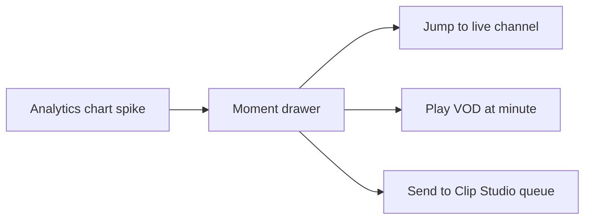

# Streamclone — product refinement and growth ideas

Expanded product notes for **Streamclone** (GitHub: [`Aron-Chu/streamclone`](https://github.com/Aron-Chu/streamclone)). This doc complements the evergreen backlog in [product-roadmap.md](product-roadmap.md) with prioritized **refine vs add** guidance, user impact, and implementation hints.

**Audience:** maintainers planning the next few releases. Not end-user install docs.

**Related:** [product.md](../.kiro/steering/product.md) (guardrails), [options.md](options.md) (tiers), [install-desktop.md](install-desktop.md) (Windows lifecycle).

---

## Positioning (one line)

Streamclone wins when it feels like **Twitch viewing, but you own the pipeline, the emotes, the minute-level data, and the clips** — not when it tries to match Twitch’s social graph or full creator dashboard.

---

## What Streamclone already does better than native Twitch

These are **differentiation anchors**. New work should extend them, not dilute them.

| Area | Streamclone advantage | Where in codebase |
|------|----------------------|-------------------|
| Playback | Ad-stripped local HLS relay; server-side fallbacks | `internal/video/orchestrator/` |
| Honesty | Requested vs loaded quality; relay startup breakdown | `frontend/src/components/Channel.tsx`, video API |
| Chat + emotes | Local WebP CDN; 7TV/FFZ toggles; Redis dictionary | `internal/emote/`, `frontend/src/components/Chat.tsx` |
| Analytics | Per-minute rollups; spike reasons; VOD chat sync progress | `internal/analytics/`, `Analytics.tsx` |
| Clips | Analytics-driven queue; vertical export (Clip Studio tier) | `clipper/`, `/studio` |
| Ops | Self-hosted; optional tiers via compose profiles; setup-control | `scripts/setup-control.ps1`, Stack status UI |

See [product-roadmap.md §3](product-roadmap.md) for the full inventory.

---

## Three product tiers (reminder)

| Tier | Profile | Typical user expectation |
|------|---------|---------------------------|
| **Core Watch** | `core` (Setup.exe default) | Directory, live HLS, chat read, emotes, summary analytics |
| **Analytics** | `+ scraper` | Minute viewer charts, TwitchTracker sync, full VOD pipeline |
| **Clip Studio** | `+ clipper` | `/studio`, Helix clips, vertical MP4 export |

**Product problem today:** many users on Core think Analytics is “broken” because empty charts and preflight warnings (e.g. “6/7 images”) don’t explain that clipper/scraper are optional. Several refinements below target **tier honesty**.

---

## Part A — Refine first (high impact, low architectural risk)

These improve daily use without new services or upstream integrations.

### A1. Channel workspace polish

**Context:** The live channel page (`/c/:login`) is the core loop. Recent work reorganized player controls: Theater moved into the primary bar, **Settings** opens a second overlay row without shrinking video height.

**Further refinements:**

| Idea | User benefit | Notes |
|------|--------------|-------|
| **Persist theater mode** | Returning users keep layout preference | Store in `frontend/src/settings.ts` (like `videoFit`, `bottomDensity`) |
| **Keyboard shortcuts** | Faster control for power users | `Space` play/pause, `f` fullscreen, `t` theater, `m` mute — document in Settings panel |
| **Split viewer vs diagnostics** | Settings feels less overwhelming | Row 1: transport + quality + theater + fullscreen; Row 2: latency, fit, density, metrics (already partially done) |
| **Mobile control row** | Usable on narrow widths | Primary row: horizontal scroll or icon-only buttons on `< lg`; keep HLS chip bottom-left clear |
| **Quality + theater discoverability** | Fewer “how do I…” questions | Optional first-run tooltip on channel page (dismissible, localStorage) |

**Guardrail:** Keep requested vs loaded quality visible when they diverge ([product.md](../.kiro/steering/product.md)).

**Primary file:** `frontend/src/components/Channel.tsx`

---

### A2. Tier honesty and onboarding

**Problem:** Core installs show Analytics UI with empty minute charts; preflight may warn about missing **clipper** image even when user only wants Core.

**Refinements:**

| Idea | User benefit | Implementation sketch |
|------|--------------|------------------------|
| **Profile-scoped image preflight** | “6/6 core images” instead of “6/7” | `Get-StreamcloneCoreImageStatus` in `scripts/lib/install-upgrade.ps1` — exclude clipper for `core` profile |
| **Tier badge in UI** | “Core Watch” vs “Analytics active” in header or Welcome overlay | Read compose profiles / optional services from existing `useOptionalServices` |
| **Analytics empty state upgrade** | Clear CTA: “Start Analytics” with link to scraper doc | Extend `ServiceStatusBanner` / Analytics empty chart copy |
| **Welcome overlay path** | First launch explains three tiers in one screen | Already partial via Stack status; tighten copy to match [options.md](options.md) |

**Why it matters:** Reduces support burden and mistaken “reinstall” loops (similar to install/bootstrap confusion on Windows).

---

### A3. Surface backend truth you already compute

Much differentiation is **implemented but hidden** in Settings or Diagnostics tab.

| Signal | Today | Proposed surface |
|--------|-------|------------------|
| Chat coverage on VOD | `hasGoodChatCoverageFromRollups` in Go | Badge on Analytics stream row: “Chat 94% covered” |
| Requested ≠ loaded quality | Shown in Settings when expanded | Small chip on player when mismatch persists >10s |
| Relay startup breakdown | Startup overlay / metrics in Settings | Post-start toast: “Relay ready in 4.2s (token 1.1s, worker 2.8s)” |
| Scraper / sync phase timings | `SyncProgressPanel` | Link from stream row: “Last sync: tracker OK, GQL 12k msgs” |

**Principle:** Honest, structured errors beat silent empty states ([product guardrails](../.kiro/steering/product.md)).

---

### A4. VOD playback loop (live ↔ archive)

**Context:** VOD start API, Analytics “play moment,” and channel VOD tab are in progress or shipped. Live player is richer than VOD player.

**Refinements:**

| Idea | User benefit | Notes |
|------|--------------|-------|
| **Shared player chrome** | Same Theater / Settings / quality patterns on VOD | Reuse `LivePlayerControls` or extract shared `PlayerControls` |
| **Chat sync to playback time** | VOD feels like Twitch VOD + chat | Scroll/highlight chat by `currentTime`; may need VOD chat cache API |
| **Actionable `vod_unavailable`** | User knows if resync vs Twitch takedown | Map API errors to: resync CTA, open Twitch URL, or “VOD expired” |
| **Play from Analytics spike** | One click from chart to that minute | Already directionally supported; polish deep-link `?t=` handling |

**Related steering:** [analytics.md](../.kiro/steering/analytics.md), VOD specs under `.kiro/specs/`.

---

### A5. Install and update reliability (Windows)

**Context:** Recent fixes: bootstrap commit-SHA fetch, `Caddyfile.local-tunnel` directory repair, defer Docker on uninstall. Release install lives at `%USERPROFILE%\streamclone`; **fixes ship from this repo**, not from editing the install folder alone ([repo-maintenance.md](repo-maintenance.md)).

**Refinements:**

| Idea | User benefit | Notes |
|------|--------------|-------|
| **Generalized deploy file repair** | Fewer “8090 not reachable” after bad Docker mounts | Preflight: bind-mount targets must be files; auto-restore from overlay (like Caddyfile) |
| **Manage → Update as primary path** | Users don’t re-run stale `Install Streamclone.cmd` from Downloads | Document in [install-desktop.md](install-desktop.md); optional tray notification |
| **Check Streamclone before Install** | Install.cmd suggests check when stack already healthy | Already in copy; could auto-detect and skip |
| **Code signing (Setup.exe)** | Fewer AV false positives | Ops/infrastructure; noted in install docs |

Log install-tier bug fixes in [repo-maintenance.md — Install bug fix log](repo-maintenance.md).

---

## Part B — Add next (meaningful new capability)

These need design specs but fit existing architecture (browser → Caddy → Go services).

### B1. “My streams” home on Directory

**Idea:** Directory becomes a **personal hub**, not only search/browse.

- Row: **Live from follows** (Helix + local follows)
- Row: **Recently watched** channels (localStorage or Postgres if you add lightweight prefs)
- Row: **Resume** — streams with partial VOD sync or open Analytics job

**Why:** Core tier stays valuable without Analytics; increases daily opens.

**Touches:** `frontend/src/components/Directory.tsx`, metadata follows APIs, optional local prefs table.

---

### B2. Moment → action pipeline (unify tiers)

Analytics already classifies spikes (`viewer_spike`, `seventv_spike`, etc.). Productize one flow:

**User story:** “I saw a 7TV emote spike at 1:42:00 — play it, clip it, or open live.”

**Why:** Makes Streamclone feel like one product, not three compose profiles.

**Touches:** `Analytics.tsx`, clipper queue API, VOD start with offset, channel deep links.

---

### B3. Data export (ownership)

Self-hosters expect **their data on disk**.

| Export | Format | Source |
|--------|--------|--------|
| Minute rollups | JSON / CSV | Postgres analytics tables |
| VOD chat (synced) | JSONL | Rollups + raw cache if stored |
| Moment list | CSV | Analytics spike picker / clip queue |

**Why:** Differentiates from Twitch (no viewer export). Aligns with educational/self-host positioning.

**Roadmap:** See [product-roadmap.md](product-roadmap.md) export sections.

---

### B4. Picture-in-picture (PiP)

**Idea:** Mini player while browsing Directory, Analytics, or Clip Studio queue.

**Why:** Local HLS on `http://localhost:8090` is ideal for PiP; low backend cost, high daily-use win.

**Touches:** `frontend/src/playback.ts`, video element ref on Channel, optional global PiP context.

---

### B5. Analytics tier operations

**Biggest “add” for serious users is operational:**

| Item | Problem today | Target |
|------|---------------|--------|
| **Scraper on GHCR** | Sibling repo clone + Camoufox setup | One image pull like core services |
| **Chat-only VOD resync** | Full sync wants scraper for tracker | Backend partial path exists; expose in UI ([roadmap deferred v0.1.5](product-roadmap.md)) |
| **IRC pool consolidation** | Up to 3 IRC connections when all tiers run | Enabler for scale; see roadmap Section H |

---

### B6. Clip Studio adoption path

Clipper image is ~1 GB; many Core users never enable it.

| Idea | User benefit |
|------|--------------|
| **“Clip this moment” from Analytics** | One preset, queue job, open Studio only when needed |
| **Preset picker on export** | TikTok / Shorts / Twitter from Analytics export UI |
| **Helix clip + local render** | Clear two-step: Twitch clip URL + vertical MP4 in MinIO |

**Steering:** [clipper.md](../.kiro/steering/clipper.md)

---

## Part C — Deprioritize (for now)

| Direction | Why wait |
|-----------|----------|
| Multi-user accounts / cloud SaaS | Conflicts with local-first, single-operator install |
| Browser Twitch embed default | Breaks upstream-boundary guardrail |
| Social features (profiles, feeds) | Not the wedge vs Twitch |
| Heavy player theming | Chrome is sufficient after control-bar redesign; depth beats skins |
| Rewriting compose for Kubernetes | Docker Compose is the product contract today |

---

## Suggested phasing (90 days)

| Phase | Theme | Examples |
|-------|--------|----------|
| **1 — Now** | Daily loop polish | VOD player parity, keyboard shortcuts, tier badges, analytics empty states |
| **2 — Next** | Connected workflows | Moment drawer, Directory “My streams”, rollup export |
| **3 — Then** | Tier ops + power | Scraper GHCR, chat-only VOD sync, PiP, signed Windows installer |

This is guidance, not a committed release plan. Track shipped work in [product-roadmap.md](product-roadmap.md) and install fixes in [repo-maintenance.md](repo-maintenance.md).

---

## How to turn an item into work

1. **Check guardrails** — [product.md](../.kiro/steering/product.md), [security.md](security.md) for auth/localhost rules.
2. **Pick tier** — Core vs Analytics vs Clipper; update [options.md](options.md) if user-visible.
3. **Spec if large** — `.kiro/specs/<feature>/` for cross-service work; small UI fixes can skip.
4. **Use code graph** — `get_ast_chunk` / `get_blast_radius` before broad refactors (see [AGENTS.md](../AGENTS.md)).
5. **Test by domain** — `.cursor/skills/streamclone/test-by-domain` after frontend or install changes.

---

## Doc maintenance

| Date | Change |
|------|--------|
| 2026-06-13 | Initial expanded refinement/growth notes (post player-controls UX, install fixes, VOD work) |

When a section ships, move summary bullets into [product-roadmap.md](product-roadmap.md) and trim duplication here.
