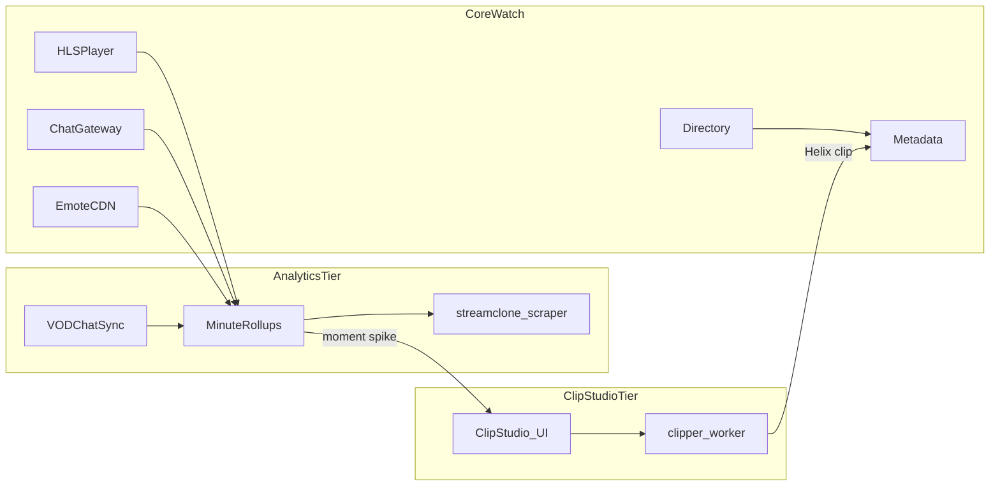
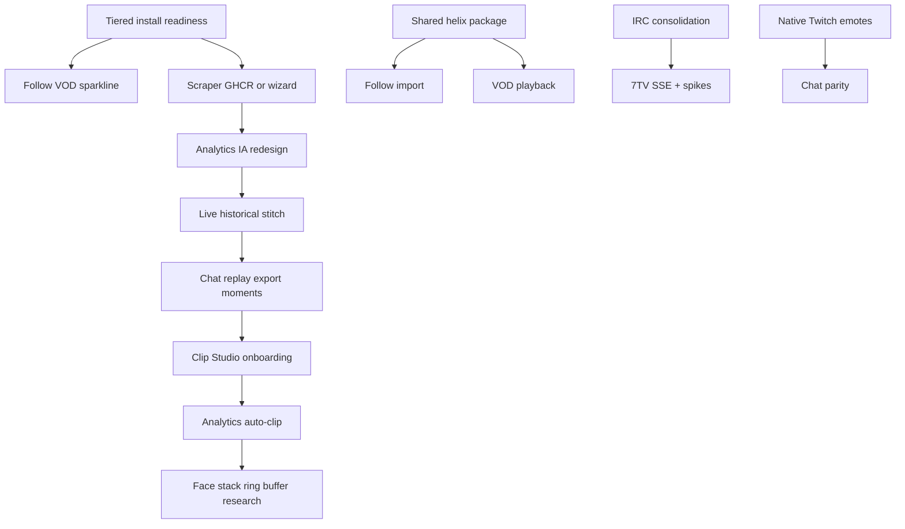

# Streamclone Product Roadmap

Evergreen backlog and suggested 12-month phasing for Streamclone — a self-hosted, operator-owned Twitch viewing loop. Grounded in the current codebase, [install audit](./install-benchmark-and-revamp-audit.md), [optional profiles](./options.md), and [steering docs](../.kiro/steering/).

**Status key:** **Already partial** · **Greenfield** · **Deferred v0.1.5**

---

## 1. Purpose & positioning

Streamclone is a **local-first, self-hostable** streaming workspace that mirrors the core Twitch loop — directory, live HLS relay, chat, emotes, analytics, optional vertical clip export — without ads, without cloud accounts for viewing, and with **data you own**.

### What Streamclone optimizes for

| Dimension | Streamclone | Native Twitch |
|-----------|-------------|---------------|
| Playback | Server-side HLS relay via Streamlink/FFmpeg → MediaMTX; ad segments stripped in relay manifest (`filterTwitchAdSegments` in `internal/video/orchestrator/orchestrator.go`) | Browser player with ad breaks; embed-bound |
| Chat | Server-side IRC ingest, enrichment, WebSocket to browser; optional send with localhost OAuth | Twitch web chat; extension-dependent emotes |
| Emotes | Local WebP CDN (7TV + FFZ today); Redis dictionary tokenization | Twitch + extensions; no local asset control |
| Analytics | Per-minute rollups (viewer, chat, provider emote spikes); VOD chat GQL sync; TwitchTracker enrichment | Creator dashboard; limited VOD chat UX for viewers |
| Clips | Optional Clip Studio tier — analytics-driven queue, vertical render, local SQLite archive | Helix clips in-browser; no local render pipeline |
| Install | Docker Compose on localhost `:8090`; Windows Setup.exe ships **Core Watch** (~382.5 MB GHCR, 6 images) | N/A — SaaS |
| Diagnostics | Honest requested vs loaded quality, relay startup breakdown, sync progress, scraper/health panels | Opaque player states |

### Architectural principle

The browser talks only to Streamclone services (Caddy proxy at `http://localhost:8090`). Upstream Twitch, 7TV, FFZ, and TwitchTracker access stays **server-side**. See [product steering](../.kiro/steering/product.md).

### Audience

- **Core users:** watch, chat read, basic Helix/VOD summary analytics — no Twitch login required.
- **Analytics users:** minute-level viewer charts + VOD chat sync — requires **Analytics tier** (scraper profile + sibling [streamclone-scraper](https://github.com/Aron-Chu/streamclone-scraper)).
- **Clipper users:** moment detection, Helix clip creation, vertical MP4 export — optional **Clip Studio tier** (`clipper` profile) + optional Twitch sign-in for clip scopes.

### Related docs

- Install: [install-desktop.md](./install-desktop.md), [install-benchmark-and-revamp-audit.md](./install-benchmark-and-revamp-audit.md)
- Profiles: [options.md](./options.md)
- Steering: [product.md](../.kiro/steering/product.md), [analytics.md](../.kiro/steering/analytics.md), [clipper.md](../.kiro/steering/clipper.md), [emote-pipeline.md](../.kiro/steering/emote-pipeline.md)
- Security: [security.md](./security.md)

---

## 2. Current tiers (core / analytics / clipper)

From [options.md](./options.md) and [install audit](./install-benchmark-and-revamp-audit.md). Setup.exe **always installs `core` only** (v0.1.4 decision).

| Tier | Compose profile | GHCR / install | What you get |
|------|-----------------|----------------|--------------|
| **Core Watch** | `core` (default) | 6 images, **382.5 MB** local pull (`v0.1.4-rc1` benchmark) | Directory, HLS playback, chat read, 7TV/FFZ emotes, Helix/VOD **summary** analytics, setup-control optional-service toggles |
| **Analytics** | `+ scraper` | **Not on GHCR** — sibling repo `streamclone-scraper` cloned beside install dir | Minute-level TwitchTracker viewer charts, Reddit LSF enrichment, Camoufox scrape pool, full VOD sync with tracker detail (`meta#ecs`) |
| **Clip Studio** | `+ clipper` | Optional clipper image (~1.01 GB trimmed locally) | `/studio` vertical render, Helix clip queue, SQLite job history, analytics moment → clip workflow |

```powershell
# Interactive tier selection (developers)
powershell -File scripts\setup.ps1

# Non-interactive full stack
scripts\setup.sh --profile full --non-interactive
```

### Core GHCR image breakdown (v0.1.4-rc1)

| Image | Local size (MB) | Role |
|-------|-----------------|------|
| `metadata` | 7.1 | Directory, Helix/GQL |
| `chat` | 7.1 | IRC gateway |
| `video` | 232.2 | Orchestrator + relay (largest core image) |
| `emote` | 107.5 | 7TV/FFZ pipeline |
| `analytics` | 8.2 | Rollups, sync API |
| `frontend` | 20.3 | React UI |
| **Total** | **382.5** | Core Watch only |

Trim notes: `video` 924→380 MB, `emote` 430→136 MB locally — publish trimmed tags to GHCR and benchmark **registry pulls**, not local builds ([install audit](./install-benchmark-and-revamp-audit.md)).

### Tier honesty (v0.1.4 gate — **Already partial**)

- `profile-core.env` comments state Helix/VOD summary only; minute charts need scraper.
- `Analytics.tsx` + `ServiceStatusBanner.tsx` show empty-state guidance + link to [scraper-cloudflare-and-proxy.md](./scraper-cloudflare-and-proxy.md).
- **Start Analytics** via setup-control starts scraper profile on demand ([`OptionalServicesPanel.tsx`](../frontend/src/components/OptionalServicesPanel.tsx), [`useOptionalServices.ts`](../frontend/src/hooks/useOptionalServices.ts)).

---

## 3. What we already do that Twitch doesn't

Inventory from the current codebase — differentiation anchors for roadmap prioritization.

### Playback & channel workspace

- **Ad-stripped local HLS relay** — `filterTwitchAdSegments` rewrites Twitch ad discontinuities out of relay manifests before the browser sees them (`internal/video/orchestrator/orchestrator.go`). Twitch serves ads in-player.
- **Requested vs loaded quality** — separate UI state in [`Channel.tsx`](../frontend/src/components/Channel.tsx); request menu reflects backend renditions when known. Twitch collapses this into opaque adaptive behavior.
- **Relay startup diagnostics** — startup timing breakdown visible during cold start. Twitch provides no equivalent for third-party relays.
- **Server-side fallbacks** — Streamlink → direct Usher HLS → FFmpeg path stays server-side per [product guardrails](../.kiro/steering/product.md). No browser Twitch embed default.
- **Playback latency modes** — `PlaybackLatencyMode` (`stable` | `fast` | `instant`) in [`settings.ts`](../frontend/src/settings.ts), wired through [`playback.ts`](../frontend/src/playback.ts) and video orchestrator. **Already partial** — modes exist; buffer stats UI expansion is backlog.
- **Channel workspace density** — `Comfort` / `Dense` bottom panel modes, expandable lower workspace beyond a bare player shell.

### Analytics & moments

- **Per-minute rollup merge** — `mergeMinuteRollups` fuses viewer, chat, and emote fields per minute bucket (`internal/analytics/`). Twitch Creator Dashboard is aggregate-oriented; viewers get no minute chart.
- **Provider-specific emote spike reasons** — [`Analytics.tsx`](../frontend/src/components/Analytics.tsx) classifies moments: `viewer_spike`, `chat_spike`, `seventv_spike`, `twitch_spike`, `ffz_spike`, etc. Twitch has no cross-provider emote velocity chart.
- **VOD chat GQL sync with progress UI** — `SyncProgressPanel` shows segment grid, phase timings (`tracker_scrape_ms`, `gql_fetch_ms`, …). Twitch VOD chat is live-scroll only in native UX.
- **Chat-only resync path** — when `viewerSamples > 0`, sync skips TwitchTracker and patches chat rollups only (`BulkPatchChatRollups`). **Already partial** — backend exists; **Deferred v0.1.5**: expose as user-facing "VOD chat without scraper profile."
- **Multi-source channel context** — LSF Reddit multi-provider fallback + TwitchTracker + Helix in one analytics workspace. Twitch has no LSF integration.
- **Honest chat coverage** — `hasGoodChatCoverageFromRollups` (`internal/analytics/chat_coverage.go`) — **Already partial**; not yet user-visible percentage.
- **Clip queue from chart** — analytics embeds Clipper Edits / Twitch Clips tabs; `pick_reason` includes spike types ([`api.ts`](../frontend/src/api.ts)).

### Emotes & chat

- **Local WebP emote CDN** — 7TV + FFZ channel sets rendered to MinIO, served at `/emotes/{uuid}/1x.webp`. Twitch serves emotes from Twitch CDN only; extensions are browser-side.
- **Provider toggles in channel workspace** — compact `Chat emotes` control with 7TV/FFZ toggles and processing poll states.
- **Redis dictionary + delta fan-out** — chat enricher hot-reloads on `emotes:delta:{login}` without full page refresh.

### Ops & install

- **Setup-control optional services** — Start Analytics / clipper toggles via host API (`scripts/setup-control.ps1`, proxied `/v1/setup-control/*`). Token auth **Already partial** (`SETUP_CONTROL_TOKEN` + `X-Streamclone-Setup-Token`).
- **SystemHealthPanel** — full variant in WelcomeOverlay; compact in Settings → Stack status (`useSystemHealth`, `useOptionalServices`).
- **No ads, no account required** for core watch loop — anonymous IRC read, anonymous playback.

### Clipper (adjacent tier)

- **Analytics-driven clip queue** — spike timestamps pre-fill Clip Studio trim. Twitch clips are manual or Streamer.bot-dependent.
- **Vertical multi-aspect presets** — [`VideoStage.tsx`](../frontend/src/components/clipStudio/VideoStage.tsx) TikTok/YT Shorts/Twitter layouts. Twitch has no native vertical export.
- **Local SQLite job archive** — clipper durable state in `clipper/` worker, not cloud. **Already partial**.

### Moment spike taxonomy (Analytics.tsx)

The analytics chart annotates rollup minutes with spike **reasons** derived from multipliers against rolling baselines. Current reason strings include:

| Reason | Meaning | Twitch equivalent |
|--------|---------|-------------------|
| `viewer_spike` | Minute viewer count >> recent baseline | None for viewers |
| `chat_spike` | Chat message rate spike | None chart-linked |
| `seventv_spike` | 7TV emote usage spike in rollups | Extension-only, no history chart |
| `twitch_spike` | Twitch emote rollup spike (when synced) | Creator emote stats only |
| `ffz_spike` | FFZ emote rollup spike | Extension-only |
| `emote_spike` | Generic emote spike when provider unspecified | None |
| `manual` | User-selected moment for clip queue | Manual clip only |

Classification logic in [`Analytics.tsx`](../frontend/src/components/Analytics.tsx) compares chat and emote multipliers; 7TV provider wins `seventv_spike` when emote mult dominates. This is foundation for **unified moment score** (Section C.2).

### Ad stripping mechanics (filterTwitchAdSegments)

- **What:** Server-side manifest rewriter removes Twitch ad discontinuity markers and ad segment URIs from relay HLS playlists before the browser loads them.
- **Where:** `internal/video/orchestrator/orchestrator.go` — invoked when serving cleaned playlists to MediaMTX relay consumers.
- **Why vs Twitch:** Viewers get uninterrupted content on local relay; Twitch intentionally inserts ad breaks in Usher manifests.
- **Limitation:** Does not bypass subscriber-only or geo-blocked content — compliance remains user responsibility.
- **Tests:** `internal/video/orchestrator/proxy_test.go` covers segment filtering edge cases.

### VOD sync pipeline (already shipped — reference for backlog)

Phases logged by `SyncHistoricalStream` ([analytics steering](../.kiro/steering/analytics.md)):

1. **Tracker scrape** — TwitchTracker detail via scraper (`meta#ecs` or Highcharts injection ≥3 points)
2. **VOD resolve** — DB cache → Helix `VideoIDByStreamID` (parallel) → tracker HTML fallback
3. **GQL fetch** — parallel segment paging with rate coordinator on 429/503
4. **Tokenize** — emote dictionary preload + comment → rollup fragments
5. **Rollup write** — `mergeMinuteRollups` per minute bucket

UI surfaces phase timing in **SyncProgressPanel**. Backlog items extend export, replay, and chat-only paths — not replace this pipeline.

---

## 4. Architecture diagram

Core → Analytics → Clipper data flow. Browser always hits Caddy `:8090`.



**IRC duplication note:** today Twitch sees up to **three** IRC pools when all tiers run — `cmd/chat`, `cmd/analytics`, `clipper/liveclipper/irc.py`. Consolidation is Section H enabler ([analytics steering](../.kiro/steering/analytics.md)).

### Service port map (localhost via Caddy :8090)

| Path / service | Upstream | Tier |
|----------------|----------|------|
| `/` frontend | `frontend:3000` | Core |
| `/v1/metadata/*` | metadata | Core |
| `/v1/video/*` | video orchestrator | Core |
| `/v1/chat/*` | chat gateway | Core |
| `/v1/emotes/*` | emote CDN + API | Core |
| `/v1/analytics/*` | analytics rollups | Core (summary); full charts need scraper |
| `/live/{login}/index.m3u8` | MediaMTX relay | Core |
| `/v1/clipper/*` | clipper `:8095` | Clipper profile |
| `/v1/setup-control/*` | host `setup-control.ps1` `:9191` | Core |
| Scraper (internal) | `scraper:8000` | Analytics profile |

PostgreSQL and Redis are internal-only. Browser never contacts raw service ports except through Caddy single-origin policy.

### Data ownership model

| Data | Storage | Operator control |
|------|---------|------------------|
| Minute rollups | PostgreSQL (`analytics_*` tables) | Export backlog Section C |
| Emote WebP assets | MinIO/S3-compatible | Backup wizard Section G |
| Clipper jobs | SQLite + local MP4 dir | Clipper tier only |
| Camoufox profile | Docker volume `scraper-profile` | Warmup scripts Section A/C |
| Twitch OAuth tokens | Local `.env` / secure store | Optional sign-in only |
| Redis chat/emote cache | Ephemeral + rebuildable | Cleared on volume wipe |

---

## Section A — Install, uninstall, and QoL backlog

Grounded in [install-benchmark-and-revamp-audit.md](./install-benchmark-and-revamp-audit.md), [install-desktop.md](./install-desktop.md), and `scripts/`.

### A.1 Speed & download size

| Feature | What | Why vs Twitch | Deps / files | Tier | Status |
|---------|------|---------------|--------------|------|--------|
| Publish trimmed GHCR tags | Ship `v0.1.4+` images with Alpine trims (video 924→380 MB, emote 430→136 MB) | Faster first install; Twitch is instant SaaS | `.github/workflows/release-images.yml`, Dockerfiles | Core | **Already partial** — local builds done; registry publish pending |
| Benchmark registry pulls | Measure compressed transfer + pull time, not local `docker build` | Honest release notes | `scripts/benchmark-ghcr-pull.ps1` | Core | **Greenfield** process |
| Incremental `docker compose pull` on Start | Only pull changed layers when restarting | Reduces daily friction | `scripts/start-streamclone.ps1` | Core | **Greenfield** |
| Parallel image pull in installer | Pull 6 core images concurrently during Setup.exe | Cuts install wall time on fast networks | `scripts/install-setup-progress.ps1` | Core | **Greenfield** |
| Optional offline core bundle | Ship pre-pulled tarball in Setup.exe for air-gapped installs | Enterprise / slow-link users | `scripts/package-release.sh` | Core | **Greenfield** |
| Exclude clipper from core metrics | Release notes state clipper (~1 GB) is optional-only | Prevents "why is install 1.5 GB?" confusion | docs, installer copy | Core | **Already partial** in audit |

### A.2 Reliability & readiness

| Feature | What | Why vs Twitch | Deps / files | Tier | Status |
|---------|------|---------------|--------------|------|--------|
| Tiered readiness gates | infra (postgres/minio) → apps → HLS playable → optional scraper | Installer currently says "ready" at Caddy 2xx only | `scripts/lib/wait-stack.ps1`, `scripts/setup.ps1`, `scripts/smoke-core.ps1` | Core | **Greenfield** |
| Fail setup on required tier failure | Block completion banner when postgres/HLS fail, not just `Write-Warning` | Trust — Twitch never "half installs" | `scripts/setup.ps1` | Core | **Greenfield** |
| Per-tier timing in benchmarks | Record postgres-ready, HLS-ready, scraper-ready ms separately | Split core vs analytics install metrics | benchmark scripts | Core | **Greenfield** |
| Fix HLS benchmark manifest path | Probe `index.m3u8` not `main_stream.m3u8` | Accurate HLS cold-start metrics | `scripts/benchmark-hls-start.ps1` | Core | **Done** — script probes `index.m3u8` first with `main_stream.m3u8` legacy fallback |
| Fix preflight capture in benchmarks | Nested `preflight-deps.ps1` stdout piping returns empty in some shells | Reliable CI/benchmark JSON | benchmark scripts | Core | **Deferred v0.1.5** |
| Docker pre-flight gate | `docker context` + `docker info` before every install/benchmark | Avoid false failures when Desktop stopped | `scripts/preflight-deps.ps1` | Core | **Already partial** |
| Pin/record third-party digests | MinIO, MediaMTX, Caddy image digests in release manifest | Reproducible installs | `deploy/docker-compose.release.yml` | Core | **Greenfield** |
| MediaMTX/MinIO healthchecks | Emote starts only after MinIO serving | Eliminates race on cold start | `deploy/docker-compose.yml` | Core | **Greenfield** |
| HLS auth mismatch self-heal | Detect Caddy/MediaMTX shared-secret drift | Reduces mysterious 401 loops | `frontend/src/playback.ts`, smoke | Core | **Greenfield** |

### A.3 Install & uninstall UX

| Feature | What | Why vs Twitch | Deps / files | Tier | Status |
|---------|------|---------------|--------------|------|--------|
| "Docker Desktop not running" blocking screen | Hard stop with launch-Docker CTA, no silent continue | #1 Windows install failure mode | installer UI, `scripts/preflight-deps.ps1` | Core | **Greenfield** (audit P0 strategic) |
| Install progress with per-tier timings | Wizard shows pull/setup/HLS/scraper phases | Transparency vs opaque SaaS signup | `scripts/install-setup-progress.ps1` | Core | **Greenfield** |
| Analytics wizard step | "Include viewer charts?" → scraper clone or GHCR pull | Closes core-vs-analytics promise gap | installer, `scripts/setup.ps1` | Analytics | **Greenfield** (audit option C) |
| One-click "Warm scraper" post-install | Runs `warm-camoufox-profile.ps1` after scraper tier start | First sync often fails cold CF | `scripts/warm-camoufox-profile.ps1`, setup-control | Analytics | **Greenfield** |
| Profile-aware uninstall | Pass only profiles actually installed (core-only skips scraper+clipper) | Avoids confusing Docker errors | `scripts/uninstall-streamclone.ps1` | Core | **Done** — compose down uses recorded `STREAMCLONE_PROFILE`; unknown markers fall back to full teardown |
| Uninstall fast path | Stop + remove containers only | Quick pause-like removal | `scripts/uninstall-streamclone.ps1` | Core | **Greenfield** |
| Uninstall full path | Volumes + `%USERPROFILE%\streamclone` | Complete removal | same | Core | **Already partial** |
| "Keep analytics DB / emote library" checkbox | Selective volume retention on uninstall | Power users preserving history | uninstall script + compose volume names | Core | **Greenfield** |
| Uninstall removal report | List containers, volumes, folders removed | Trust | uninstall script | Core | **Greenfield** |
| Manage Streamclone tray app | Restart, logs, disk usage from system tray | Operator QoL — Twitch has no local stack | new launcher or extend Start/Stop scripts | Core | **Greenfield** |

### A.4 Security & script consistency

| Feature | What | Why vs Twitch | Deps / files | Tier | Status |
|---------|------|---------------|--------------|------|--------|
| Crypto RNG for secrets | Replace `Get-Random` with `[System.Security.Cryptography.RandomNumberGenerator]` | Shipped secrets must be unpredictable | `scripts/lib/env.ps1` | Core | **Done** — `Get-EnvRandomHex` uses crypto RNG; no `Get-Random` remains in `scripts/` |
| Disable dev token import in release | `TWITCH_DEV_TOKEN_IMPORT_ENABLED=false` in shipped templates | Matches [security.md](./security.md) | `deploy/env/profile-core.env`, `scripts/package-release.sh` | Core | **Done** — release-bundle.env ships `false`; dev keeps `true` via `.env.dev`; validators are release-aware |
| Unified `Get-StreamcloneComposeArgs` | One compose builder for setup/start/stop/uninstall/setup-control/reload | Tag drift and overlay bugs | `scripts/lib/env.ps1`, all host scripts | Core | **Already partial** — some scripts fixed |
| Setup-control token on all POSTs | `X-Streamclone-Setup-Token` validated | CSRF on localhost | `scripts/setup-control.ps1`, `frontend/src/api.ts` | Core | **Already partial** |
| Installer CI smoke | Setup.exe exit code + progress file + `smoke-core.ps1` in CI | Catch regressions before tag | `.github/workflows/ci.yml` | Core | **Already partial** |

### A.5 Cross-platform

| Feature | What | Why vs Twitch | Deps / files | Tier | Status |
|---------|------|---------------|--------------|------|--------|
| macOS notarization | Signed + notarized `.app` / `.command` launchers | Gatekeeper trust | `launchers/`, CI | Core | **Greenfield** |
| Linux deb/AppImage | Packaged install beyond `make setup` | Linux self-hosters | new packaging scripts | Core | **Greenfield** |
| WSL vs Hyper-V guidance in installer | Detect and recommend Docker backend on Windows | Reduces context drift | installer docs + preflight | Core | **Greenfield** |
| Cold-install VM benchmark | True clean-machine Setup.exe proof | Install score capped until done | QA process | Core | **Greenfield** |

### A.6 Scraper delivery (install-adjacent)

| Feature | What | Why vs Twitch | Deps / files | Tier | Status |
|---------|------|---------------|--------------|------|--------|
| Publish scraper to GHCR | Camoufox scraper image in release matrix | Analytics works OOTB from Setup.exe | `streamclone-scraper` repo, release workflow | Analytics | **Greenfield** (audit option B) |
| One-click sibling clone in Manage UI | Clone `streamclone-scraper` beside install dir | Current default path | setup-control, frontend | Analytics | **Already partial** via setup docs |
| Scraper not in default Setup.exe | Document clearly in installer + empty state | Honest tiers (v0.1.4 decision) | docs, UI | Analytics | **Already partial** |

### A.7 Benchmark discipline (ongoing)

Reference targets from [install audit](./install-benchmark-and-revamp-audit.md) — re-run before each release tag:

| Benchmark script | Measures | v0.1.4-rc1 baseline | Target |
|------------------|----------|---------------------|--------|
| `benchmark-ghcr-pull.ps1` | Compressed pull + local size per core image | **382.5 MB** total (6 images) | Document on final tag |
| `benchmark-exe-install.ps1` | Setup.exe exit code + duration | Partial (reinstall 2s) | Cold VM exit 0 |
| `benchmark-restart.ps1` | Stop → Start → HTTP 200 | stop 2.3s, up 17.1s, HTTP 0.1s | Stable on `%USERPROFILE%\streamclone` |
| `smoke-core.ps1` | healthz + proxy 200 | Pass | Gate release |
| `benchmark-hls-start.ps1` | Relay startup + manifest 200 | Pass manual; script path bug | Fix manifest probe |
| `benchmark-analytics-load.ps1` | insights/history/streams p50 | insights 15ms, history 13ms | p50 &lt;3s heavy paths |

Pre-flight gate (`preflight-deps.ps1 -JsonSummary`) must pass before any benchmark row is recorded. Record `IMAGE_TAG`, compose files, GHCR vs local build in output JSON.

### A.8 Alternative install architectures (reference only)

From install audit — **not** near-term roadmap unless Docker Desktop fixes plateau:

| Option | Pros | Cons | Roadmap stance |
|--------|------|------|----------------|
| Docker Desktop compose (current) | Best stack compatibility | Windows startup/context fragility | **Active** — tiered readiness, preflight |
| Pre-bundle lightweight core images | Faster first run | Larger Setup.exe, update complexity | Section A.1 offline bundle |
| Native Windows services | Better UX | Major rewrite | **Out of scope** Section J |
| WSL-managed stack | Deterministic Linux runtime | User setup friction | Document in installer guidance |

---

## Section B — Core viewer & channel workspace

Deferred v0.1.5 items and UX gaps from [product steering](../.kiro/steering/product.md).

### B.1 Playback & VOD

| Feature | What | Why vs Twitch | Deps / files | Tier | Status |
|---------|------|---------------|--------------|------|--------|
| In-player VOD playback | Relay past broadcasts through existing ffmpeg/Streamlink path, not Twitch embed | Ad-free VOD, local quality control; guardrail: no browser embed default | `cmd/video`, `Channel.tsx`, orchestrator | Core | **Deferred v0.1.5** |
| VOD tab actions | Jump to analytics stream, sync chat, open in player from channel VOD list | Unified workspace vs separate Twitch VOD page | `Channel.tsx`, metadata API | Core | **Greenfield** |
| Latency modes + buffer stats | Expand `PlaybackLatencyMode` UI with visible buffer depth, downgrade reasons | Honest latency vs Twitch "low latency" toggle | `playback.ts`, `Channel.tsx` | Core | **Already partial** |
| Audio-only mode | Video element hidden; audio continues | Bandwidth saver for background listening | `Channel.tsx`, player controls | Core | **Greenfield** |
| PiP / chat-only layout | Picture-in-picture or chat-focused layout while listening | Multitask viewing | `Channel.tsx` CSS/layout | Core | **Greenfield** |
| Stream error recovery UX | Surface structured errors from orchestrator (offline, geo, token) | Twitch shows generic offline slate | `Channel.tsx`, video API | Core | **Already partial** |

### B.2 Channel header & social

| Feature | What | Why vs Twitch | Deps / files | Tier | Status |
|---------|------|---------------|--------------|------|--------|
| Live viewer sparkline | Mini chart in channel header from live collector or Helix polls | At-a-glance trend; Twitch shows point-in-time count only | analytics live API, `Channel.tsx` | Core / Analytics | **Deferred v0.1.5** |
| Follow / unfollow button | Wire UI to existing follow API | Local follow list without leaving app | `getFollowed` in `api.ts`, `Channel.tsx` | Core | **Deferred v0.1.5** |
| Import Twitch follow list on sign-in | Populate ChannelRail from Helix follows | Faster onboarding for authenticated users | `ChannelRail.tsx`, Helix | Core | **Greenfield** |
| Custom directory lists | Pin channels, hide categories, "my roster" separate from Twitch follows | Personal curation | metadata + frontend | Core | **Greenfield** |
| Raid / host visualization | Parse IRC USERNOTICE; timeline marker on analytics chart | Moment context Twitch buries in chat | `internal/chat/parse`, `Analytics.tsx` | Core / Analytics | **Greenfield** |
| Hype train / sub train detection | Chat pattern detector → clipper triggers | Auto-highlight moments | chat parse, clipper webhook | Analytics / Clipper | **Greenfield** (spec: live-clipper requirements) |

### B.3 Chat replay & workspace

| Feature | What | Why vs Twitch | Deps / files | Tier | Status |
|---------|------|---------------|--------------|------|--------|
| Chat replay scrub mode | Scrub analytics chart → chat panel shows historical messages for that minute | Unique VOD review UX; Twitch VOD chat is not chart-linked | `Analytics.tsx`, rollup API, chat history | Analytics | **Greenfield** |
| Chat replay without scraper | Helix/GQL-only path for users without scraper profile | Lowers analytics tier barrier | sync service, `profile-core.env` | Analytics | **Deferred v0.1.5** |
| Multi-channel grid | 2–4 simultaneous relays in one view | Power-user monitoring; resource-heavy | video orchestrator, frontend layout | Core | **Greenfield** |
| OBS virtual cam / NDI output | Export local relay stream for restreamers | Streamers using Streamclone as source | video pipeline, FFmpeg | Core | **Greenfield** |

### B.4 Personal data (local-only)

| Feature | What | Why vs Twitch | Deps / files | Tier | Status |
|---------|------|---------------|--------------|------|--------|
| Personal watch history | Local SQLite/Postgres watch log, no cloud | Privacy-first recall | new table or sidecar DB | Core | **Greenfield** |
| Block list / NSFW tag | Local content filtering for household installs | Parental control Twitch lacks locally | metadata filters, settings | Core | **Greenfield** |

### B.5 Channel workspace UX (existing — extend, don't regress)

Per [product steering](../.kiro/steering/product.md), preserve when shipping backlog items:

- **WelcomeOverlay** — full `SystemHealthPanel` on first run; optional-service controls for Analytics/Clipper.
- **Settings → Stack status** — compact health panel; same data sources as Welcome (`useSystemHealth`, `useOptionalServices`).
- **Requested vs loaded quality** — separate state; request menu reflects backend renditions when known.
- **Bottom panel density** — `Comfort` / `Dense` modes in lower workspace; emote provider toggles must stay reachable.
- **LSF / About integration** — Reddit multi-provider fallback data in channel context (analytics tier enrichment).
- **Structured stream errors** — offline, geo, token failures visible; no silent empty player.
- **Localhost token import** — preserve device-code / token import affordance for optional auth.

### B.6 Playback latency modes (expand backlog detail)

Current `PlaybackLatencyMode` values in [`settings.ts`](../frontend/src/settings.ts):

| Mode | HLS behavior (summary) | Backlog |
|------|------------------------|---------|
| `stable` | Larger buffer, fewer rebuffers | Show buffer depth in diagnostics |
| `fast` | Reduced latency target | Surface downgrade events to user |
| `instant` | Aggressive low-latency config | Warn on unstable networks |

[`playback.ts`](../frontend/src/playback.ts) implements `hlsLatencyConfig`, automatic downgrade via `onLatencyDowngrade`, and `latencyModeLabel` for UI. Twitch "Low Latency" is opaque; Streamclone should expose **why** a downgrade happened (buffer starved, segment gap, relay stall).

### B.7 Follow API (Deferred v0.1.5 — wire UI)

Backend/API groundwork is **thinner than previously stated** (verified 2026-06):

- `getFollowedChannels` (read-only) exists in [`frontend/src/api.ts`](../frontend/src/api.ts); `ChannelRail.tsx` consumes it.
- **No follow/unfollow mutations exist** in `api.ts` or the metadata service.
- Twitch removed the Helix follow/unfollow write endpoints (2021), so this must be a **local follow list** (new metadata table + endpoints), not a Helix passthrough.

**Gap:** channel page lacks follow/unfollow control, and the backend write path doesn't exist yet. **Why vs Twitch:** local follow list can diverge from Twitch follows (custom roster backlog B.2). **Deps:** new metadata follow table + API, frontend mutation + button. **Tier:** Core. **Effort:** Medium (was misfiled as Low).

---

## Section C — Analytics & scraper differentiators

Build on [`internal/analytics/`](../internal/analytics/) and sibling [streamclone-scraper](https://github.com/Aron-Chu/streamclone-scraper). See [analytics steering](../.kiro/steering/analytics.md) and [scraper optimization notes](../.kiro/specs/scraper-optimization-notes.md).

### C.1 Near-term — extend what exists

**Sequencing note:** Ship analytics **information architecture and live/historical trust** before chat replay, export, and moment ranking deepen the loop. Defer channel compare and scheduled sync until the single-stream workflow is legible and scraper delivery is solved (Section A.6).

| Feature | What | Why vs Twitch | Deps / files | Tier | P | Status |
|---------|------|---------------|--------------|------|---|--------|
| **Analytics workspace IA redesign** | Moment-review cockpit: left stream rail + filters/sync state, header with freshness + coverage + primary CTA, center Moment Timeline chart, right tabs (Moments default), minute detail drawer | Today `Analytics.tsx` routes, syncs, charts, moments, emotes, and clips in one crowded surface — powerful but hard to trust; elevates existing Top Moments logic without new backend | `Analytics.tsx`, `chartTheme.ts` | Analytics | **P1** | **Greenfield** — UX debt |
| **Live stream identity + historical stitch** | Reconcile live route vs historical stream IDs; empty states when live collector has zero rollups but history is rich; stitch live tail → synced VOD on one chart | Playwright: rail says "Collecting now" while chart says "No recent data" — undermines honest diagnostics | live collector, rollups merge, `Analytics.tsx` | Analytics | **P1** | **Already partial** backend |
| Export rollups CSV/JSON/Parquet | Download per-stream minute data | Data portability; Twitch exports are creator-only | analytics API, `Analytics.tsx` | Analytics | **P2** | **Greenfield** |
| Channel compare overlay | Two logins, normalized timelines on one chart | Competitive analysis — **after** export + replay + single-stream clarity | `Analytics.tsx`, rollups API | Analytics | **P3** | **Deferred** — edge cases multiply early |
| Game-segment chapters | Surface `GET .../games` as clickable chart chapters | Chapter navigation; Twitch has VOD chapters for creators only | analytics API, frontend | Analytics | **P2** | **Already partial** — API exists |
| Manual bookmark / saved moment | Star any minute rollup; persist locally; bridge to replay + clip queue | Small glue between analytics, replay, and Clip Studio (see L2) | `Analytics.tsx`, local storage or metadata API | Analytics | **P2** | **Greenfield** |
| Follower-gain correlation | Overlay TwitchTracker follower delta on rollups | Growth vs content moments | scraper + rollups merge | Analytics | **P3** | **Greenfield** |
| Chat word/phrase frequency | Per-segment term stats from synced VOD chat | Content analysis | sync tokenization, new aggregation | Analytics | **P3** | **Greenfield** |
| Camoufox warmup in setup flow | Integrate `warm-camoufox-profile.ps1` into Start Analytics | First sync success rate | setup-control, scripts | Analytics | **P1** | **Greenfield** |
| Publish scraper to GHCR OR wizard clone | See Section A.6 | Analytics OOTB | release pipeline | Analytics | **P0** | **Greenfield** |
| Analytics ↔ scraper contract tests | Versioned API assertions in CI | Catch sibling drift | `.github/workflows/smoke-scraper.yml` | Analytics | **P1** | **Greenfield** (audit P1 #9) |
| VOD chat resync without scraper profile | User-facing chat-only sync when viewer data exists | Core-adjacent users get chat charts | `BulkPatchChatRollups`, UI copy | Analytics | **P1** | **Deferred v0.1.5** / **Already partial** backend |
| Chat coverage honesty UI | Show "X% of stream has chat data" from `hasGoodChatCoverageFromRollups` | Honest data gaps vs implied completeness | `chat_coverage.go`, `Analytics.tsx` | Analytics | **P1** | **Already partial** |
| SyncProgressPanel enhancements | ETA, cancel, retry per phase | Operator control during long VOD sync | `Analytics.tsx` | Analytics | **P2** | **Already partial** |
| Early stream row / syncing API | Placeholder row during sync (no 404) | Better loading UX | analytics sync | Analytics | **P2** | **Already partial** |
| Browser pool metrics in health panel | Scraper queue depth, CF state, pool warm | Debug scraper without CLI | scraper API, `SystemHealthPanel` | Analytics | **P2** | **Greenfield** |

Direct HTTP fast-path and host CDP toggles stay in **advanced scraper diagnostics** (Section C.5) — not primary product roadmap UX.

#### Analytics workspace redesign direction (P1)

Make Analytics a **moment review cockpit**, not a chart surrounded by secondary tables. Keep cyan/violet/emerald chart language from [`chartTheme.ts`](../frontend/src/components/analytics/chartTheme.ts); reduce card nesting; make sync/live/stats-only language explicit.

| Zone | Contents |
|------|----------|
| **Left rail** | Stream history, filters, synced vs stats-only state, compact health badges |
| **Header** | Title, stream identity, data freshness, coverage %, primary CTA: Sync / Resume / Refresh |
| **Center** | Moment Timeline chart — game chapters, sync frontier, selected playhead, clearer mode toggles |
| **Right panel** | Tabs: Moments · Emotes · Clips · Sync — **default Moments**, not emotes |
| **Drawer** | Selected minute: top emotes, chat rate, viewer delta, Open VOD, Queue Clip; later Replay Chat |

Existing Top Moments classification in [`Analytics.tsx`](../frontend/src/components/Analytics.tsx) (~line 2572) is the foundation — redesign **elevates** shipped value rather than inventing a parallel feature.

### C.2 Novel / rarely done elsewhere

| Feature | What | Why vs Twitch | Deps / files | Tier | Status |
|---------|------|---------------|--------------|------|--------|
| Unified moment score | Fuse viewer + chat + 7TV/Twitch/FFZ spikes into ranked highlights reel | One-click "best of stream" list | `Analytics.tsx` spike logic, new scoring | Analytics / Clipper | **Already partial** — spike reasons exist |
| Stream autopsy report | PDF/markdown export: peaks, top emotes, game switches, follower delta, LSF mentions | Shareable retrospective | export service, templates | Analytics | **Greenfield** |
| Cross-stream pattern mining | Heuristic: "chat spikes 90s after viewer spikes" per channel | Local ML-lite insights, no cloud | rollups analytics job | Analytics | **Greenfield** |
| Tracker scrape cache dashboard | Hit rate, CF block status, recommended warmup | Scraper operability | scraper metrics API | Analytics | **Greenfield** |
| Emote velocity heatmap | Separate lanes per provider on shared timeline | Visual emote meta; extends spike reasons | `Analytics.tsx` chart | Analytics | **Already partial** |
| Scheduled sync | Cron via setup-control for followed channels' latest VOD | Hands-off archive building — **after** scraper GHCR/wizard (A.6) | setup-control, analytics jobs | Analytics | **Deferred** — P3 |
| Reddit LSF ↔ moment linking | When LSF post timestamp overlaps rollup spike, cross-link in About tab | Community context | LSF provider, metadata UI | Analytics | **Already partial** — LSF data exists |
| Mock fallback guardrails | Keep `SCRAPER_ALLOW_MOCK_FALLBACK` dev-only with UI warning | Prevent flat charts mistaken as real | scraper env, Analytics empty state | Analytics | **Already partial** |

### C.3 Scraper sibling repo (external)

Scraper lives in **sibling repo** `streamclone-scraper`, not this monorepo. Key integration points:

- Compose service `scraper:8000`, `SCRAPER_API_URL=http://scraper:8000/v2/scrape`
- Default engine: **Camoufox** (`SCRAPER_BROWSER=camoufox`)
- Windows dev: `SCRAPER_EPHEMERAL_BROWSER=true`, diagnose via `docker exec` not host `:8000` (wslrelay risk)
- Real scrape requires `meta#ecs` or Highcharts injection ≥3 points — mock HTML yields flat charts

### C.4 Analytics API surface (reference for backlog)

Endpoints consumed by [`Analytics.tsx`](../frontend/src/components/Analytics.tsx) — extend, don't break routing guards:

| Endpoint | Purpose | Notes |
|----------|---------|-------|
| `GET /v1/analytics/channels/{login}/live` | Live rollup tail | Live route `/analytics/{login}` |
| `GET /v1/analytics/channels/{login}/streams` | Stream history sidebar | Only stream picker — no header dropdown |
| `GET /v1/analytics/streams/{streamId}` | Rollups + sparse mode | `targetQueryStreamId` guard for date slugs |
| `POST /v1/analytics/streams/{streamId}/sync?channel={login}` | VOD chat + tracker sync | Long-running; SyncProgressPanel |
| `GET /v1/analytics/streams/{streamId}/games` | Game segments | Chapter backlog C.1 |
| Sync status (Redis) | Phase + timing fields | `viewerStatus`: ok/failed/skipped/pending |

**Routing guard:** numeric `streamId` passes through; date slugs (`YYYY-MM-DD`) resolve via `matchedStream` only — never API-call with date string ([analytics steering](../.kiro/steering/analytics.md)).

### C.5 Scraper optimization backlog (from spec notes)

From [`.kiro/specs/scraper-optimization-notes.md`](../.kiro/specs/scraper-optimization-notes.md):

| Optimization | Config / behavior | Roadmap item |
|--------------|-------------------|--------------|
| P0 bridge profile | `SCRAPER_EPHEMERAL_BROWSER=true`, `MAX_CONCURRENT=1`, Reddit off | Windows dev default |
| Pooled browser | `ephemeral=false`, `max_concurrent=2` — faster warm TT detail (~5.9s p50) | Pool metrics in health panel |
| Direct HTTP fast-path | `ANALYTICS_TT_DIRECT_HTTP_ENABLED` | Advanced diagnostics only (Settings → Stack / scraper panel) — not main Analytics UX |
| Host CDP mode | `scripts/scraper-cdp.ps1` | Advanced diagnostics only — Windows dev iteration |
| TT proxy attempts | Camoufox forces direct for TwitchTracker | Document in scraper UI — proxy requests no-op |
| Host `:8000` on Windows | wslrelay stale listener — **never benchmark via host port** | Diagnostics copy in SystemHealthPanel |
| Scrape cache gating | `scrape_cache.put()` only on ecs or ≥3 chart points | Already in scraper |
| Humanized retry | `SCRAPER_RETRY_MAX=3`, jitter 2–12s | Expose retry count in sync status |

### C.6 Rollup merge rules (do not break)

When implementing export/compare/autopsy features:

- Multiple DB rows can exist per minute (sync at `:00`, live collector at offset seconds).
- **`mergeMinuteRollups`** merges viewer, chat, emote fields — not max-viewer replacement.
- **`consolidateRollupsByMinute`** dedupes via merge.
- Emote rollup keys store **local emote-service UUID** (`/emotes/{uuid}/1x.webp`), not 7TV provider id.
- Run `go test ./internal/analytics/...` after merge logic changes.

---

## Section D — Clipper & vertical video

From [clipper steering](../.kiro/steering/clipper.md), [live-clipper spec](../.kiro/specs/live-clipper/requirements.md), [emote-tokenizer-roadmap](../.kiro/specs/emote-tokenizer-roadmap.md).

**Boundary:** clipper is **adjacent** — SQLite, optional profile, does not block core viewer. Image ~1.01 GB trimmed locally; not in core GHCR pull.

### D.1 V1.5 clipper enhancements

**Sequencing note:** Ship onboarding and job-not-found recovery **before** auto-clip, batch export, or face stack. Today `/studio/missing-job` shows a small centered "Failed to load clip details from server." with no tier context or escape hatch.

| Feature | What | Why vs Twitch | Deps / files | Tier | P | Status |
|---------|------|---------------|--------------|------|---|--------|
| **Clip Studio onboarding + job-not-found recovery** | Explain clipper tier; show local archive; link back to Analytics; expose Start Clip Studio | First-run and error UX must match tier honesty before automation features | `ClipStudio.tsx`, `OptionalServicesPanel`, clipper SQLite | Clipper | **P1** | **Greenfield** |
| Queue clip from chart click | Timestamp + duration pre-filled from analytics spike | Frictionless moment → clip | `Analytics.tsx`, clipper API | Clipper | **P1** | **Already partial** |
| Batch export top N moments | Queue multiple clips from ranked moments list | Highlight reel automation | analytics + clipper queue | Clipper | **P2** | **Greenfield** |
| Template presets per game/category | Saved caption/layout presets | Faster vertical export per content type | `ClipStudio.tsx`, templates | Clipper | **P3** | **Greenfield** |
| Emote overlay on vertical render | Chat emote bursts on clip via `emote_overlay.py` | Vertical content with emote context | `clipper/liveclipper/emote_overlay.py` | Clipper | **P2** | **Already partial** |
| Hype-train / webhook dedupe | Improve duplicate suppression for burst triggers | Queue stability | clipper queue logic | Clipper | **P2** | **Greenfield** |
| Share link via R2/B2 | Optional upload after render | Remote sharing without Twitch clip page | clipper storage config | Clipper | **P3** | **Greenfield** (spec: later) |
| Whisper caption styles | Kinetic text, word emphasis coloring | Short-form polish | clipper render, ASS filters | Clipper | **P3** | **Greenfield** |
| Local clip archive browser | Search rendered MP4s by channel/date/reason | Offline library; Twitch clips are cloud-only | clipper SQLite + filesystem UI | Clipper | **P2** | **Already partial** — fold into D.1 onboarding |

### D.2 Differentiated capabilities

| Feature | What | Why vs Twitch | Deps / files | Tier | Status |
|---------|------|---------------|--------------|------|--------|
| Analytics-driven auto-clip | Internal webhook from rollup spikes — no Streamer.bot | Integrated moment → clip pipeline | analytics → clipper webhook | Clipper / Analytics | **Greenfield** |
| Chat-to-trim alignment | VOD chat peak timestamp + configurable latency offset | Aligns vertical clip to chat reaction | clipper trim logic (spec requirement) | Clipper | **Already partial** |
| Multi-aspect export | TikTok 9:16, YT Shorts, Twitter 1:1 presets | Platform-native outputs | `VideoStage.tsx` | Clipper | **Already partial** |
| IRC velocity monitor | Native clipper IRC spike detection without Streamer.bot | Standalone automation | `clipper/liveclipper/irc.py` | Clipper | **Already partial** |
| Helix async clip polling | Poll until clip downloadable; clear failure states | Reliable clip acquisition | `clipper/liveclipper/twitch.py` | Clipper | **Already partial** |
| Face/saliency stack (V2) | Dual-canvas vertical: webcam + gameplay crop (MediaPipe/YOLO) | Pro vertical content | roadmap spec; out of V1 | Clipper | **Research** — not committed Q4 ship |
| Ring-buffer capture (V2) | Rolling HLS buffer per watched channel; reduce Helix clip latency | Instant moments without clip API wait | video + clipper integration | Clipper | **Research** — RFC spike only |

### D.3 Clipper ops defaults

- V1 hosts nothing by default — local render only
- Dashboard binds `127.0.0.1`; WSL2 uses `CLIPPER_HOST=0.0.0.0`
- Single render worker default; duplicate suppression + chat cooldown separate
- Raw inputs deleted after successful render; configurable MP4 retention (~48h default)

### D.4 Clipper job lifecycle (reference)

States from [clipper steering](../.kiro/steering/clipper.md):

```
queued → creating_clip → downloading → transcribing → rendering → ready | failed
```

| State | User-visible meaning | Twitch equivalent |
|-------|---------------------|-------------------|
| `creating_clip` | Helix clip API in flight | Browser clip button |
| `downloading` | Streamlink fetch of clip URL | None locally |
| `transcribing` | faster-whisper (optional) | None |
| `rendering` | FFmpeg vertical + captions + emote overlay | None |
| `ready` | Open in Clip Studio / export MP4 | Clip watch page only |

Duplicate suppression and chat cooldown are separate mechanisms — backlog D.1 dedupe improvements must preserve both.

### D.5 Clipper ↔ Streamclone integration boundaries

**Allowed (thin clients):**

- `ClipStudio.tsx` at `/studio/:jobId`
- `Analytics.tsx` tabs — queue, list, link to studio
- Caddy `/v1/clipper/*` → clipper `:8095`

**Forbidden:**

- Routing clip creation through `cmd/video` or `cmd/chat`
- Storing job state in PostgreSQL metadata cache
- Making core viewer depend on clipper profile being up

New clipper features land in `clipper/liveclipper/` first; UI follows as API consumer.

### D.6 Vertical render stack (V1 vs V2)

| Capability | V1 (current / 1.5 backlog) | V2 (research) |
|------------|---------------------------|---------------|
| Aspect presets | TikTok 9:16, Shorts, 1:1 via VideoStage | Same + custom safe zones |
| Captions | Whisper → ASS burn-in | Kinetic styles, word emphasis |
| Emote overlay | `emote_overlay.py` burst rendering | Sync to chat spike timestamps |
| Trim alignment | Chat peak + latency offset | ML scene detection |
| Source capture | Helix clip + Streamlink download | Ring buffer from live relay (**research** — RFC only) |
| Face/gameplay stack | Single crop | Dual canvas MediaPipe/YOLO (**research** — not Q4 ship candidate) |

---

## Section E — Emotes & chat

From [emote-pipeline steering](../.kiro/steering/emote-pipeline.md) and [emote-tokenizer-roadmap](../.kiro/specs/emote-tokenizer-roadmap.md).

### E.1 Major gaps vs real Twitch chat

| Feature | What | Why vs Twitch | Deps / files | Tier | Status |
|---------|------|---------------|--------------|------|--------|
| Native Twitch emote IRC tag | Parse `emotes` tag ranges → fragments before custom tokenization | Kappa, subs, bits emotes missing today — first-impression chat fidelity gap | `internal/chat/parse`, enricher | Core | **P1** | **Greenfield** — major gap |
| BTTV provider toggle | Third provider alongside 7TV/FFZ | Extension parity | emote seeder, channel UI | Core | **Greenfield** |
| 7TV EventAPI SSE | Live emote set updates via `https://events.7tv.io/v3` | Real-time set changes without refresh | emote service background worker | Core | **Greenfield** |
| Aho-Corasick tokenizer | Punctuation-adjacent emotes (`Kappa`, `:)` boundaries) | Accuracy vs whitespace Trie | `internal/chat/enrich`, tokenizer roadmap | Core | **Greenfield** |
| Lazy hydration | Download emote assets on first chat sighting, not full catalog seed | Scale + faster channel join | emote worker, ensure API | Core | **Greenfield** |
| FFZ globals | `GET /v1/set/global` metadata + lazy assets | Global emote parity | emote seeder | Core | **Greenfield** |
| Provider TTL reconciliation | Periodic REST reconcile when SSE missed | Consistency | emote sync jobs | Core | **Greenfield** |
| Provider metadata tables | Separate provider ID, set ID, version, last_seen from local rows | Foundation for BTTV/SSE/lazy | PostgreSQL schema | Core | **Greenfield** |

### E.2 Analytics & curator

| Feature | What | Why vs Twitch | Deps / files | Tier | Status |
|---------|------|---------------|--------------|------|--------|
| Emote usage leaderboard | Per channel/stream top emotes from rollups | Creator insight; extends spike chart | analytics rollups, UI | Analytics | **Greenfield** |
| Curator tools | Reorder set, upload custom emotes, alias conflict UI | Local 7TV-style curation | emote API, channel emote tab | Core | **Already partial** — basic ensure/toggles |
| Pending asset exclusion from hot dict | Don't serve dictionary entries until `1x.webp` active | Prevent broken img tags | emote worker, Redis rebuild | Core | **Greenfield** |

### E.3 Chat infrastructure

| Feature | What | Why vs Twitch | Deps / files | Tier | Status |
|---------|------|---------------|--------------|------|--------|
| IRC consolidation | Single Redis bus for chat + analytics + clipper spikes | 3 duplicate IRC pools today | `internal/chat/ircconn`, architecture | Core / Analytics / Clipper | **Greenfield** enabler |
| Chat moderation view | Delete/timeout/ban via authenticated token | Mod tools in local client | chat gateway, OAuth scopes | Core | **Greenfield** — scope-heavy, optional |
| Chat write polish | Authenticated send with scope errors surfaced | Optional parity | chat auth paths | Core | **Already partial** |

### E.4 Current emote pipeline (reference — preserve)

From [emote-pipeline.md](../.kiro/steering/emote-pipeline.md):

1. Channel page → `POST /v1/channels/{login}/emotes/ensure` with Twitch user ID + provider toggles (7TV, FFZ).
2. Seeder fetches provider metadata; worker renders WebP 1x–4x to MinIO.
3. Redis dictionary `channel:emotes:{login}` rebuilt on ready; deltas via `emotes:delta:{login}`.
4. Chat enricher Trie tokenizes on whitespace; frontend renders `fragments[]` as ``.

**Gaps explicitly called out in steering:**

- No native Twitch emote IRC `emotes` tag parsing
- No BTTV provider
- No 7TV EventAPI SSE
- No Aho-Corasick / punctuation-adjacent matching
- Eager catalog download vs lazy hydration
- FFZ globals and TTL reconciliation future work

### E.5 Emote provider comparison (target state)

| Provider | Metadata API | Assets | Live updates | Status |
|----------|--------------|--------|--------------|--------|
| 7TV | `SEVENTV_API_URL/users/twitch/{id}` | Lazy target | SSE `events.7tv.io/v3` target | **Already partial** |
| FFZ | `/room/id/{twitch_id}` + login fallback | Lazy target | TTL reconcile target | **Already partial** channel |
| BTTV | BTTV API (backlog) | Lazy target | Poll/SSE TBD | **Greenfield** |
| Twitch native | IRC `emotes` tag | Twitch CDN URLs in fragments | Real-time in IRC | **Greenfield** — major gap |

### E.6 Tokenizer roadmap alignment

Adopting [emote-tokenizer-roadmap](../.kiro/specs/emote-tokenizer-roadmap.md) requires:

1. Update requirements/design specs first.
2. Provider metadata tables separated from local emote rows.
3. Aho-Corasick automaton built off hot path; atomic pointer swap install.
4. Benchmarks before/after on punctuation, `:)` boundaries, repeated emotes, zero-width.
5. Native Twitch fragments parsed **before** custom dictionary pass to preserve text offsets.

---

## Section F — Discovery & metadata

| Feature | What | Why vs Twitch | Deps / files | Tier | Status |
|---------|------|---------------|--------------|------|--------|
| Improved directory search | Category filters, language, live-only, viewer sort | Faster channel finding | `cmd/metadata`, directory UI | Core | **Greenfield** |
| YouTube cross-link card | Expand [`youtube.go`](../internal/metadata/api/youtube.go) into channel sidebar | Cross-platform creator context | metadata API, `Channel.tsx` | Core | **Already partial** — backend stub |
| Stream schedule inference | "Usually live Tue/Thu 7pm" from historical `started_at` | Viewer planning | analytics history aggregation | Core / Analytics | **Greenfield** |
| Category analytics | Aggregate stats across directory by game | Trend discovery | metadata + analytics | Analytics | **Greenfield** |
| Local live notifications | Desktop toast / webhook when followed channel goes live | No Twitch push dependency | metadata poller, OS integration | Core | **Greenfield** |
| Import follows on sign-in | Helix follows → ChannelRail | See Section B.2 | `ChannelRail.tsx` | Core | **Greenfield** |
| Block list / NSFW | Local filtering | See Section B.4 | settings | Core | **Greenfield** |

### F.1 Metadata service capabilities (extend)

| Feature | What | Why vs Twitch | Deps / files | Tier | Status |
|---------|------|---------------|--------------|------|--------|
| Directory caching | Redis-backed GQL/Helix directory | Faster repeat loads | `cmd/metadata` | Core | **Already partial** |
| Channel insights panel | Helix + tracker summary on channel | Single workspace | metadata + analytics APIs | Core | **Already partial** |
| Game category pages | Browse by game with live sort | Directory depth | metadata GQL | Core | **Greenfield** |
| Language filter | Filter directory by broadcast language | Locale discovery | Helix fields | Core | **Greenfield** |
| Tag search | Search by stream tags | Niche discovery | metadata index | Core | **Greenfield** |
| Recently watched (local) | Quick reopen last N channels | Convenience | local storage / DB | Core | **Greenfield** |
| Creator social links | Parse/ display socials from Helix | Channel context | metadata API | Core | **Greenfield** |

### F.2 YouTube cross-link expansion

[`youtube.go`](../internal/metadata/api/youtube.go) exists — backlog expands into channel sidebar card:

- Show latest YouTube upload title + thumbnail when channel linked
- Optional manual YouTube channel ID override in settings
- No YouTube playback in Streamclone player (guardrail: server-side Twitch relay focus)

---

## Section G — Ops, observability & power-user

| Feature | What | Why vs Twitch | Deps / files | Tier | Status |
|---------|------|---------------|--------------|------|--------|
| Grafana dashboards optional profile | Wire [`deploy/observability/`](../deploy/observability/) into compose profile | Power-user metrics | compose profile | Ops | **Greenfield** — not default install |
| Backup/restore wizard | Postgres dump + MinIO emote bucket + clipper SQLite | Disaster recovery | new script + UI | Ops | **Greenfield** |
| Resource governor | Cap concurrent relays, clipper jobs, scraper concurrency from Settings | Protect gaming PC | video/clipper/scraper env | Ops | **Greenfield** |
| Update channel stable/beta | Image tag selection from Manage UI | Controlled upgrades | setup-control, GHCR tags | Ops | **Greenfield** |
| Remote access tunnel profile | One-click Cloudflare Tunnel ([`docker-compose.local-tunnel.yml`](../deploy/docker-compose.local-tunnel.yml)) | Remote webhook/dashboard without port forward | compose profile | Ops | **Already partial** — compose exists |
| Multi-user household profiles | Isolated local watch history per Windows user | Shared machine privacy | local auth, SQLite | Ops | **Greenfield** |
| API keys for automation | Read-only analytics export, clipper webhook docs | Integrations | auth middleware | Ops | **Greenfield** |
| Stream diagnostics export | Bundle HLS manifest, relay logs, health snapshot for support | Debug without Discord | scripts, UI | Ops | **Greenfield** |
| Compose log viewer in UI | Tail service logs from Manage panel | Operator convenience | setup-control | Ops | **Greenfield** |

### G.1 SystemHealthPanel extensions

Current health surfaces ([product steering](../.kiro/steering/product.md)):

- Compose service up/down
- Optional profile state (scraper, clipper)
- Setup-control reachability

Backlog additions (do not duplicate compose probes in unrelated UI):

| Metric | Source | Tier |
|--------|--------|------|
| Scraper queue depth / CF state | scraper `/health` or metrics | Analytics |
| Browser pool warm / ephemeral flag | scraper env + probe | Analytics |
| Relay active count | video orchestrator | Core |
| Clipper queue length / render CPU | clipper API | Clipper |
| Postgres / MinIO readiness | tiered readiness gates | Core |
| Disk usage emote bucket + clipper output | MinIO + filesystem | Ops |

### G.2 Setup-control API (power-user)

Host API at `:9191`, proxied `/v1/setup-control/*`:

- Start/stop optional compose profiles (scraper, clipper)
- Validated via `SETUP_CONTROL_TOKEN` + `X-Streamclone-Setup-Token` on POST (**Already partial**)
- Backlog: expose logs tail, image pull, version pin, backup trigger — all guarded by same token model

See [security.md](./security.md) before expanding mutating endpoints.

---

## Section H — Consolidation & tech debt enablers

From steering + [comprehensive-review-brief.md](./comprehensive-review-brief.md). These unlock faster feature delivery; not user-visible alone.

| Enabler | What | Why | Deps / files | Status |
|---------|------|-----|--------------|--------|
| Shared `internal/twitch/helix` | Unify metadata, analytics, clipper Helix clients | 3+ duplicate token refresh implementations | Go packages | **Greenfield** |
| Shared IRC ingest bus | One Twitch IRC connection → Redis pub/sub → chat, analytics, clipper | Duplicate upstream connections | `internal/chat/ircconn`, Redis | **Greenfield** |
| Shared GQL client | VOD/comments queries for metadata + analytics | Hash updates in one place | Go HTTP client | **Greenfield** |
| Versioned scraper API contract | OpenAPI or schema tests between repos | Sibling drift prevention | CI, scraper repo | **Greenfield** |
| Playwright install smoke in CI | Full Setup.exe path on Windows runner | Release trust | `.github/workflows/` | **Already partial** |
| Single VERSION source | Root `VERSION` file drives package, installer, preflight | Tag consistency | `VERSION`, scripts | **Already partial** |
| Frontend analytics routing guards | `targetQueryStreamId` date slug handling | Prevent 404 regressions | `Analytics.tsx` | **Already partial** |
| Emote ensure HTTP hop documentation | Only Go→Go inter-service call | Clear boundary | `sync.go` preloadChannelEmotes | **Already partial** |
| Clipper consume Go surfaces | Prefer webhook/SSE + proxied emote CDN over Python Helix/IRC | Fourth duplicate client prevention | clipper modules | **Greenfield** |
| govulncheck / npm audit blocking | Security gate on master | Supply chain | CI | **Already partial** |

---

## Section I — Suggested 12-month phasing

Representative mapping — adjust per release capacity. P tags reference Section K matrix.

### Quarterly overview

| Quarter | Theme | Representative deliverables | Primary tier |
|---------|-------|----------------------------|--------------|
| **Q1** | Install trust + core UX | Tiered readiness, profile-aware uninstall, follow button, VOD player, live sparkline, scraper warmup in setup, publish slim GHCR, crypto RNG, disable dev token import | Core (+ Analytics setup) |
| **Q2** | Analytics IA + depth | Workspace redesign, live/historical stitch, chat replay scrub, unified moment reel, rollup export, chat coverage UI, scraper GHCR or wizard, contract tests, native Twitch emote IRC tag (chat fidelity) | Analytics + Core chat |
| **Q3** | Emotes + chat fidelity | BTTV toggle, 7TV SSE, Aho-Corasick tokenizer, lazy hydration, IRC consolidation phase 1, channel compare (if single-stream workflow stable) | Core |
| **Q4** | Clipper automation + ops | Clip Studio onboarding, analytics auto-clip webhook, backup wizard, optional tunnel + Grafana profiles, resource governor; face stack + ring buffer **research only** | Clipper + Ops |

### Q1 detail (months 1–3)

| Item | Priority | Status baseline |
|------|----------|-----------------|
| Tiered readiness + fail setup on required tier failure | P0 | Greenfield |
| Profile-aware uninstall | P0 | Greenfield |
| Fix `benchmark-hls-start.ps1` manifest path | P1 | Deferred v0.1.5 |
| Publish trimmed GHCR + benchmark registry pulls | P0 | Already partial |
| Docker Desktop blocking screen in installer | P0 | Greenfield |
| Follow / unfollow button on channel page | P1 | Deferred v0.1.5 |
| In-player VOD playback | P1 | Deferred v0.1.5 |
| Live viewer sparkline | P2 | Deferred v0.1.5 |
| Camoufox warmup integrated into Start Analytics | P1 | Greenfield |
| Crypto RNG + release token import disabled | P0 | Audit P0 |
| Analytics empty state + honest tiers | P0 | Already partial — maintain |

### Q2 detail (months 4–6)

| Item | Priority | Status baseline |
|------|----------|-----------------|
| Analytics workspace IA redesign | P1 | Greenfield — UX debt |
| Live stream identity + historical chart stitch | P1 | Already partial backend |
| Chat replay scrub ↔ analytics chart | P1 | Greenfield |
| Chat coverage percentage UI | P1 | Already partial |
| VOD chat without scraper profile (user-facing) | P1 | Deferred v0.1.5 |
| Unified moment score + batch clip queue | P1 | Already partial |
| Native Twitch emote IRC parsing | P1 | Greenfield — major gap |
| Rollup export CSV/JSON | P2 | Greenfield |
| Manual bookmark / saved moment | P2 | Greenfield |
| Game segment chapters on chart | P2 | Already partial API |
| Scraper GHCR publish OR installer wizard step | P0 | Greenfield |
| Analytics ↔ scraper contract tests | P1 | Greenfield |
| Scraper cache / health metrics in SystemHealthPanel | P2 | Greenfield |
| Channel compare overlay | P3 | Deferred — after export + replay |
| Scheduled VOD sync cron | P3 | Deferred — after scraper delivery |

### Q3 detail (months 7–9)

| Item | Priority | Status baseline |
|------|----------|-----------------|
| BTTV provider | P2 | Greenfield |
| 7TV EventAPI SSE listener | P2 | Greenfield |
| Aho-Corasick tokenizer | P2 | Greenfield |
| Lazy emote hydration | P2 | Greenfield |
| FFZ globals | P3 | Greenfield |
| IRC consolidation (chat + analytics) | P1 | Greenfield enabler |
| Emote usage leaderboard in analytics | P3 | Greenfield |
| Shared `internal/twitch/helix` extraction | P1 | Greenfield enabler |
| Channel compare overlay (if ready) | P3 | Deferred from Q2 |

### Q4 detail (months 10–12)

| Item | Priority | Status baseline |
|------|----------|-----------------|
| Clip Studio onboarding + job-not-found recovery | P1 | Greenfield |
| Analytics-driven auto-clip internal webhook | P1 | Greenfield |
| Emote overlay polish on vertical render | P2 | Already partial |
| Whisper kinetic caption styles | P3 | Greenfield |
| Face/saliency stack prototype | Research | RFC only — not committed ship |
| Ring-buffer capture research spike | Research | RFC only — not committed ship |
| Backup/restore wizard | P2 | Greenfield |
| Optional Cloudflare tunnel profile in UI | P2 | Already partial compose |
| Optional Grafana observability profile | P3 | Greenfield |
| Resource governor in Settings | P2 | Greenfield |
| Stream autopsy markdown export | P3 | Greenfield |
| Scheduled VOD sync cron (if scraper delivery done) | P3 | Deferred from Q2 |

### Monthly milestone map (suggested)

| Month | Focus | Ship candidates |
|-------|-------|-----------------|
| M1 | Install P0 | Tiered readiness, crypto RNG, dev token import off, GHCR slim tag publish |
| M2 | Install P0 + core deferred | Profile-aware uninstall, Docker blocking screen, follow button |
| M3 | Core playback | In-player VOD, sparkline prototype, Camoufox warmup in Start Analytics |
| M4 | Analytics IA + trust | Workspace redesign MVP, live/historical stitch, chat coverage %, native Twitch emote tag start |
| M5 | Analytics depth | Chat replay scrub MVP, rollup CSV export, moment reel ranking, scraper GHCR or wizard |
| M6 | Analytics hardening | Contract tests in CI, scraper health in panel, manual bookmarks; **not** compare/scheduled sync |
| M7 | Emotes providers | BTTV toggle, lazy hydration phase 1 |
| M8 | Emotes + IRC | 7TV SSE, Aho-Corasick, IRC consolidation phase 1 |
| M9 | Clipper UX | Clip Studio onboarding + job-not-found recovery, archive browser polish |
| M10 | Clipper automation | Analytics auto-clip webhook, batch top-N queue |
| M11 | Ops | Backup wizard, resource governor, tunnel profile UI |
| M12 | Research + polish | Face stack + ring buffer RFCs, autopsy export beta, channel compare if ready |

### Dependency graph (high level)



---

## Section J — Explicit out-of-scope / guardrails

Mirror [product steering](../.kiro/steering/product.md). Do **not** plan these without an explicit spec and compliance review.

| Guardrail | Rationale |
|-----------|-----------|
| **Browser-side Twitch embeds as default playback** | Breaks upstream-boundary model; server-side relay is the product |
| **Hosted rendering farm without cost spec** | Clipper V1 is local-first; cloud render changes economics and security |
| **Direct TikTok/YouTube upload APIs** | Distribution is user-operated; avoid platform ToS entanglement |
| **Language implying Twitch/7TV endorsement** | Educational self-hosting project; compliance visibility required |
| **Multi-tenant SaaS control plane** | Local-first single-operator install is the scope |
| **`docker system prune -a` in scripts/docs** | Destructive to unrelated Docker state |
| **IDM-style Docker pull accelerators** | Unsupported complexity ([install audit](./install-benchmark-and-revamp-audit.md)) |
| **Replacing Caddy** | Steering locks reverse proxy choice |
| **Observability stack in default Setup.exe** | Weight; keep Grafana optional (Section G) |
| **Native Windows services rewrite** | Major rewrite; Docker Desktop fixes are the near-term bet |
| **Claiming clipper trim improves core install** | Clipper is optional profile only |
| **Treating `v0.1.4-test` tags as production baseline** | Benchmark discipline |

### Compliance note

Users are responsible for Twitch Terms of Service, developer agreement, and third-party provider policies. Streamclone provides configurable upstream access and does not bypass DRM or subscription gates.

---

## Section K — Prioritization matrix appendix

**Impact:** user value / differentiation (H/M/L)
**Effort:** engineering cost (H/M/L)
**Tier:** Core / Analytics / Clipper / Ops
**Priority:** P0 (release/trust) → P3 (nice-to-have)

| # | Item | Impact | Effort | Tier | P | Status |
|---|------|--------|--------|------|---|--------|
| 1 | Tiered install readiness gates | H | M | Core | P0 | Done (`scripts/lib/wait-stack.ps1`, setup fails on tier failure) |
| 2 | Profile-aware uninstall | H | L | Core | P0 | Done |
| 3 | Publish trimmed GHCR core images | H | M | Core | P0 | Already partial |
| 4 | Honest core vs analytics tiers in UI/docs | H | L | Core | P0 | Already partial |
| 5 | Scraper delivery model (GHCR or wizard) | H | H | Analytics | P0 | Already partial — compose + `SCRAPER_USE_IMAGES=1` wired; GHCR publish CI still missing (sibling repo) |
| 6 | Crypto RNG for generated secrets | M | L | Core | P0 | Done (already shipped) |
| 7 | Disable dev token import in release | M | L | Core | P0 | Done |
| 8 | Docker Desktop not-running blocking UX | H | M | Core | P0 | Done (`preflight-deps.ps1` dockerEngineRunning + installer hard stop) |
| 9 | Setup-control auth on all mutations | M | L | Core | P0 | Already partial |
| 10 | Unified Get-StreamcloneComposeArgs everywhere | M | M | Core | P1 | Already partial |
| 11 | In-player VOD playback | H | M | Core | P1 | Deferred v0.1.5 |
| 12 | Follow / unfollow button | M | M | Core | P1 | Done (local follows: migration 000011 + metadata API + `Channel.tsx`) |
| 13 | Live viewer sparkline | M | M | Core | P2 | Done (`MiniViewerSparkline` in channel header) |
| 14 | VOD chat without scraper profile (UI) | H | M | Analytics | P1 | Done ("Sync VOD chat" chat-only path in `Analytics.tsx`) |
| 15 | Fix benchmark-hls-start manifest path | L | L | Core | P1 | Done (already shipped) |
| 16 | Camoufox warmup in Start Analytics flow | H | M | Analytics | P1 | Done (setup-control warmup probe on Start Analytics) |
| 17 | Analytics workspace IA redesign | H | M | Analytics | P1 | Done (Moments-default right rail, header CTAs, sync state) |
| 18 | Live stream identity + historical stitch | H | M | Analytics | P1 | Done (live/historical stitch fix in `Analytics.tsx`) |
| 19 | Chat replay scrub from analytics chart | H | M | Analytics | P1 | Greenfield |
| 20 | Unified moment score + highlights reel | H | M | Analytics | P1 | Already partial |
| 21 | Analytics ↔ scraper contract tests | M | M | Analytics | P1 | Greenfield |
| 22 | Chat coverage percentage UI | M | L | Analytics | P1 | Done (coverage badge in `Analytics.tsx`) |
| 23 | Clip Studio onboarding + job-not-found recovery | H | M | Clipper | P1 | Done (`/studio` archive index + recovery states) |
| 24 | Native Twitch emote IRC tag parsing | H | M | Core | P1 | Done (`internal/chat/parse/emotes.go` + enricher native ranges) |
| 25 | Rollup export CSV/JSON | M | M | Analytics | P2 | Greenfield |
| 26 | Manual bookmark / saved moment | M | L | Analytics | P2 | Greenfield |
| 27 | BTTV provider toggle | M | M | Core | P2 | Done (seeder provider + ensure API + channel UI toggle) |
| 28 | 7TV EventAPI SSE live updates | M | H | Core | P2 | Greenfield |
| 29 | Aho-Corasick emote tokenizer | M | H | Core | P2 | Greenfield |
| 30 | Lazy emote asset hydration | M | H | Core | P2 | Greenfield |
| 31 | IRC ingest consolidation | H | H | Core | P1 | Already partial — phase 1 bus stub (`internal/chat/pubsub/ircbus.go`), full merge pending |
| 32 | Shared internal/twitch/helix package | M | M | Ops | P1 | Greenfield |
| 33 | Queue clip from analytics chart click | H | L | Clipper | P1 | Already partial |
| 34 | Analytics-driven auto-clip webhook | H | M | Clipper | P1 | Greenfield |
| 35 | Batch export top N moments | M | M | Clipper | P2 | Done (clipper `POST /v1/jobs/batch` + studio queue UI) |
| 36 | Emote overlay on vertical render | M | M | Clipper | P2 | Already partial |
| 37 | Multi-aspect export presets | M | L | Clipper | P2 | Already partial |
| 38 | Channel compare overlay | M | H | Analytics | P3 | Deferred |
| 39 | Scheduled VOD sync cron | M | M | Analytics | P3 | Deferred |
| 40 | Face/saliency vertical stack | H | H | Clipper | Research | RFC only |
| 41 | Ring-buffer instant capture | H | H | Clipper | Research | RFC only |
| 42 | Backup/restore wizard | M | M | Ops | P2 | Already partial — `scripts/backup-streamclone.ps1` (backup only, no restore wizard) |
| 43 | Optional Grafana observability profile | L | M | Ops | P3 | Greenfield |
| 44 | Resource governor (relays/jobs/scraper) | M | M | Ops | P2 | Already partial — `MAX_CONCURRENT_RELAYS` cap; jobs/scraper caps pending |
| 45 | Stream autopsy PDF/markdown report | M | H | Analytics | P3 | Greenfield |
| 46 | Personal watch history (local) | M | M | Core | P3 | Greenfield |
| 47 | Import Twitch follows on sign-in | M | L | Core | P2 | Greenfield |
| 48 | Installer CI cold-path smoke on VM | H | H | Core | P1 | Greenfield |

### Impact × Effort quick reference

|  | Low effort | Medium effort | High effort |
|--|------------|---------------|-------------|
| **High impact** | #2 profile uninstall, #12 follow, #22 chat coverage, #26 bookmarks, #33 chart clip queue | #1 readiness, #3 GHCR slim, #11 VOD player, #17 analytics IA, #18 live stitch, #19 chat replay, #24 Twitch emotes | #5 scraper delivery, #31 IRC merge, #40 face stack research, #41 ring buffer research |
| **Medium impact** | #23 Clip Studio onboarding | #16 warmup, #25 export, #34 auto-clip, #42 backup | #38 channel compare, #45 autopsy |
| **Low impact** | #15 benchmark script fix | #39 Grafana profile | #44 cold VM smoke |

### P0 cluster (do first)

Install trust, tier honesty, scraper delivery decision, security hardening (RNG, token import).

### P1 cluster (next)

Analytics IA + live/historical trust, chat replay + coverage + moments, Clip Studio onboarding, native Twitch emote IRC tag (chat fidelity), core deferred v0.1.5 (VOD player, follow, chat-only sync), scraper warmup, consolidation enablers (IRC, Helix).

### P2 cluster

Exports, bookmarks, BTTV/SSE/tokenizer, clipper batch, backup wizard, resource caps.

### P3 cluster

Channel compare, scheduled sync (after scraper delivery + single-stream clarity), novelty ML heuristics, autopsy reports, watch history, Grafana default-adjacent ops.

### Research cluster (not committed ship)

Face/saliency stack, ring-buffer capture — RFC spikes only (Q4 M12).

---

## Section L — Novel Twitch-adjacent ideas (differentiation playground)

Features rarely offered together in native Twitch or single-purpose tools. Most are **Greenfield**.

### L.1 Unified timeline (watch + data + social)

| ID | Feature | Description | Why it matters |
|----|---------|-------------|----------------|
| L1 | Sync scrub bar | One playhead drives HLS position, analytics chart cursor, and VOD chat window | Twitch separates player, VOD chat, and stats; we can unify because we own rollups + relay |
| L2 | Moment bookmarks | Star any minute rollup; persist locally; export as JSON | Personal highlight index without Twitch clip limits — **C.1 P2** backlog |
| L3 | Compare to previous stream | Overlay prior stream's viewer curve ghosted on current live chart | "Is this launch beating last week?" at a glance |
| L4 | Raid impact report | When raid USERNOTICE fires, measure viewer delta + chat velocity for next 5 minutes | Post-raid analytics Twitch doesn't show to viewers |
| L5 | Emote civil war detector | When two emotes spike in opposition, flag as narrative moment | Unique to provider-specific spike taxonomy in `Analytics.tsx` |

### L.2 Creator intelligence (viewer-side)

| ID | Feature | Description | Why it matters |
|----|---------|-------------|----------------|
| L6 | Stream grade | Letter score from avg viewers, chat rate, follower delta, duration | Quick "how did it go" without Creator Dashboard access |
| L7 | Optimal stream length hint | Historical curve shows viewer drop-off minute | Data from own rollups |
| L8 | Category performance index | Rank channel's streams within a game category by chat/minute | Discovery + self-improvement |
| L9 | Clip ROI estimate | Map clip creation times to subsequent viewer spikes | Links clipper jobs to analytics outcomes |
| L10 | LSF velocity | Track Reddit post score/comment growth vs stream moments | Social ripple outside Twitch |

### L.3 Local-first superpowers

| ID | Feature | Description | Why it matters |
|----|---------|-------------|----------------|
| L11 | Offline analytics library | Browse synced streams without network; charts from Postgres only | Airplane review of last week's streams |
| L12 | Emote CDN mirror export | Tar of MinIO emotes for backup or second machine | Own your rendered assets |
| L13 | Playback audit log | Local log: quality switches, stalls, ad segments stripped count | Transparency Twitch hides |
| L14 | Household kid mode | Block channels/tags; max quality; no clipper | Parental control without Twitch account |

### L.4 Clip and content pipeline

| ID | Feature | Description | Why it matters |
|----|---------|-------------|----------------|
| L15 | Montage generator | Concat top N vertical clips with crossfade + shared intro card | One-click "best of stream" |
| L16 | Chat replay burn-in | Render scrolling chat overlay on vertical clip from rollup minute | TikTok-style reaction without manual edit |
| L17 | Sound spike detect | FFmpeg astats on relay audio → mark loud moments on chart | Complements chat-based triggers |
| L18 | Thumbnail picker | Extract best frame by sharpness/face score from clip segment | Shorts CTR optimization |

### L.5 Scraper and data acquisition

| ID | Feature | Description | Why it matters |
|----|---------|-------------|----------------|
| L19 | Tracker mirror cache | Store raw TT HTML in Postgres; replay parse without re-scrape | Resilience when Cloudflare blocks |
| L20 | Scrape queue prioritization | User-watched channels get scrape priority | Fair resource use |
| L21 | Alternate viewer sources | SullyGnome/TwitchCharts as fallback when TT fails | Reduces single-point dependency |
| L22 | Reddit clip verification | Match LSF clip URL to local rollup timestamp | Validate viral moments |

### L.6 Integrations (no browser upstream)

| ID | Feature | Description | Why it matters |
|----|---------|-------------|----------------|
| L23 | Discord webhook on go-live | Followed channel live → Discord embed | Community bots without cloud |
| L24 | Home Assistant sensor | MQTT/REST: `streamclone.channel.live` | Smart home automations |
| L25 | Obsidian export | Stream notes as markdown with embedded chart PNG | Research / journaling workflow |
| L26 | Streamer.bot bidirectional | Streamclone fires webhooks to SB; SB fires clipper | Two-way automation hub |
| L27 | CSV → OBS text source | Current viewer/chat rate to local OBS via file | Stream overlay from analytics |

---

## Section M — Install/uninstall performance targets

Benchmarks from [install-benchmark-and-revamp-audit.md](./install-benchmark-and-revamp-audit.md) with **target** columns for roadmap tracking.

| Metric | Current (v0.1.4-rc1) | Target | Roadmap items |
|--------|---------------------|--------|---------------|
| Core GHCR pull size | 382.5 MB (6 images) | ≤350 MB after further video slim | K#3, Section A speed |
| Cached Stop → Start | stop 2.3s, up 17.1s | stop <3s, up <12s | A incremental pull, tiered readiness |
| Setup.exe cold install | Partial (reinstall 2s) | <10 min on clean VM, exit 0 | A fail setup, Docker blocking UX |
| HLS cold start (live) | ~18s startup, ~2.8s HLS ready | <15s startup, <3s HLS | playback tuning |
| Analytics API p50 | 13–15ms | <20ms p50 sustained | H Helix/IRC consolidation |
| First scraper sync (cold CF) | Often fails without warmup | >80% success after warmup flow | K#16, C Camoufox |
| Uninstall (core) | Errors on unused profiles | <30s, zero errors | K#2 profile-aware uninstall |
| Idle RAM (core stack) | Not formally gated | ≤6 GB documented | K#44 resource governor |

**Do not optimize:** Clipper image size for core install metrics. **Do not run:** `docker system prune -a` in any installer path ([install audit](./install-benchmark-and-revamp-audit.md)).

---

## Section N — Competitive positioning (self-hosted landscape)

| Capability | Streamclone | Streamlink CLI | StreamLadder / ClipGPT SaaS |
|------------|-------------|----------------|------------------------------|
| Directory + search | Yes | No | No |
| Local HLS relay | Yes | Yes | Uses VOD URL |
| Chat + emotes | Yes (7TV/FFZ) | No | No |
| Minute analytics | Yes (+ scraper) | No | No |
| VOD chat sync | Yes | No | Sometimes |
| Vertical clip + ASR | Yes (clipper) | No | Yes (cloud) |
| Ad stripping | Partial (direct HLS path) | Via plugins | N/A |
| Install friction | Docker + Setup.exe | CLI | Account + upload |
| Data ownership | Full local | N/A | Cloud |

**Strategic wedge:** Streamclone is the only column that combines **directory + relay + emote chat + owned analytics + local clip studio** in one Compose stack. Prioritize integrations between those layers (moment → clip → export) over matching Twitch feature parity (subs, bits, predictions UI).

---

## Section O — Feature dependency graph (selected)

```
Publish slim GHCR ──► faster install / Start
Tiered readiness ──► fail setup on tier failure ──► trustworthy benchmarks
Scraper GHCR or wizard ──► Analytics tier works OOTB
Analytics IA redesign ──► live/historical stitch ──► honest empty states
Live stitch + coverage ──► chat replay scrub ──► export + bookmarks
Clip Studio onboarding ──► moment score ──► clip queue ──► analytics auto-clip
IRC bus consolidation ──► lower upstream load + simpler hype-train detection
Twitch emote IRC tag ──► Aho-Corasick tokenizer ──► accurate emote heatmap
Shared Helix client ──► VOD-without-scraper + live sparkline
Backup wizard ──► offline analytics library confidence
Channel compare + scheduled sync ──► after single-stream workflow + scraper delivery
```

---

## Appendix — Deferred v0.1.5 checklist

From [install-benchmark-and-revamp-audit.md](./install-benchmark-and-revamp-audit.md) — track until shipped:

- [ ] In-player VOD playback
- [ ] Follow button on channel page
- [ ] Live viewer sparkline on channel header
- [ ] VOD chat replay without scraper profile (user-facing)
- [x] ~~Fix `benchmark-hls-start.ps1` manifest path (`index.m3u8`)~~ — script already probes `index.m3u8` first
- [ ] Fix nested `preflight-deps.ps1` capture in benchmark scripts
- [x] ~~Ensure `release-smoke` runs on `workflow_dispatch` RC tags~~ — done in workflow revamp

---

## Appendix — Key file index

| Area | Primary files |
|------|---------------|
| Ad stripping | `internal/video/orchestrator/orchestrator.go` — `filterTwitchAdSegments` |
| Channel player | `frontend/src/components/Channel.tsx` |
| Analytics UI | `frontend/src/components/Analytics.tsx` — spike reasons, workspace IA redesign target |
| Chart theme | `frontend/src/components/analytics/chartTheme.ts` — cyan/violet/emerald palette |
| Clip Studio UX | `frontend/src/components/clipStudio/` — onboarding + `/studio/:jobId` recovery |
| Spike classification | `frontend/src/components/Analytics.tsx` — `chat_spike`, `seventv_spike`, … |
| Chat coverage | `internal/analytics/chat_coverage.go` — `hasGoodChatCoverageFromRollups` |
| Rollup merge | `internal/analytics/` — `mergeMinuteRollups` |
| Optional services | `frontend/src/components/OptionalServicesPanel.tsx`, `frontend/src/hooks/useOptionalServices.ts` |
| Setup control | `scripts/setup-control.ps1`, `internal/metadata/api/setup_welcome.go` |
| Install / uninstall | `scripts/install-setup-progress.ps1`, `scripts/uninstall-streamclone.ps1` |
| Profiles | `deploy/env/profile-core.env`, [options.md](./options.md) |
| Clipper worker | `clipper/liveclipper/` — SQLite, `emote_overlay.py`, `irc.py`, `twitch.py` |
| Clip Studio UI | `frontend/src/components/clipStudio/VideoStage.tsx` |
| Emote pipeline | `cmd/emote`, [emote-pipeline.md](../.kiro/steering/emote-pipeline.md) |
| Scraper (sibling) | [streamclone-scraper](https://github.com/Aron-Chu/streamclone-scraper) |
| Benchmarks | `scripts/benchmark-ghcr-pull.ps1`, `scripts/benchmark-hls-start.ps1`, `scripts/benchmark-analytics-load.ps1` |

---

## Appendix — Install audit P0/P1 cross-reference

| Audit # | Item | Roadmap section |
|---------|------|-----------------|
| P0-1 | Setup.exe core-only vs analytics promise | A.6, I Q1 |
| P0-2 | Scraper excluded from GHCR | A.6, C.1, K#5 |
| P0-3 | On-demand scraper sibling repo | A.6, Already partial |
| P0-4 | setup-control auth | A.4, Already partial |
| P0-5 | Dev token import in release | A.4, K#7 |
| P0-6 | Non-crypto secret RNG | A.4, K#6 |
| P1-7–10 | CI/release validation | H, A.4 |
| P1-11 | Compose overlay consistency | A.4, H |
| P1-12 | Setup smoke warnings | A.2 |
| P1-13 | Uninstall profile awareness | A.3, K#2 |
| P1-14 | Shallow readiness | A.2, K#1 |
| P1-15 | Core analytics guidance | Already partial, Section 2 |

---

## Appendix — Competitive positioning summary

Streamclone is **not** a Twitch replacement for discovery at global scale. It wins for operators who want:

1. **Ad-free local relay** with honest diagnostics (`filterTwitchAdSegments`, quality separation).
2. **Owned analytics artifacts** — minute rollups, VOD chat sync, provider emote spikes exportable (backlog).
3. **Optional vertical clip factory** adjacent to analytics moments — no Streamer.bot requirement (backlog auto-clip).
4. **Self-hosted emote CDN** — 7TV/FFZ today; Twitch/BTTV/SSE on roadmap Section E.
5. **Transparent install tiers** — Core Watch ~382.5 MB vs full+scraper+clipper multi-GB optional stack.

Twitch wins on: global CDN, mobile apps, creator monetization, social graph, moderation at scale, official apps. Streamclone deliberately does not chase those — see Section J.

---

## Appendix — Release workflow reference (install trust)

From [install audit](./install-benchmark-and-revamp-audit.md):

- `workflow_dispatch` with RC tag → publish + release-smoke only (no GitHub Release assets)
- `package` + `windows-installer` only on real git tag push `refs/tags/v*`
- Final tag gated on `release-smoke` green
- Single `VERSION` at repo root drives package, installer, preflight
- Workflows: `.github/workflows/ci.yml`, `release-images.yml`, `smoke-scraper.yml`

Roadmap install items (#3 GHCR slim, #44 cold smoke) align with this pipeline — not a parallel release process.

---

## Appendix — Environment variables index (analytics/scraper backlog)

Frequently tuned when shipping Section C items:

| Variable | Default / note | Backlog touchpoint |
|----------|----------------|-------------------|
| `SCRAPER_API_URL` | `http://scraper:8000/v2/scrape` | Scraper delivery A.6 |
| `SCRAPER_BROWSER` | `camoufox` | Warmup flow |
| `SCRAPER_EPHEMERAL_BROWSER` | `false` compose / `true` Windows dev | Health panel |
| `SCRAPER_MAX_CONCURRENT` | `2` pooled / `1` bridge | Resource governor G |
| `ANALYTICS_TT_DIRECT_HTTP_ENABLED` | `true` | Settings toggle C.5 |
| `ANALYTICS_VOD_GQL_CONCURRENCY` | `3` (max 6) | Long VOD tuning |
| `ANALYTICS_TRACKER_SCRAPE_TIMEOUT_MS` | `120000` | Keep &gt; scraper wait budget |
| `SCRAPER_ALLOW_MOCK_FALLBACK` | dev only | UI warning C.2 |
| `PROXY_BYPASS` | `twitchtracker.com` | Scraper docs |
| `SETUP_CONTROL_TOKEN` | generated | setup-control auth |

Full list: [analytics steering](../.kiro/steering/analytics.md), [scraper-cloudflare-and-proxy.md](./scraper-cloudflare-and-proxy.md).

---

## Appendix — Clipper configuration index (Section D backlog)

| Variable | Purpose |
|----------|---------|
| `CLIPPER_HOST` | Bind address (`0.0.0.0` for WSL2 host access) |
| Twitch OAuth bundle | Helix clip creation scopes |
| Webhook shared token | Validate external triggers |
| Duplicate window / chat cooldown | Queue suppression |
| Output retention hours | Local MP4 lifecycle |
| faster-whisper `compute_type` | CPU-safe `int8` default |

Secrets never in URLs, logs, or user-facing SQLite fields ([clipper steering](../.kiro/steering/clipper.md)).

---

## Appendix — Document maintenance

Regenerate or review this roadmap when:

- GHCR core image count/size changes (currently 6 images / 382.5 MB)
- Deferred v0.1.5 checklist items ship
- Scraper delivery model decision changes (GHCR vs wizard vs sibling-only)
- New steering guardrails added to [product.md](../.kiro/steering/product.md)
- Major tier added (e.g. hosted observability default — unlikely per Section J)

**Owners (suggested):** install/QoL → scripts + installer; core UX → frontend + video; analytics → `internal/analytics` + scraper sibling; clipper → `clipper/liveclipper`; emotes → `cmd/emote`.

---

*Last updated: 2026-06-12. Regenerate when major tiers, GHCR sizes, or deferred v0.1.5 items change.*
