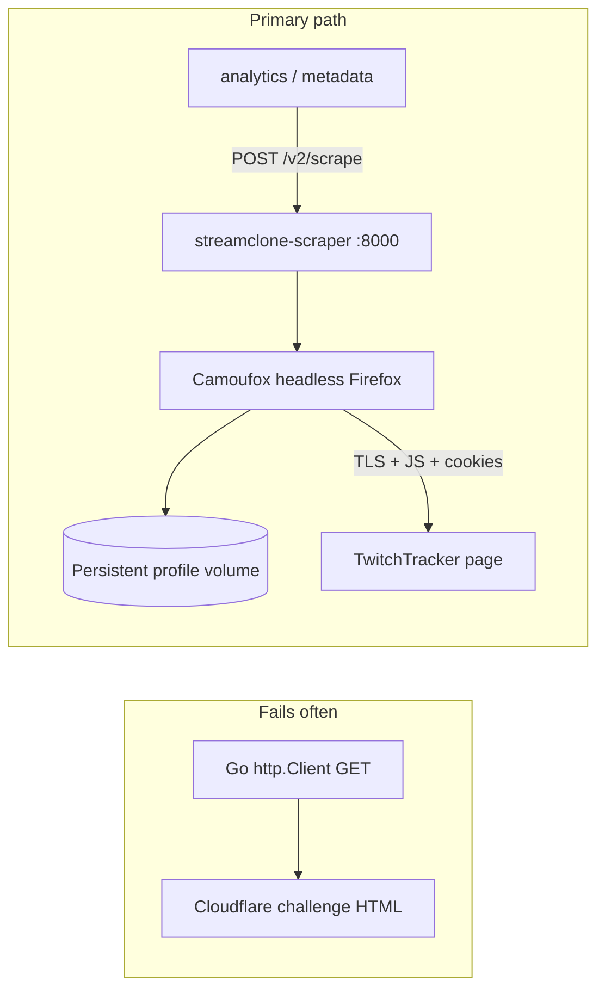
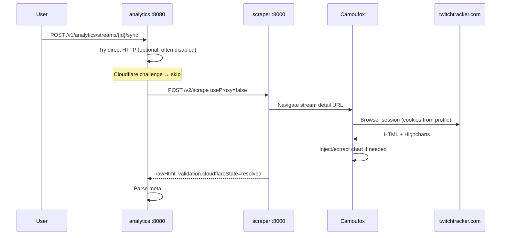

# Streamclone Scraper — Cloudflare & Proxy (Quick Reference)

This explains how the **optional scraper profile** gets minute-level viewer data from **TwitchTracker**, why plain HTTP fails, what **Camoufox** does, and what role **proxies** actually played in practice.

**Scope:** TwitchTracker analytics scrapes (`--profile scraper`). The scraper lives in the sibling repo [`streamclone-scraper`](https://github.com/Aron-Chu/streamclone-scraper) and runs as Docker service `scraper:8000`. Core watching/clipping does **not** need it.

---

## What the scraper is for

| Need | Without scraper | With scraper |
|------|-----------------|--------------|
| Watch live streams | Works | — |
| Channel directory / Helix VOD list | Works | — |
| TwitchTracker **summary** stats (avg/peak on channel page) | Sometimes via direct HTTP | More reliable via browser |
| **Minute-level viewer chart** on Analytics (`meta#ecs` / Highcharts) | Usually **blocked or empty** | Primary path |

Analytics sync (`internal/analytics/sync.go`) calls:

```http
POST http://scraper:8000/v2/scrape
Authorization: Bearer <SCRAPER_API_KEY>
```

with a TwitchTracker stream detail URL, e.g. `https://twitchtracker.com/{login}/streams/{streamId}`.

Metadata can also fall back to the scraper when direct HTTP hits Cloudflare (`internal/metadata/api/api.go`).

---

## Why plain HTTP does not work

TwitchTracker sits behind **Cloudflare**. A normal `GET` from Go (`http.Client`) often returns a challenge page instead of stream data.

Streamclone detects that with heuristics like:

- `"just a moment"`
- `"performing security verification"`
- `"cf_chl_opt"`

See `looksLikeCloudflareChallenge()` in `internal/analytics/sync.go` and `internal/metadata/api/api.go`.

Direct HTTP is optionally tried first (`ANALYTICS_TT_DIRECT_HTTP_ENABLED`), but success rate is low; the stack **disables direct HTTP** in the current Windows bridge profile because it mostly wastes time before the browser scrape.

---

## How we get past Cloudflare (the real approach)

We do **not** use a special Cloudflare API or token bypass. We use a **real browser automation stack** that looks like a normal user session to Cloudflare.



### 1. Camoufox (default engine)

- **What:** Anti-fingerprinting Firefox automation (Playwright-style API). Compose default: `SCRAPER_BROWSER=camoufox`.
- **Why it works:** Cloudflare checks TLS fingerprint, headers, and JavaScript behavior. Camoufox mimics a real browser better than `curl` or server-side HTTP clients.
- **Config:** `deploy/docker-compose.yml` — `shm_size: 2gb`, profile volume `scraper-profile:/data/camoufox-profile`, cache volume `camoufox-cache`.

### 2. Persistent browser profile (cookie reuse)

- Path in container: `CAMOUFOX_PERSISTENT_PROFILE=/data/camoufox-profile`
- After Cloudflare accepts a session once, **cookies persist** in the Docker volume so headless runs reuse them.

**One-time warmup (manual):** `scripts/warm-camoufox-profile.ps1`

1. Opens TwitchTracker in **headful** Camoufox on the host.
2. You complete any Cloudflare check manually.
3. Press Enter — cookies are saved to the profile dir.
4. Headless Docker scrapes reuse those cookies.

Preflight scripts (`scripts/scraper-preflight.ps1`) tell you to run warmup if they still see Cloudflare HTML.

### 3. Highcharts injection (data extraction)

Even after Cloudflare clears, TwitchTracker sometimes serves a **chart shell** without full minute data in HTML.

- Env: `SCRAPER_TWITCHTRACKER_INJECT_HIGHCHARTS=true` (compose default)
- The scraper runs in-page JS against Highcharts to pull viewer series when the static page is incomplete.

Validation expects **`cloudflareState=resolved`** and enough chart points (≥3) for analytics rollups (~80 points typical).

### 4. What analytics parses from the HTML

Priority in `parseTwitchTrackerHTML()`:

1. **`meta id="ecs"`** — encoded minute viewer series (best source)
2. Injected **`streamclone-viewer-chart`** JSON (from scraper injection)
3. Legacy HTML selectors (peak, duration, table rows)

Without `meta#ecs` or injected chart data, the Analytics viewer timeline stays **flat** (summary-only).

### 5. Retries

Scraper env (see `.kiro/specs/scraper-optimization-notes.md`):

- `SCRAPER_RETRY_MAX=3`
- `SCRAPER_RETRY_MIN_MS=2000` / `SCRAPER_RETRY_MAX_MS=12000`

Random backoff on Cloudflare blocks, sparse chart shells, or navigation errors.

### 6. CDP fallback (Windows)

If Camoufox inside Docker is unstable:

- `scripts/scraper-cdp.ps1` — starts **host Chrome** with `--remote-debugging-port=9222` and a persistent profile.
- Set `CDP_URL=http://host.docker.internal:9222` and `SCRAPER_BROWSER=cdp` in `.env`, recreate scraper.

Uses real Chrome on the host (sometimes easier to pass CF interactively, then reuse profile).

---

## Proxy — what it was for and what we learned

### Configuration (optional)

Compose passes proxy env into the scraper container:

| Variable | Purpose |
|----------|---------|
| `PROXY_SERVER` | Single upstream proxy URL |
| `PROXY_USERNAME` / `PROXY_PASSWORD` | Auth |
| `PROXY_POOL` | Multiple proxies |
| `PROXY_BYPASS` | Hosts to reach directly (steering suggests `twitchtracker.com`) |

Setup may ask for `PROXY_*` in `.env.local` during `--profile scraper` install (`scripts/setup.sh`) for **TwitchTracker egress** experiments.

Scrape requests can include `"useProxy": true|false` in the JSON body.

### What we actually measured (June 2026)

From `.kiro/specs/scraper-optimization-notes.md` and `internal/analytics/sync.go`:

| Finding | Detail |
|---------|--------|
| **Analytics always sends `useProxy: false`** | Code comment: *"datacenter proxies are Cloudflare-blocked on TwitchTracker"* |
| **Camoufox forces direct for TwitchTracker** | `proxy_attempts → [false]` for TT URLs in scraper |
| **`useProxy: true` did not change routing** | Benchmarks: `usedProxy` stayed `false`; same ~81 chart points, slightly higher latency |
| **No proxy pool configured** | `proxy_pool_count=0` in typical installs |
| **Direct Camoufox + warmed profile worked** | p50 ~7–9s, `cloudflareState=resolved`, 81 chart points |

**Bottom line for TwitchTracker:**

- Proxies were explored for **egress diversity** (and possibly other scrape targets like Reddit in the scraper repo).
- **Datacenter proxies made Cloudflare worse**, not better, on TwitchTracker.
- Production path for TT: **direct egress from the Camoufox container** + **persistent warmed profile**, not rotating datacenter IPs.

If you configure residential proxies in the future, the scraper may still **bypass them for TT** by design; check `streamclone-scraper` routing logic before assuming `PROXY_SERVER` affects Tracker scrapes.

### Proxy vs “bypass” — don’t confuse with Caddy

| Layer | Role |
|-------|------|
| **Caddy `:8090`** | Reverse proxy for *your* Streamclone app (frontend, APIs, HLS). Unrelated to TwitchTracker scraping. |
| **HTTP `PROXY_*`** | Optional outbound proxy for the *scraper container* when talking to the public internet. |
| **Camoufox** | The mechanism that actually satisfies Cloudflare for TwitchTracker today. |

---

## End-to-end flow (Analytics sync)



---

## Operational tips

| Symptom | Likely cause | Fix |
|---------|--------------|-----|
| Flat viewer chart, peak-only stats | Scrape returned shell HTML, no `meta#ecs` | Run scraper preflight; warmup Camoufox profile |
| `"just a moment"` in HTML | Cloudflare block | `warm-camoufox-profile.ps1`; check profile volume locks |
| Scraper “works” on `:8000` but analytics empty (Windows) | **wslrelay** stale listener | Use `diagnose-scraper.ps1 -UseDocker` or hit scraper via `docker exec` |
| Camoufox deadlocks | `SCRAPER_MAX_CONCURRENT > 1` with ephemeral browser | Use `SCRAPER_EPHEMERAL_BROWSER=true`, `SCRAPER_MAX_CONCURRENT=1` on Windows |
| Proxy configured but no effect on TT | By design for TwitchTracker | Expect direct Camoufox; proxies target other workloads |

**Diagnostics:**

```powershell
.\scripts\diagnose-scraper.ps1 -UseDocker
.\scripts\scraper-preflight.ps1
.\scripts\tt-proxy-compare.py   # direct vs useProxy comparison
```

**Stack MCP:** `scraper_probe` in `tools/stack/stack_mcp.py` — POSTs with `useProxy` true/false and checks `meta#ecs` / Cloudflare strings.

---

## Security note

`PROXY_*` credentials belong in **`.env.local` only** — never commit them (`docs/options.md`, `CONTRIBUTING.md`).

Scraper port **`8000`** should stay on trusted networks (same as other dev service ports).

---

## Related files

| Path | Topic |
|------|--------|
| `deploy/docker-compose.yml` | Scraper service, Camoufox/proxy env |
| `internal/analytics/sync.go` | TT scrape + parse + `useProxy: false` |
| `internal/metadata/api/api.go` | TT page fetch fallback to scraper |
| `scripts/warm-camoufox-profile.ps1` | Manual Cloudflare warmup |
| `scripts/scraper-cdp.ps1` | Host Chrome CDP fallback |
| `.kiro/steering/analytics.md` | Scraper integration + pitfalls |
| `.kiro/specs/scraper-optimization-notes.md` | Benchmarks, proxy vs direct |
| `streamclone-scraper/` (sibling repo) | Scraper implementation (`main.py`, browser pool, injection) |

---

*Summary: Cloudflare is handled by **real browser automation (Camoufox) + persistent cookies + optional Highcharts injection**, not by HTTP tricks. Proxies were tested for egress but **datacenter proxies failed on TwitchTracker**; analytics and the scraper **prefer direct** connections for TT, with manual profile warmup when Cloudflare still challenges.*
