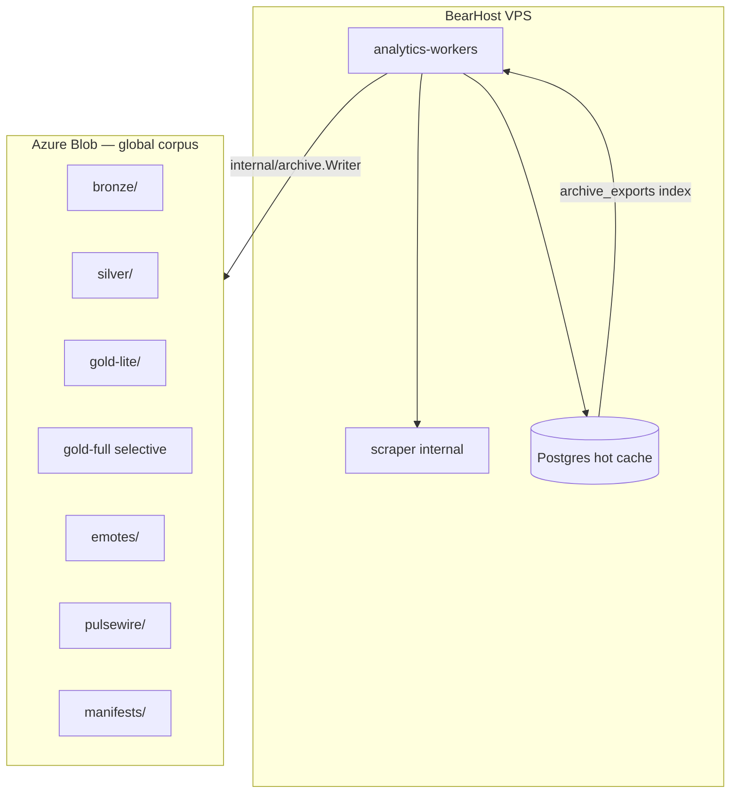

# Global Archive Corpus — Requirements

Status: **draft / implementation spec**
Companion: [requirements.md](requirements.md) · [azure-archive-setup.md](../azure-archive-setup.md) · [bearhost-production.md](../bearhost-production.md)

---

## TL;DR

Streamclone maintains **one shared global archive corpus** in Azure Blob Storage — VOD **intelligence** (catalog, identity, viewer charts, chat aggregates, emote metadata), not Twitch video files. BearHost VPS runs long-lived **analytics-workers** that continuously export artifacts; Postgres is a disposable hot cache.

**Product constraints (non-negotiable)**

| Rule | Detail |
|------|--------|
| No VOD video mirroring | Do not download or store full MP4/HLS VOD files |
| One global corpus | No per-user or per-install cold archives |
| Azure first | `ARCHIVE_STORAGE_PROVIDER=azure`; legacy `gcs_uri` column name stays |
| Scraper internal | TT/Camoufox egress from BearHost requires residential proxy or hybrid home-PC slot |
| Idempotent exports | Same natural key + unchanged content → stable hash or versioned path |

**Core principle — every artifact stores up to four layers:**

1. **Raw / semi-raw source** (Helix payload, TT HTML/chart JSON, 7TV API response)
2. **Normalized facts** (VOD catalog rows, viewer minute lines, emote records)
3. **Derived analytics** (rollups, gold-lite aggregates, coverage ratios)
4. **Manifest / provenance** (sidecar JSON + Postgres index row)

---

## Goals

- Durable long-term storage for top **100–200** (configurable to 500) streamers.
- Artifacts are **queryable** (Postgres manifest index), **reproducible** (raw + parser version), and **cheap** (metadata-first; selective gold-full).
- Future multi-user UI can search/filter/retrieve archived stream intelligence without re-scraping.
- Long-running export loop on BearHost survives Postgres retention purges.

## Non-goals

- Full Twitch VOD video mirroring (MP4/HLS).
- Per-user archive partitions or quotas.
- Replacing Postgres as the live Analytics query engine (cold lazy-load is P2).
- Mirroring every emote size/format — one canonical WebP/AVIF per emote is optional P1.
- GCS writer (Azure only until explicitly requested).

---

## Architecture (today → target)



**Long-running orchestration (no separate daemon binary required for v1):**

| Worker | Host process | Trigger | Status |
|--------|--------------|---------|--------|
| Bronze indexer | `cmd/analytics` | `BRONZE_WORKER_INTERVAL` | **Shipped** (partial artifacts) |
| Backfill / Silver | `cmd/analytics` | `BACKFILL_WORKER_INTERVAL` | **Shipped** |
| Gold enqueuer + worker | `cmd/analytics` | `GOLD_ENQUEUER_INTERVAL` | **Shipped** (single Gold tier today) |
| Sync export on completion | `cmd/analytics` | `ARCHIVE_EXPORT_ON_SYNC` | **Shipped** |
| Emote snapshot worker | `cmd/analytics` | weekly tick | **Shipped** (per-channel 7TV only) |
| Directory sample export | `cmd/analytics` | hourly | **Shipped** |
| Nightly pg_dump | `scripts/backup-streamclone.ps1` / cron | daily | **Shipped** (operator) |
| Corpus coverage reporter | `cmd/backfill coverage …` | CLI / cron | **Partial** |
| **Corpus orchestrator v2** | `cmd/archive run` or extended workers | unified tick | **Planned** |

v1 continues embedded workers in analytics; v2 may add `cmd/archive run` as a thin supervisor that only coordinates export ticks and coverage snapshots without duplicating sync logic.

---

## Manifest model

### Requirement MAN-C1 (P0)

Every exported blob MUST have predictable provenance. Write manifest data **both**:

1. **Postgres index** — queryable, retention-guard compatible.
2. **Optional sidecar** — `{prefix}/manifests/{scope}/manifest.json` for blob-only recovery.

### Requirement MAN-C2 (P0)

Expand `archive_exports` (preferred) rather than introduce `archive_manifests` unless row width forces a split. Add columns via forward migration `0000xx_archive_manifest_expand.up.sql`.

### Proposed `archive_exports` expansion

| Column | Type | Purpose |
|--------|------|---------|
| `artifact_id` | `UUID` | Stable id; default `gen_random_uuid()` on insert |
| `artifact_type` | `TEXT` | Existing PK component |
| `natural_key` | `TEXT` | Existing PK component |
| `tier` | `TEXT` | `bronze`, `silver`, `gold_lite`, `gold_full`, `emote`, `pulsewire` |
| `provider` | `TEXT` | `twitch`, `twitchtracker`, `7tv`, `ffz`, `bttv`, `reddit`, … |
| `channel_login` | `TEXT` | nullable |
| `channel_id` | `TEXT` | nullable |
| `stream_id` | `TEXT` | nullable |
| `vod_id` | `TEXT` | nullable |
| `source_url` | `TEXT` | nullable |
| `gcs_uri` | `TEXT` | Azure HTTPS URI (legacy name) |
| `content_sha256` | `TEXT` | hex digest of **stored** object bytes |
| `compressed_size_bytes` | `BIGINT` | rename/map from `byte_size` |
| `uncompressed_size_bytes` | `BIGINT` | nullable |
| `row_count` | `BIGINT` | existing |
| `schema_version` | `TEXT` | e.g. `vod_catalog/v1` |
| `parser_version` | `TEXT` | git tag or semver of parser |
| `created_at` | `TIMESTAMPTZ` | existing |
| `fetched_at` | `TIMESTAMPTZ` | upstream fetch time |
| `coverage_ratio` | `REAL` | nullable 0..1 |
| `export_status` | `TEXT` | extend: `complete`, `partial`, `failed`, `skipped`, `pending`, `confirmed` |
| `failure_reason` | `TEXT` | map from `error` |
| `metadata` | `JSONB` | extensible bag |

**Migration notes**

- Map existing `confirmed` → `complete` in application layer; keep DB check constraint widened.
- Backfill `content_sha256` on next re-export; do not block old rows.
- Index: `(tier, channel_login, exported_at DESC)`, `(stream_id, tier)`, `(provider, artifact_type)`.

### Optional supporting tables

| Table | When |
|-------|------|
| `archive_coverage_snapshots` | Daily rollup of coverage report JSON for trend graphs |
| `channel_identity_state` | Hot cache of last identity/crosswalk export per login |
| `vod_catalog_state` | Hot cache: last seen VOD ids, tombstone detection |

`bronze_index_state` (**shipped**, migration `000034`) remains; extend with `last_identity_at`, `last_crosswalk_at`, `last_roster_at` columns.

### Sidecar manifest JSON (example)

```json
{
  "artifactId": "550e8400-e29b-41d4-a716-446655440000",
  "artifactType": "bronze_vod_catalog",
  "tier": "bronze",
  "provider": "twitch",
  "channelLogin": "xqc",
  "channelId": "71092938",
  "schemaVersion": "vod_catalog/v1",
  "parserVersion": "streamclone/v0.3.0",
  "blobUri": "https://ststreamclone3lf6tt.blob.core.windows.net/streamclone-archive/streamclone/channels/vod_index/provider=twitch/login=xqc/date=2026-06-20.jsonl.gz",
  "contentSha256": "a1b2c3…",
  "compressedSizeBytes": 4096,
  "uncompressedSizeBytes": 28000,
  "rowCount": 42,
  "fetchedAt": "2026-06-20T14:30:00Z",
  "createdAt": "2026-06-20T14:30:05Z",
  "status": "complete",
  "metadata": {
    "helixLimit": 80,
    "rosterRank": 3
  }
}
```

---

## Blob path specification

**Prefix:** `{ARCHIVE_AZURE_PREFIX}/` (default `streamclone/`)

Paths below are relative to prefix. **Shipped** paths marked; **planned** paths are target layout (may version alongside legacy keys during transition).

### Bronze

| Artifact | Path | Status |
|----------|------|--------|
| VOD catalog (dated) | `channels/vod_index/provider=twitch/login={login}/date={yyyy-mm-dd}.jsonl.gz` | **Planned** (today: `channels/vod_index/{login}.jsonl.gz`) |
| VOD catalog (legacy) | `channels/vod_index/{login}.jsonl.gz` | **Shipped** |
| Stream catalog snapshot | `streams/catalog/stream_id={stream_id}/snapshot={RFC3339}.json.gz` | Planned |
| Tombstone | `streams/tombstones/stream_id={stream_id}/date={yyyy-mm-dd}.json` | Planned |
| Channel identity | `channels/identity/provider=twitch/channel_id={channel_id}/date={yyyy-mm-dd}.json` | Planned |
| Provider crosswalk | `channels/crosswalk/login={login}/date={yyyy-mm-dd}.json` | Planned |
| TT channel summary | `channels/summary/{login}.json` | **Shipped** |
| Top roster | `rosters/tier0/date={yyyy-mm-dd}.jsonl.gz` | Planned (today: `channels/top200.json.gz`, `channels/top500.json.gz`) |
| Bronze coverage summary | `coverage/bronze/date={yyyy-mm-dd}.json` | Planned |
| Directory samples | `directory/date={date}/hour={hh}/part-000.jsonl.gz` | **Shipped** |

### Silver

| Artifact | Path | Status |
|----------|------|--------|
| Normalized viewer rollups | `rollups/viewers/stream_id={stream_id}/source=twitchtracker/part-000.jsonl.gz` | Planned (today: `rollups/stream_id={id}/part-000.jsonl.gz`) |
| Raw TT HTML | `raw/twitchtracker/stream_id={stream_id}/fetched_at={timestamp}.html.gz` | Partial (`tt-detail/{login}/{stream_id}/page.html.gz` shipped) |
| TT chart JSON extract | `raw/twitchtracker/stream_id={stream_id}/fetched_at={timestamp}.chart.json.gz` | Planned |
| Silver manifest sidecar | `manifests/stream_id={stream_id}/silver.json` | Planned |

### Gold

| Artifact | Path | Status |
|----------|------|--------|
| Gold-lite chat minute rollups | `rollups/chat/stream_id={stream_id}/minute.jsonl.gz` | Planned |
| Gold-lite emote rollups | `rollups/emotes/stream_id={stream_id}/provider={provider}.jsonl.gz` | Planned |
| Gold-lite manifest | `manifests/stream_id={stream_id}/gold-lite.json` | Planned |
| Gold-full VOD chat | `vod_chat/stream_id={stream_id}/part-000.jsonl.gz` | Partial (`messages.jsonl.gz` shipped) |
| Gold-full manifest | `vod_chat/stream_id={stream_id}/manifest.json` | Planned |

### Emotes

| Artifact | Path | Status |
|----------|------|--------|
| Global 7TV snapshot | `emotes/snapshots/provider=7tv/login=global/date={yyyy-mm-dd}.jsonl.gz` | Planned |
| Per-channel snapshot | `emotes/snapshots/provider=7tv/login={login}/date={yyyy-mm-dd}.jsonl.gz` | **Shipped** (path uses `part-000.jsonl.gz`) |
| Changelog | `emotes/changelog/provider=7tv/login={login}/date={yyyy-mm-dd}.jsonl.gz` | Partial (append API shipped; diff detection planned) |
| Media cache | `emotes/media/provider=7tv/emote_id={id}/hash={sha256}.webp` | Planned |
| Media metadata | `emotes/media/provider=7tv/emote_id={id}/metadata.json` | Planned |

### PulseWire (when profile enabled)

| Artifact | Path |
|----------|------|
| Raw social | `pulsewire/raw/source={reddit\|lsf\|…}/date={yyyy-mm-dd}.jsonl.gz` |
| Stories | `pulsewire/stories/date={yyyy-mm-dd}.jsonl.gz` |
| Entities | `pulsewire/entities/date={yyyy-mm-dd}.jsonl.gz` |
| Clusters | `pulsewire/clusters/date={yyyy-mm-dd}.jsonl.gz` |
| Moderation audit | `pulsewire/moderation/audit/date={yyyy-mm-dd}.jsonl.gz` |

### Visual metadata (no VOD video)

| Artifact | Path |
|----------|------|
| VOD thumbnail | `media/thumbnails/stream_id={stream_id}/vod.jpg` |
| Clips catalog | `clips/catalog/channel={login}/date={yyyy-mm-dd}.jsonl.gz` |
| Clip thumbnail | `clips/thumbnails/clip_id={clip_id}.jpg` |

### System

| Artifact | Path | Status |
|----------|------|--------|
| Nightly pg_dump | `postgres/nightly/{date}.sql.gz` | **Shipped** |
| Export manifest mirror | `manifest/archive_exports/date={yyyy-mm-dd}.jsonl.gz` | Planned |

**Path migration rule:** Writers MAY write both legacy and hive-style paths for one release cycle; manifest rows point at canonical hive path.

---

## Tier specifications

### Bronze — index & identity (API-only on BearHost)

**Requirement BR-C1 (P0):** Bronze runs on BearHost without residential proxy (Helix, 7TV user lookup, TT summary HTTP API, directory roster).

**Requirement BR-C2 (P0):** Expand beyond VOD list + summary.

#### Bronze artifacts

| # | Artifact | Source | Priority |
|---|----------|--------|----------|
| 1 | VOD catalog snapshots | Twitch Helix Get Videos | P0 |
| 2 | Channel identity snapshots | Helix Get Users + emote provider lookups | P0 |
| 3 | Provider crosswalk | 7TV / FFZ / BTTV id mapping | P0 |
| 4 | Top-N roster snapshots | Tier-0 directory + always-tracked | P0 |
| 5 | Availability / deletion tombstones | Diff across catalog snapshots | P1 |
| 6 | Coverage summary | Derived from `bronze_index_state` + manifest | P0 |

#### VOD catalog line schema (`vod_catalog/v1`)

Each JSONL line:

```json
{
  "streamId": "12345678901",
  "vodId": "987654321",
  "channelLogin": "xqc",
  "channelId": "71092938",
  "title": "…",
  "category": "Just Chatting",
  "gameId": "509658",
  "startedAt": "2026-06-19T20:00:00Z",
  "endedAt": "2026-06-20T01:15:00Z",
  "durationSeconds": 18900,
  "createdAt": "2026-06-20T01:20:00Z",
  "publishedAt": "2026-06-20T01:25:00Z",
  "thumbnailUrl": "https://…",
  "viewCount": 120000,
  "language": "en",
  "type": "archive",
  "source": "helix",
  "availability": "available",
  "firstSeenAt": "2026-06-20T01:30:00Z",
  "lastSeenAt": "2026-06-20T14:30:00Z",
  "rawHelix": { },
  "schemaVersion": "vod_catalog/v1",
  "provider": "twitch",
  "fetchedAt": "2026-06-20T14:30:00Z"
}
```

`availability` enum: `available`, `deleted`, `private`, `unknown`.

**Helix limit note:** Today `bronzeHelixVODLimit = 80` per channel per fetch. Requirement BR-C3 (P1): paginate Helix VOD index until cap (`BRONZE_VOD_INDEX_MAX_PAGES`) or date floor (`BRONZE_VOD_INDEX_SINCE_DAYS`, default 90).

#### Channel identity schema (`channel_identity/v1`)

```json
{
  "twitchUserId": "71092938",
  "login": "xqc",
  "displayName": "xQc",
  "profileImageUrl": "https://…",
  "offlineImageUrl": "https://…",
  "description": "…",
  "broadcasterType": "partner",
  "twitchCreatedAt": "2014-09-18T…",
  "sevenTvUserId": "…",
  "sevenTvEmoteSetId": "…",
  "ffzRoomId": null,
  "bttvChannelId": null,
  "firstSeenAt": "2026-01-01T…",
  "lastSeenAt": "2026-06-20T…",
  "raw": {
    "helix": { },
    "seventv": { }
  },
  "schemaVersion": "channel_identity/v1",
  "fetchedAt": "2026-06-20T14:30:00Z"
}
```

#### Provider crosswalk schema (`provider_crosswalk/v1`)

```json
{
  "login": "xqc",
  "twitchChannelId": "71092938",
  "sevenTvUserId": "…",
  "sevenTvEmoteSetId": "…",
  "ffzRoomId": null,
  "bttvChannelId": null,
  "internalChannelId": null,
  "schemaVersion": "provider_crosswalk/v1",
  "fetchedAt": "2026-06-20T14:30:00Z"
}
```

#### Roster snapshot line (`roster/v1`)

```json
{
  "date": "2026-06-20",
  "source": "tier0_directory",
  "rank": 3,
  "channelLogin": "xqc",
  "channelId": "71092938",
  "reasonIncluded": "top_n_live_viewers",
  "trackingTier": "bronze",
  "workerConfigVersion": "bearhost-prod-2026-06",
  "topN": 200,
  "includedBy": "global_roster",
  "firstSeenInRoster": "2026-01-15",
  "lastSeenInRoster": "2026-06-20"
}
```

`includedBy` enum: `global_roster`, `always_tracked`, `operator`, `system`.

---

### Silver — viewer charts + provenance

**Requirement SV-C1 (P0):** Export normalized rollups **and** enough raw/semi-raw TT payload to re-parse.

**Requirement SV-C2 (P0):** Write `partial` manifests when chart coverage &lt; threshold; include `coverage_ratio`, `first_minute_seen`, `last_minute_seen`, `expected_duration_minutes`, `failure_reason`, `retry_after`.

#### Normalized viewer rollup line (`viewer_rollup/v1`)

```json
{
  "streamId": "12345678901",
  "vodId": "987654321",
  "channelLogin": "xqc",
  "minuteOffset": 42,
  "timestamp": "2026-06-19T20:42:00Z",
  "viewerCount": 85000,
  "sourceProvider": "twitchtracker",
  "sourceUrl": "https://twitchtracker.com/xqc/streams/12345678901",
  "fetchedAt": "2026-06-20T08:00:00Z",
  "parserVersion": "tt-chart/v2",
  "chartCoverageRatio": 0.94,
  "isInterpolated": false,
  "isIncomplete": false,
  "qualityFlags": []
}
```

**Egress:** TT Camoufox from BearHost datacenter IP is **blocked by default** unless `SCRAPER_RESIDENTIAL_PROXY_*` configured. Silver bulk backfill SHOULD use residential proxy or hybrid home-PC slot (`ARCHIVE_EGRESS_SLOT=home` planned).

---

### Gold — split into gold-lite and gold-full

**Requirement GD-C1 (P0):** Split current single Gold tier.

| Tier | Content | Default |
|------|---------|---------|
| **gold-lite** | Chat/emote **aggregates** per minute | `GOLD_LITE_ENABLED=true` |
| **gold-full** | Full raw VOD chat replay | `GOLD_FULL_ENABLED=false` |

#### Gold-lite aggregate line (`chat_aggregate/v1`)

```json
{
  "streamId": "12345678901",
  "minuteOffset": 42,
  "messagesPerMinute": 1200,
  "uniqueChatters": 850,
  "topEmotes": [{"provider": "7tv", "id": "…", "name": "…", "count": 400}],
  "emoteCountsByProvider": {"7tv": 900, "twitch": 200},
  "chatVelocityScore": 0.82,
  "schemaVersion": "chat_aggregate/v1"
}
```

#### Gold-full message line (`vod_chat/v1`)

Existing export shape; add `messageId`, `offsetSeconds`, hashed `userId`, `parserVersion`, pagination cursor fields.

#### Gold-full selection rules (never default all top-200)

- Operator force enqueue (`backfill gold enqueue`)
- `peak_viewers >= GOLD_FULL_MIN_PEAK_VIEWERS`
- `duration_min >= GOLD_FULL_MIN_DURATION_MINUTES`
- PulseWire/news-linked streams (future)
- Major viewer spike heuristic (future)
- `GOLD_FULL_OPERATOR_ONLY=true` gates automatic enqueue

---

### Emote archive — provider-agnostic

**Requirement EM-C1 (P0):** Providers: `7tv`, `ffz`, `bttv`, `twitch`.

**Requirement EM-C2 (P0):** Export global 7TV set to `login=global`.

**Requirement EM-C3 (P1):** Changelog via snapshot diff (added/removed events).

**Requirement EM-C4 (P2):** Canonical media cache — one WebP per emote; **non-blocking** per-item failures.

#### Emote snapshot line (`emote_snapshot/v1`)

```json
{
  "channelLogin": "xqc",
  "twitchChannelId": "71092938",
  "sevenTvUserId": "…",
  "sevenTvEmoteSetId": "…",
  "emoteId": "…",
  "emoteName": "Name",
  "aliases": [],
  "animated": true,
  "zeroWidth": false,
  "width": 112,
  "height": 112,
  "frameCount": 24,
  "addedAt": "2024-01-01T…",
  "removedAt": null,
  "contentHash": "…",
  "snapshotAt": "2026-06-20T00:00:00Z",
  "raw": { },
  "schemaVersion": "emote_snapshot/v1",
  "provider": "7tv"
}
```

---

### PulseWire archive

When `pulse-wire` profile enabled, export before `SOCIAL_RETENTION_DAYS` purge with manifest tier `pulsewire`. Wire through existing `ArtifactSocialItem` path and storygraph store queries.

---

## Long-running script / worker behavior

### Requirement RUN-C1 (P0)

Workers MUST be safe to run 24/7 on BearHost:

- Idempotent upserts on `(artifact_type, natural_key)`.
- Per-item failure MUST NOT fail entire batch.
- Exponential backoff on provider errors (`next_run_at` on `backfill_jobs`, bronze error column).
- Graceful shutdown on SIGTERM (context cancel in `cmd/analytics`).

### Requirement RUN-C2 (P0)

Config via env profiles:

- `deploy/env/profile-archive.env`
- `deploy/env/profile-bearhost-prod.env`

### Requirement RUN-C3 (P1)

Optional cron on VPS:

```bash
# /etc/cron.d/streamclone-corpus
0 6 * * * streamclone cd /opt/streamclone/app && docker compose exec -T analytics go run ./cmd/backfill coverage report --out=/opt/streamclone/backups/coverage-$(date +\%F).json
0 3 * * * streamclone bash /opt/streamclone/app/scripts/bearhost-pg-backup.sh
```

### Requirement RUN-C4 (P2)

`cmd/archive run` supervisor:

- Tick bronze → emote snapshots → coverage snapshot export → blob verify
- Does not replace sync/backfill workers in v1

---

## Coverage reporting

### Requirement COV-C1 (P0)

Extend `go run ./cmd/backfill coverage report` (**partial shipped** in `internal/analytics/coverage_report.go`).

### Commands

| Command | Purpose | Status |
|---------|---------|--------|
| `backfill coverage report` | Full corpus summary | Shipped |
| `backfill coverage report --tier bronze` | Bronze-only | Planned |
| `backfill coverage report --tier emotes` | Emote snapshot coverage | Planned |
| `backfill coverage report --tier silver` | Viewer rollup coverage | Planned |
| `backfill coverage report --tier gold-lite` | Aggregate coverage | Planned |
| `backfill coverage report --tier gold-full` | Full chat coverage | Planned |
| `backfill coverage verify-blobs` | Postgres ↔ Azure existence + hash | Planned |
| `backfill coverage stale --older-than 7d` | Stale channel snapshots | Planned |

### Questions each report MUST answer

1. Which top-N channels have Bronze VOD catalog + identity + crosswalk?
2. Which channels have 7TV snapshots (incl. global)?
3. Which streams have Silver viewer rollups (complete vs partial)?
4. Which streams have gold-lite / gold-full?
5. Which artifacts failed (`export_status=failed`)?
6. Which channels have stale snapshots (&gt; N days)?
7. Which Azure blobs exist but lack Postgres manifest rows?
8. Which Postgres manifest rows point to missing blobs?

`archive_coverage_snapshots` stores daily JSON for trending.

---

## Environment variables

### Existing (keep)

See `deploy/env/profile-archive.env` and `profile-bearhost-prod.env`.

### New / expanded

| Variable | Default | Purpose |
|----------|---------|---------|
| `ARCHIVE_MANIFEST_SCHEMA_VERSION` | `manifest/v1` | Sidecar + row schema tag |
| `ARCHIVE_PARSER_VERSION` | `VERSION` file | Parser semver in manifests |
| `ARCHIVE_WRITE_SIDECAR_MANIFEST` | `true` | Upload sidecar JSON per artifact |
| `ARCHIVE_CONTENT_HASH_ENABLED` | `true` | SHA-256 on upload |
| `BRONZE_VOD_INDEX_SINCE_DAYS` | `90` | Catalog date floor |
| `BRONZE_VOD_INDEX_MAX_PAGES` | `5` | Helix pagination cap |
| `BRONZE_IDENTITY_ENABLED` | `true` | Channel identity export |
| `BRONZE_CROSSWALK_ENABLED` | `true` | Provider crosswalk export |
| `BRONZE_TOMBSTONE_ENABLED` | `true` | Deletion detection |
| `BRONZE_COVERAGE_EXPORT_ENABLED` | `true` | Daily `coverage/bronze/…` blob |
| `SILVER_RAW_TT_HTML` | `true` | Store full HTML when &lt; size cap |
| `SILVER_RAW_TT_CHART_JSON` | `true` | Prefer chart JSON extract |
| `SILVER_RAW_TT_MAX_BYTES` | `8388608` | Skip full HTML above 8 MiB |
| `SILVER_PARTIAL_MIN_COVERAGE` | `0.20` | Below → failed; above → partial |
| `GOLD_LITE_ENABLED` | `true` | Minute chat/emote aggregates |
| `GOLD_FULL_ENABLED` | `false` | Full VOD chat export |
| `GOLD_FULL_MIN_PEAK_VIEWERS` | `5000` | Auto-enqueue threshold |
| `GOLD_FULL_MIN_DURATION_MINUTES` | `60` | Auto-enqueue threshold |
| `GOLD_FULL_OPERATOR_ONLY` | `true` | Disable auto enqueue when true |
| `EMOTE_GLOBAL_7TV_ENABLED` | `true` | Global 7TV snapshot |
| `EMOTE_CHANGELOG_DIFF_ENABLED` | `true` | Snapshot diff → changelog |
| `EMOTE_MEDIA_CACHE_ENABLED` | `false` | Canonical WebP mirror |
| `EMOTE_MEDIA_CACHE_MAX_BYTES` | `524288` | Skip large emotes |
| `PULSEWIRE_ARCHIVE_ENABLED` | `false` | PulseWire cold export |
| `CORPUS_COVERAGE_SNAPSHOT_ENABLED` | `true` | Daily coverage blob |
| `CORPUS_BLOB_VERIFY_INTERVAL` | `24h` | verify-blobs scheduler |

---

## Implementation plan by module

### Phase 1 — Manifest + Bronze expansion (P0)

| File / module | Work |
|---------------|------|
| `migrations/0000xx_archive_manifest_expand.up.sql` | Expand `archive_exports`; extend `bronze_index_state` |
| `internal/archive/manifest.go` | New fields on `ExportRecord`; status enum widen |
| `internal/archive/writer.go` | SHA-256, sidecar write, hive path helpers |
| `internal/archive/bronze_export.go` **(new)** | VOD catalog, identity, crosswalk, roster, tombstone writers |
| `internal/analytics/bronze_indexer.go` | Call expanded bronze exporters; pagination |
| `internal/analytics/coverage_report.go` | Tier filters; emote/silver/gold sections |
| `cmd/backfill/main.go` | New coverage subcommands |
| `deploy/env/profile-archive.env` | New env defaults |

### Phase 2 — Silver provenance (P0)

| File / module | Work |
|---------------|------|
| `internal/archive/exporter.go` | Silver paths; chart JSON extract; partial manifest |
| `internal/analytics/backfill_worker.go` | Partial status propagation |
| `internal/analytics/sync.go` | Capture TT chart JSON at sync time |
| `internal/archive/silver_manifest.go` **(new)** | Sidecar builder |

### Phase 3 — Gold-lite / gold-full split (P1)

| File / module | Work |
|---------------|------|
| `internal/config/config.go` | `GOLD_LITE_*`, `GOLD_FULL_*` |
| `internal/analytics/gold_rules.go` | Split lite vs full rules |
| `internal/archive/chat_aggregate.go` **(new)** | Gold-lite rollup export |
| `internal/analytics/backfill_worker.go` | Tier routing |

### Phase 4 — Emote corpus (P1)

| File / module | Work |
|---------------|------|
| `internal/archive/emote_exporter.go` | Global 7TV; diff changelog; FFZ/BTTV |
| `internal/emote/seeder/seeder.go` | Raw payload capture for export |
| `internal/archive/emote_media_cache.go` **(new)** | Optional WebP mirror |
| `internal/archive/workers.go` | Roster-wide provider snapshots |

### Phase 5 — PulseWire + visuals (P2)

| File / module | Work |
|---------------|------|
| `internal/storygraph/archive/` **(new)** | Social/story/cluster export |
| `internal/archive/thumbnails.go` **(new)** | VOD/clip thumbnail cache |
| `internal/archive/directory_export.go` | Already shipped; align paths |

### Phase 6 — Verify + orchestrator (P2)

| File / module | Work |
|---------------|------|
| `internal/archive/verify.go` **(new)** | Blob list vs Postgres |
| `cmd/archive/main.go` | `run`, `verify-blobs` subcommands |
| `scripts/bearhost-corpus-smoke.sh` **(new)** | Acceptance automation |

---

## Acceptance tests

Run against 5 test channels + 1 known TT stream on staging or BearHost with Azure credentials.

| # | Test | Pass criteria |
|---|------|---------------|
| 1 | Bronze 5 channels | VOD catalog blobs under hive path |
| 2 | Bronze identity | `channels/identity/…` blobs exist |
| 3 | Roster snapshot | `rosters/tier0/date=…` exists |
| 4 | Manifest rows | `archive_exports` has sha256, tier, provider |
| 5 | 7TV per-channel | 5 snapshot blobs |
| 6 | 7TV global | `login=global` snapshot |
| 7 | 7TV changelog | Add/remove event after emote change |
| 8 | Silver one stream | Normalized rollups + raw/chart payload |
| 9 | Silver partial | Low coverage → `partial` + ratio |
| 10 | Gold-lite one stream | Chat aggregate blob |
| 11 | No VOD video | Zero `*.mp4`, `*.m3u8`, `*.ts` under prefix |
| 12 | Coverage report | All tiers reflected |
| 13 | Idempotent re-run | Same hash or new dated version; no dup rows |
| 14 | Per-item failure | Failed channel recorded; others succeed |
| 15 | verify-blobs | No orphan index rows; orphans listed |

Automate in `scripts/bearhost-corpus-smoke.sh` (planned).

---

## Rollback plan

1. **Disable exports:** `ARCHIVE_ENABLED=false` — workers skip upload; Postgres retention guard off unless `ARCHIVE_PROTECT_RETENTION=true`.
2. **Disable tiers individually:** `BRONZE_ENABLED=false`, `GOLD_LITE_ENABLED=false`, etc.
3. **Revert migration:** Forward-only preferred; if rollback needed, `0000xx_*_down.sql` drops new columns only (never drop `archive_exports` with data).
4. **Blob prefix freeze:** Point `ARCHIVE_AZURE_PREFIX=streamclone-canary/` for experiments without touching production corpus.
5. **BearHost:** Re-sync prior compose env via `scripts/bearhost-deploy-phased.sh`; local PC remains rollback for 48h per runbook.

---

## Risks and mitigations

| Risk | Impact | Mitigation |
|------|--------|------------|
| TT blocked on VPS IP | Silver stall | Residential proxy; hybrid home egress; `partial` + retry |
| Helix rate limits | Bronze gaps | Pagination caps; stagger `channelsPerTick`; backoff |
| Azure cost drift | Budget overrun | Cool tier + lifecycle (90d); aggregates over raw chat; monthly budget alert |
| Manifest / blob drift | Restore failures | `verify-blobs` cron; content_sha256 on upload |
| Schema churn | Parser mismatch | `schema_version` on every artifact; never edit applied migrations |
| Emote media ToS | Legal/CDN load | Metadata-first; rate-limited media cache; CDN URL in manifest |
| Gold-full runaway | Storage + GQL cost | `GOLD_FULL_OPERATOR_ONLY=true`; strict peak/duration gates |
| Postgres bloat | VPS disk | Retention + manifest guard; nightly pg_dump to blob |
| Path migration | Broken restore | Dual-write legacy + hive paths one release |

---

## Related code (today)

| Area | Path |
|------|------|
| Blob writer + keys | `internal/archive/writer.go` |
| Sync export | `internal/archive/exporter.go` |
| Manifest upsert | `internal/archive/manifest.go` |
| Emote export | `internal/archive/emote_exporter.go` |
| Background workers | `internal/archive/workers.go` |
| Bronze indexer | `internal/analytics/bronze_indexer.go` |
| Backfill queue | `internal/analytics/backfill_worker.go` |
| Coverage report | `internal/analytics/coverage_report.go` |
| CLI | `cmd/backfill`, `cmd/archive` |
| DB | `migrations/000030_archive_exports.up.sql`, `000034_bronze_index_state.up.sql` |
| Env | `deploy/env/profile-archive.env`, `profile-bearhost-prod.env` |

---

## Document history

| Date | Change |
|------|--------|
| 2026-06-20 | Initial corpus requirements draft — manifest model, tier expansion, long-running worker spec |
