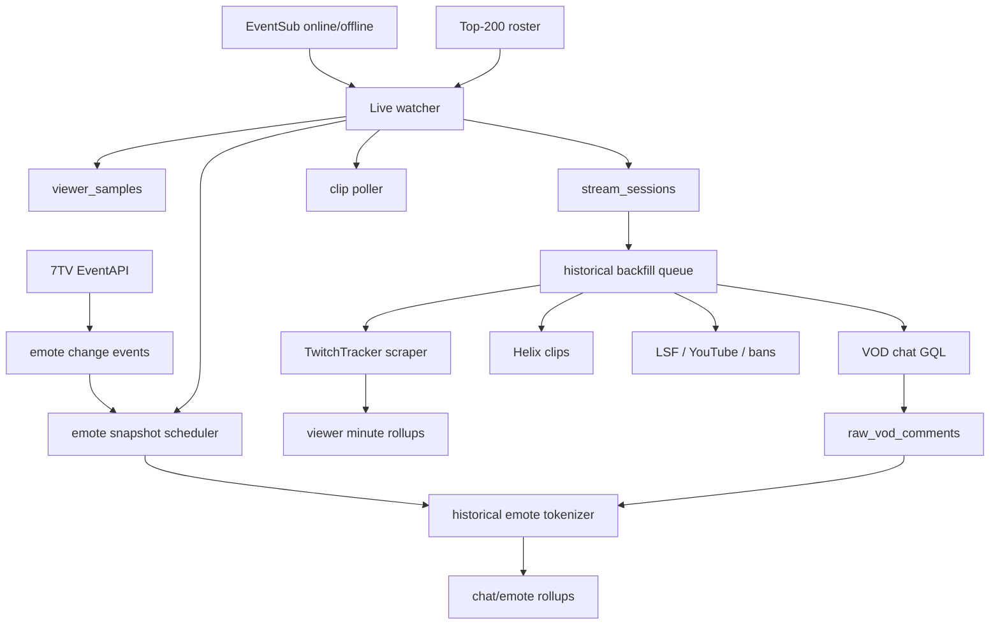

Yes — for “as many streams as possible from the top 200 streamers,” I would **not** make TwitchTracker + VOD GQL the only system. I would build a **live-first archive**, then use TwitchTracker/GQL as historical backfill.

The reason: historical data disappears or becomes harder to recover. Live viewer count, active 7TV emote sets, title/category changes, clip spikes, and chat can all be captured cheaply while the stream is happening. Historical reconstruction should only fill gaps.

Twitch’s official API already supports live stream discovery/viewer count through Get Streams, clips through Get Clips, and VOD listings through Get Videos; EventSub can notify you when a stream starts or ends. ([Twitch Developers][1]) 7TV also has an EventAPI specifically for live updates to 7TV data, commonly used to push channel emote changes to clients. ([GitHub][2])

# The exact thing you should archive

## Tier 0 — always collect for top 200

This is cheap and should run all the time.

For each top-200 streamer:

```text
channel_id
login
display_name
profile_image
is_live
stream_id
title
category/game
started_at
viewer_count sample
language
tags
snapshot_time
```

Cadence:

```text
Every 30–60 seconds while live
Every 5–10 minutes while offline
```

This gives you your own TwitchTracker-style viewer timeline without waiting for TwitchTracker.

Use this for:

* live viewer chart
* stream start/end detection
* rising leaderboard
* stream sessions
* determining which streams deserve expensive backfill

---

## Tier 1 — stream index archive

For every top-200 streamer, maintain a canonical stream history table.

Collect:

```text
stream_id
login
vod_id if known
title
category segments
started_at
ended_at
duration
avg_viewers
peak_viewers
source_confidence
has_tt_detail
has_vod_chat
has_emote_snapshots
has_clips
```

Sources:

```text
Helix Get Streams while live
Helix Get Videos after stream
TwitchTracker stream list/detail
local live samples
```

This is the most important archive. Even if you cannot afford full chat for every stream, you should at least know every stream existed.

---

## Tier 2 — TwitchTracker viewer detail

Scrape this historically:

```text
/{login}/streams/{streamId}
```

Extract:

```text
viewer minute chart
game/category segments
stream title
stream start/end
peak/avg viewers if present
TwitchTracker stream metadata
```

Priority:

```text
P0: always-tracked streamers
P1: top 50 streamers
P2: top 200 streams above threshold
P3: user-requested streams
```

Do **not** scrape TwitchTracker for every single stream immediately if the VPS scraper is small. Queue it.

Good policy:

```text
During live:
- use your own Helix viewer samples

After stream ends:
- wait 10–30 minutes
- fetch TwitchTracker detail once
- compare TT viewer chart against your live samples
- fill missing minutes only
```

This prevents TwitchTracker from being your primary live data source.

---

## Tier 3 — VOD chat GQL archive

This is expensive. Do not run full GQL chat for every stream blindly.

Collect full VOD chat for:

```text
Always-tracked streamers
Top N streams by peak viewers
Streams with clip spikes
Streams with LSF/social stories
Streams with unusual chat velocity
User-requested streams
Streams before VOD disappears
```

Store two layers:

### Raw comments

```text
vod_id
stream_id
comment_id
offset_seconds
created_at
commenter_login
message_text
message_fragments if available
badges
raw_json
fetched_at
```

### Derived rollups

```text
stream_id
minute
chat_count
unique_chatters_estimate
emote_counts
top_terms
message_velocity
```

Important: **always save raw comments before tokenization**. Then you can re-tokenize later when your emote logic improves.

---

## Tier 4 — emote snapshots

This is the one you are most right to worry about.

7TV/FFZ/BTTV emotes change constantly. If you only fetch today’s emote list, you may mis-tokenize an old VOD because a streamer could have added/removed/renamed emotes after the stream happened.

So you need **historical emote snapshots**.

For each tracked channel, snapshot:

```text
provider: 7tv | ffz | bttv | twitch
channel_id
login
emote_set_id
emote_id
emote_name/code
image_url
animated
zero_width / modifier flags if available
owner/source
snapshot_time
valid_from
valid_to
raw_json
hash
```

Cadence:

```text
Top 50 live streamers: every 5 minutes while live
Top 200 live streamers: every 15 minutes while live
Offline top 200: every 6–12 hours
Always-tracked: every 5 minutes while live, hourly offline
```

For 7TV specifically, use two modes:

```text
1. Snapshot polling
2. 7TV EventAPI listener for live emote-set changes
```

The EventAPI is useful because it can catch add/remove events close to real time instead of waiting for the next poll. ([GitHub][2])

For FFZ/BTTV, use their APIs/snapshots. FFZ documents emote set access, and BetterTTV describes a REST API for channel/global emotes. ([FrankerFaceZ][3])

---

# The core rule for emotes

You need to tokenize chat using the **emote set closest to the message timestamp**, not the emote set at sync time.

Bad:

```text
Sync VOD today
Fetch current 7TV emotes today
Apply to chat from 3 weeks ago
```

Good:

```text
Message at 2026-06-20 18:42
Find channel emote snapshot active around 2026-06-20 18:42
Tokenize using that snapshot
```

If no exact snapshot exists:

```text
Use nearest snapshot before message time
If unavailable, use nearest after message time
Mark confidence = estimated
```

Add tokenization confidence:

```text
exact_snapshot
nearby_snapshot
current_snapshot_fallback
unknown
```

This will make your analytics honest.

---

# What should run on the VPS scraper?

Your VPS scraper should mainly handle **browser-only historical/backfill work**, not everything. Your own uploaded architecture guide already separates scraper-needed paths from API paths: TwitchTracker detail, Reddit HTML fallback, YouTube HTML search, and rare X fallback need the scraper; Helix clips, Reddit JSON, GQL VOD chat, IRC chat, and emote APIs do not.

## Put on VPS scraper

```text
TwitchTracker stream detail pages
TwitchTracker stream list pages if needed
Reddit HTML fallback
Reddit comment HTML hydration
YouTube HTML search fallback
X / StreamerBans fallback
```

## Do not put on browser scraper

```text
Helix Get Streams
Helix Get Videos
Helix Get Clips
Twitch GQL VOD chat
7TV/FFZ/BTTV API snapshots
7TV EventAPI listener
IRC live chat
Postgres rollup writing
```

Those should be normal API workers, not browser jobs.

---

# Proposed archive system



---

# Top-200 streamer tracking policy

You need a table like:

```text
tracked_streamers
- twitch_user_id
- login
- display_name
- priority_tier
- reason
- last_seen_live_at
- last_rank
- is_always_tracked
- archive_policy
```

Priority tiers:

```text
P0: always tracked manually
P1: current top 50 live
P2: current top 200 live
P3: recently top 200 in last 7 days
P4: user-requested / social-spike streamer
```

This prevents your top-200 list from constantly changing and losing context.

---

# Exact scrape/archive cadences

## Live watcher

```text
Every 30–60s:
- Get Streams for top-200 tracked live candidates
- store viewer_count
- update title/category if changed
```

## Stream discovery

```text
Every 5m:
- refresh top live directory
- update top-200 roster
- detect new stream sessions
```

## VOD discovery

```text
Every 10–30m while live:
- check Get Videos for current/recent archive VOD

After offline:
- check VOD every 10m for 1 hour
- then hourly for 24 hours
```

## TwitchTracker detail

```text
After offline + 10–30m:
- queue TT detail scrape

Retry:
- 15m
- 1h
- 6h
- 24h
```

## VOD chat GQL

```text
Immediately after VOD appears:
- queue if stream qualifies

Priority:
1. user requested
2. social/clip spike
3. top 25 streamers
4. peak viewers above threshold
5. random sample for dataset coverage
```

## Emote snapshots

```text
While live:
- P0/P1: every 5m
- P2: every 15m

Offline:
- P0/P1: hourly
- P2: every 6–12h

On 7TV EventAPI change:
- snapshot immediately
```

## Clips

```text
While live:
- poll clips every 5–10m

After offline:
- continue every 15m for 2–3h
```

---

# What to store historically from TwitchTracker

For each stream detail page:

```text
source_url
login
stream_id
scraped_at
viewer_points[]
category_segments[]
title
start_time
end_time
duration
peak_viewers
avg_viewers
raw_meta_ecs_json
raw_highcharts_json
parse_version
scrape_status
```

Also store raw blobs:

```text
tt_detail_raw_html_hash
tt_detail_extracted_json
```

Do not only store final rollups. You want to be able to re-parse if your parser improves.

---

# What to store from VOD chat

For full historical quality:

```text
stream_id
vod_id
comment_id
offset_seconds
message_created_at
commenter_id/login/display_name
message_text
fragments
badges
emotes_from_twitch_tags if present
raw_comment_json
gql_page_cursor
fetched_at
```

Derived:

```text
minute
chat_count
unique_chatters
top_emotes
top_7tv_emotes
top_ffz_emotes
top_bttv_emotes
message_velocity
```

Keep raw + derived. Raw is your source of truth.

---

# What to store for 7TV/FFZ/BTTV

## Emote snapshot table

```text
emote_snapshots
- id
- provider
- twitch_user_id
- login
- snapshot_time
- emote_set_id
- hash
- raw_json
```

## Emote snapshot items

```text
emote_snapshot_items
- snapshot_id
- provider
- emote_id
- code
- image_url
- animated
- zero_width
- owner
- flags
```

## Emote changes

```text
emote_change_events
- provider
- twitch_user_id
- login
- event_time
- change_type: added | removed | renamed | set_changed
- emote_id
- old_code
- new_code
- raw_event
```

## Tokenization record

```text
chat_tokenization_runs
- stream_id
- vod_id
- provider_snapshot_strategy
- snapshot_start
- snapshot_end
- comments_processed
- confidence
- tokenizer_version
```

This is important because you may re-tokenize the same VOD later with better emote history.

---

# Bronze / Silver / Gold archive design

## Bronze — collect for all top 200

Cheap, always-on.

```text
stream sessions
viewer samples from Helix
title/category changes
VOD IDs
clips metadata
emote snapshots
basic LSF/social mentions
```

This should be your default.

## Silver — collect for important streams

Moderate cost.

```text
TwitchTracker detail scrape
complete viewer minute chart
full clip harvest
Reddit/YouTube corroboration
better category segments
```

Trigger Silver if:

```text
top 50 streamer
peak viewers > threshold
clip spike
LSF/social mention
user opened analytics
```

## Gold — expensive full archive

Expensive.

```text
full VOD GQL chat
raw comments
historical emote tokenization
emote rollups
chat heatmap
full replay/search
```

Trigger Gold if:

```text
P0 streamer
user requested
top 10 stream by viewers today
major social story
ban/drama/clip spike
stream has unusually high chat velocity
```

This is how you avoid trying to GQL-fetch every top-200 VOD.

---

# VPS worker layout

On the VPS, I would run:

```text
archive-scheduler
- decides what gets Bronze/Silver/Gold

live-watcher
- Helix stream samples
- stream session lifecycle

emote-watcher
- 7TV EventAPI
- 7TV/FFZ/BTTV snapshots

vod-discovery-worker
- Helix videos
- maps stream_id -> vod_id

tt-scrape-worker
- calls streamclone-scraper for TwitchTracker

vod-chat-worker
- Twitch GQL pages
- segment checkpointing

tokenizer-worker
- joins raw chat to historical emote snapshots

rollup-worker
- writes minute rollups

pulsewire-worker
- Reddit/clips/YouTube/bans/social evidence
```

Only this one needs browser:

```text
streamclone-scraper
```

Everything else should be regular Go/Python workers.

---

# Queue priorities

Use a queue like Redis/Asynq/Temporal-style jobs.

Priority order:

```text
1. User-requested sync
2. Currently live P0/P1 streamers
3. Recently ended P0/P1 streams
4. Social-spike streams
5. Top-200 Bronze maintenance
6. TwitchTracker Silver backfill
7. Gold VOD chat backfill
8. Old historical cleanup
```

This prevents the system from wasting the VPS on random old streams while a user is waiting.

---

# What “as updated as possible” means

For viewers:

```text
Live Helix samples every 30–60s
TT detail backfill after stream ends
```

For chat:

```text
Live IRC archive where possible
GQL VOD chat after stream ends for selected streams
```

For emotes:

```text
7TV EventAPI listener
5–15m snapshots while live
hourly/daily snapshots while offline
tokenize chat against nearest historical snapshot
```

For clips:

```text
5–10m while live
2–3h after stream ends
```

For social spread:

```text
global ingest every 5m
per-login backfill on demand
higher frequency for top/live/social-spike streamers
```

---

# The hard truth

You cannot perfectly reconstruct historical 7TV/FFZ/BTTV state unless you were already snapshotting it or the provider exposes enough historical change data. Current emote APIs usually tell you the current channel state, not necessarily the exact state at every past minute.

So the best system is:

```text
From now forward:
  accurate historical emote snapshots

Before your archive started:
  best-effort current/nearest snapshot, marked estimated
```

That means your system should display confidence:

```text
Emote accuracy: exact snapshot
Emote accuracy: estimated from nearest snapshot
Emote accuracy: current emotes fallback
```

---

# My exact recommendation

For your top-200 streamer archive, build this:

```text
1. Top-200 live roster from Helix/directory every 5m.
2. Viewer samples every 30–60s while live.
3. Stream session table that canonicalizes every stream.
4. Emote snapshots every 5–15m while live.
5. 7TV EventAPI listener for instant emote changes.
6. Clip polling every 5–10m while live and 2–3h after offline.
7. VOD discovery immediately after stream ends.
8. TwitchTracker detail queued after stream ends for Silver streams.
9. Full VOD GQL chat only for Gold streams.
10. Raw chat stored before tokenization.
11. Tokenization uses nearest historical emote snapshot.
12. VPS scraper only handles TwitchTracker/browser fallback jobs.
```

That gives you the best balance: **maximum coverage for top 200**, while reserving the expensive scraper/GQL work for streams that are actually worth full historical indexing.

[1]: https://dev.twitch.tv/docs/api/reference?utm_source=chatgpt.com "Reference"
[2]: https://github.com/SevenTV/EventAPI?utm_source=chatgpt.com "SevenTV/EventAPI: A service which provides live updates ..."
[3]: https://www.frankerfacez.com/developers?utm_source=chatgpt.com "Developers"
